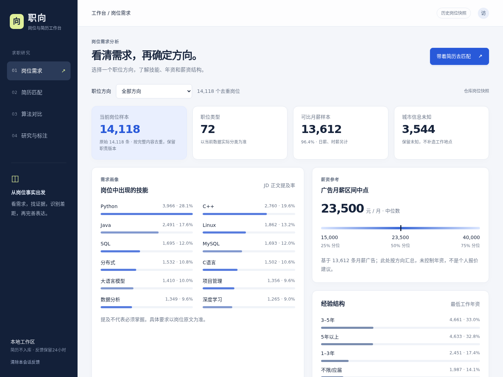
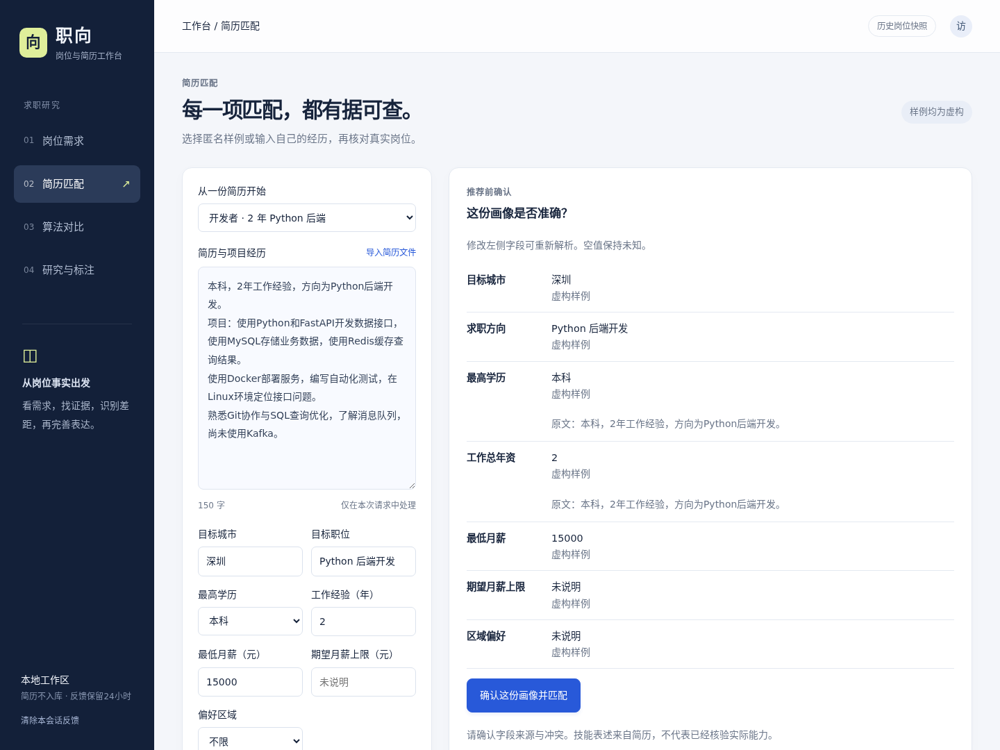
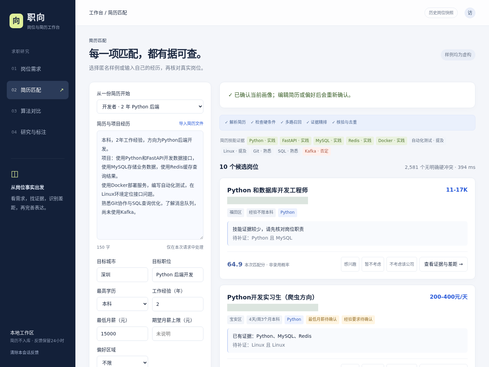
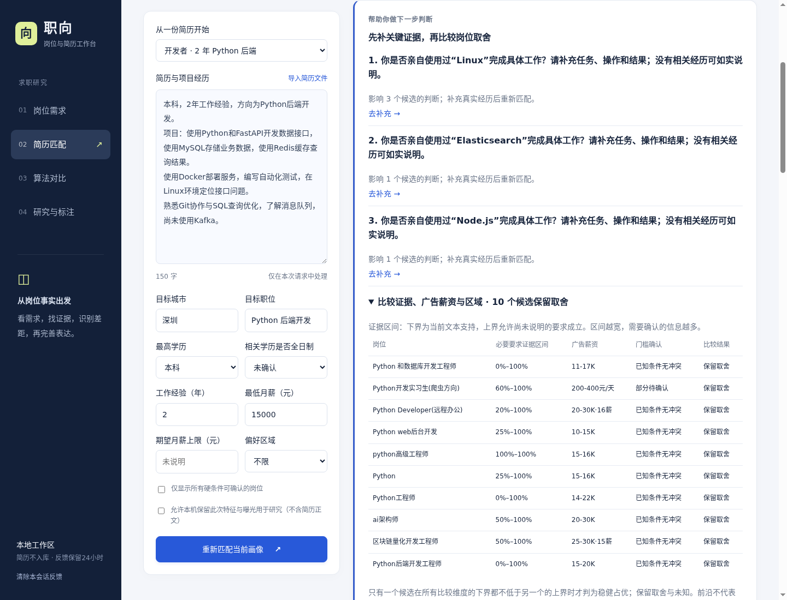
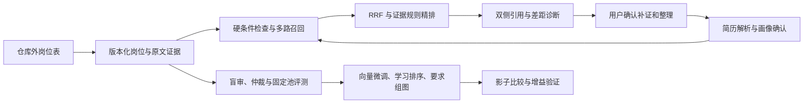

# 职向 · Job Agent

**以岗位需求理解与双侧证据为核心的人岗匹配智能体工作台。**

面向应届生与转岗求职者，结合岗位需求图谱、文本检索与证据约束智能体，提供需求分析、简历匹配、差距诊断和求职材料完善流程。研究部分涵盖领域向量微调、要求组异构图与学习排序，并通过固定候选池和消融实验评估各组件的作用。

[产品流程](#产品流程) · [四项决策改进](#四项决策改进) · [公开数据](data/README.md) · [项目完善内容](#项目完善内容) · [迭代过程](#迭代过程) · [快速运行](#快速运行) · [验证结果与研究进展](#验证结果与研究进展)



## 产品流程

1. **看需求**：按方向查看技能提及、经验、区域与广告薪资分布；未知字段保留未知。
2. **确认画像**：选择内置样例或导入 TXT、文字型 PDF、DOCX；逐字段展示来源与冲突，确认后开始推荐。
3. **检索与核验**：城市、薪资、年资、学历三态检查；BM25＋向量召回、RRF 融合、证据规则精排与公司去重。
4. **补证与整理**：匹配理由定位到简历和 JD 两侧；记录真实经历，经确认后重新匹配。整理器只调整完整经历块顺序。
5. **研究验证**：同一画像对比算法，维护盲审、仲裁、版本冻结与研究记录；未审核标签不自动进入正式训练。





| 证据与差距 | 算法对比 | 研究与标注 | 移动端 |
|---|---|---|---|
| [查看截图](docs/screenshots/04-evidence.png) | [查看截图](docs/screenshots/05-comparison.png) | [查看截图](docs/screenshots/06-research.png) | [查看截图](docs/screenshots/07-mobile.png) |

更多界面与交互说明见 [平台展示](docs/SCREENSHOTS.md)。

## 四项决策改进

结合 Management Science、AEJ: Economic Policy、Nature Human Behaviour、Journal of Labor Economics 的招聘与技能研究，以及 WWW 2025 的交互推荐方法，在检索排序之后增加四项可解释决策能力。完整研究依据、论文出版状态和验证设计见 [招聘痛点与创新设计](docs/HIRING_PAIN_POINTS_AND_INNOVATIONS.md)。

| 改进 | 具体行为 | 页面入口 |
|---|---|---|
| 要求与具体经历对齐 | 区分“Python 写接口＋Excel 清洗”和“Python 清洗”；本人、任务与工具需有对应关系，普通 AND 仍允许跨经历支持 | 岗位详情中的工具—任务对应经历 |
| 按判断影响追问 | 依据本次候选选择学历、总年资、专项年资或具体经历问题；已满足 OR 分支不再追问另一技能 | 推荐结果顶部，点击问题返回相应字段 |
| 保留逻辑的最小补证路线 | `(Python 且 SQL) 或 (Java 且 MySQL)` 保留两条完整路线；补已有证据、学习实践与工具—任务补证分别列出 | 岗位详情中的最小补证路线 |
| 证据区间与候选取舍 | 以必要要求逻辑区间、广告薪资区间和区域偏好比较；未知保持未知，保留高薪与证据之间的取舍 | 推荐结果中的可展开比较表 |

这些能力已经接入推荐与诊断接口，使用 CPU 即可运行。35 维模型特征和原排序基线保留可比口径，新增细粒度证据结论用于诊断与决策展示。逻辑区间表示可解析要求的支持范围；文本支持仍需核对真实经历，广告薪资也不等于个人可获得的工资。

四项方法的固定反例对照可以独立复跑：

```bash
python -m research.evaluate_decision_innovations --output-dir ../job-agent-decision-run
```

输出目录须为新目录。已执行的 [25 例结果与归因](docs/evaluation/decision_innovations/REPORT.md) 已归档。这组对照验证具体错误机制和算法性质；真实人岗排序收益及用户体验需用独立审核数据和用户试验验证。



[查看补证路线界面](docs/screenshots/decision-support/09-actions.png) · [浏览器执行记录](docs/screenshots/decision-support/browser-verification.json)

## 项目完善内容

项目从规则与词向量驱动的推荐原型，逐步完善为包含需求理解、画像确认、检索排序、行动反馈和研究评测的本地平台。

| 方向 | 原有问题 | 本轮完善 |
|---|---|---|
| 数据基础 | 去重口径与职责版本混在一起，原文来源难以回查 | 核对 14,118 条历史岗位内容版本、72 个职类；保留岗位家族、来源摘要、原文字段与跨度，按家族划分研究数据 |
| 需求理解 | 技能词命中难以区分否定、团队背景、必需项和替代项 | 建立岗位—要求组—技能/任务结构，保留嵌套 AND/OR；分别记录原文事实、机器解析与待验证关系 |
| 画像确认 | 样例条件可能残留，编辑简历后旧画像仍可能被使用 | 增加解析预览、字段来源、冲突确认；确认凭据绑定简历、偏好、会话与解析版本 |
| 检索与排序 | 查询偏重技能词，具体项目经历参与不足 | 引入完整经历与项目分块，组合 BM25、向量召回和 RRF；统一 35 维训练/推理特征，提供 LambdaRank 研究入口 |
| 模型研究 | 词向量训练与真实人岗任务衔接不足 | 实现 Qwen 向量 LoRA、多正例学习和核验难负例；构建保留要求组的异构 GNN，并设置池化与随机图对照 |
| 简历完善 | 推荐理由、差距分析和修改操作缺少一致的事实校验 | 关联简历与 JD 双侧证据；以模块化技能组织诊断、补证、经历块整理和面试练习，经用户确认后重新匹配 |
| 可信评测 | 主要依赖 AUC，不同模型的候选和标签口径可能不一致 | 冻结共同查询、候选池与标签版本，增加引用校验、盲审仲裁、对抗样例、标注断点和实验来源检查 |
| 平台交付 | 旧服务与训练入口耦合，可复现性不足 | 建立独立 FastAPI 服务和四个工作台页面，补齐移动端布局、演示数据生成器、自动回归及 GitHub CI |

## 迭代过程

### 1. 审计旧系统，确定优化依据

先核查代码、标签生成、模型元数据与线上调用链。历史最佳验证 AUC **0.5739** 对应 20 维高级 XGBoost，9 维默认模型为 **0.5526**。训练材料主要来自 20 份画像的 3,200 条合成事件，存在标签翻转、画像覆盖有限、事件级切分和训练/线上特征不一致等问题。因此，重构先修数据与评测口径，再开展模型实验。详见 [仓库审计](docs/AUDIT.md)。

### 2. 建立岗位数据与需求图基础

完成字段剖析、薪资与年资解析、内容版本保留、岗位家族划分和原文证据定位，再抽取技能、任务与要求组。当前解析版本形成 **56,778 条岗位—技能提及、4,354 条岗位—任务提及、40,715 个顶层要求组**，用于需求展示和匹配计算；抽取质量另行评估。共现及模型预测关系保留待验证状态。详见 [数据剖析](docs/DATA_PROFILE.md) 和 [当前实现记录](docs/V2_IMPLEMENTATION.md)。

### 3. 完成需求分析到推荐的产品流程

将需求概览、简历导入、画像确认、条件检查、多路召回、证据精排与岗位详情串联到统一工作台。推荐结果同时呈现已有证据、条件未知项与待补证要求；公司排除可以撤销，补证材料经过确认后进入下一轮匹配。简历整理保留完整经历块，并校验日期、年资、角色与成果归属。

### 4. 开展向量与图模型对照实验

完成 Qwen3-Embedding-0.6B 的 **600 步 LoRA 标题检索实验**，开发集 Recall@10 从 **0.6016 提升到 0.7539**。完成 GraphSAGE、简单池化与保度随机图共 **9 组训练**；该代理任务中真实图与随机图没有形成可区分的检索收益。根据实验结果，进一步实现面向人岗对齐的多正例训练和保留要求组的图结构，后续在统一标注池中验证。详见 [向量实验](docs/EMBEDDING_RESULTS.md)、[图模型实验](docs/GRAPH_RESULTS.md) 和 [研究方案](docs/FULL_RESEARCH_PLAN.md)。

### 5. 用反例推动第二轮修正

围绕“应届生勿投”“团队使用某技能”“同技能但不同职责”“经历换序改变年资”等案例复核判断链，修正否定与主体作用域、样例条件残留、项目查询缺失和整理后的事实校验。同步统一查询模板、35 维特征与评测候选池，增加过期凭据、并发补证、缓存重载、引用校验及标注恢复测试。问题与对应实现见 [问题分析](docs/PROBLEM_ANALYSIS_AND_NEXT_STEPS.md) 和 [第二轮实施记录](docs/V2_IMPLEMENTATION.md)。

### 6. 完成复现与发布验证

通过 **183 项 CPU 回归测试**，核对 90 个人岗结果的 3,150 个线上/离线特征值一致性，完成画像确认至算法比较的浏览器流程和移动端检查。整理运行截图、中文文档及仓库外演示数据生成器，并在 GitHub CI 中验证安装与回归流程。当前交付为可运行的本地研究平台；人岗效果验证、多用户服务与公开部署按后续阶段推进。

### 7. 从匹配分数走向证据与行动决策

调研招聘中的信息摩擦、能力信号、技能组合和多目标选择，将具体经历对齐、关键追问、逻辑补证规划与候选取舍接入现有平台。用同技能不同任务、嵌套替代条件、专项年资未知和缺失薪资等反例验证，保持假设回答与确认画像分离。补充全日制字段的确认流程，以及向招聘方核对岗位信息的清单。

## 算法与工程重点

**要求组与经历证据对齐。** 岗位要求保留嵌套 AND/OR、必需/优先、否定和主体信息；简历区分本人实践、技能自述与团队背景。已有 Python 证据可以覆盖“Python 或 Java”，不能因此推导出候选人会 Java。图模型预测的关系不能用作事实引用。

**训练与在线推荐使用统一规范。** 完整经历和项目块参与查询，35 维共享特征覆盖语义、技能、任务、条件与要求组支持程度；编码模型、模板、解析器、池化和数据版本均绑定摘要。学习排序器先进行影子评测，达到验收条件后再接入默认推荐。

**固定共同池的可复核评测。** 人岗向量训练采用多正例对比学习与已审核难负例，未知关系不直接当负例；要求组图与显式逻辑、简单池化、保度随机图作对照。评测固定查询、候选池及标签版本，检查样本完整性。模型弱监督与人工标注分别记录来源和结果。



配置编码器时，服务使用 BM25＋冻结向量＋证据规则；最小演示使用 BM25＋字符 TF-IDF。人岗微调、要求组 GNN 和学习排序的效果在共同标签池完成后统一评估。

## 快速运行

平台已在 **Python 3.11** 验证。仓库现已提供 **14,118 条岗位的公开处理版**，可直接在 CPU 上运行，无需配置模型服务或接口密钥。数据下载、字段和版本说明见 [data/README.md](data/README.md)。

### Linux / macOS

```bash
git clone https://github.com/blues-kun/job-agent.git
cd job-agent
python3.11 -m venv .venv
source .venv/bin/activate
python -m pip install -r requirements-platform.txt

# 使用仓库附带的公开岗位数据。
export JOB_AGENT_DATA="$PWD/data/job_data_public.xlsx"
python -m job_agent --port 8094
```

### Windows PowerShell

```powershell
git clone https://github.com/blues-kun/job-agent.git
cd job-agent
py -3.11 -m venv .venv
.\.venv\Scripts\python.exe -m pip install -r requirements-platform.txt
$env:JOB_AGENT_DATA = Join-Path (Get-Location) "data/job_data_public.xlsx"
.\.venv\Scripts\python.exe -m job_agent --port 8094
```

访问 **http://127.0.0.1:8094**。远程 IDE 需要转发该端口。选择内置简历样例→解析→确认画像→查看推荐。切换自己的授权岗位表时，将 `JOB_AGENT_DATA` 指向仓库外的 XLSX，重启服务加载。

公开文件保留14,118条内容记录；当前Excel加载器按“岗位名＋企业＋薪资”去重后显示14,115条。另有16条合成岗位生成器用于轻量测试：`python -m scripts.create_demo_data --output /仓库外/演示岗位.xlsx`。

向量编码器、本地 Qwen 辅助行动、研究快照、标注恢复与 GPU 训练配置见 [运行手册](docs/V2_RUNBOOK.md)。服务绑定本机，用于单机研究与演示。

## 关键代码

| 能力 | 入口 |
|---|---|
| FastAPI 与画像确认门 | [api.py](job_agent/api.py)、[profiles.py](job_agent/profiles.py) |
| 否定、主体、任务与要求逻辑 | [semantics.py](job_agent/semantics.py)、[domain.py](job_agent/domain.py) |
| BM25、向量与项目块召回 | [corpus.py](job_agent/corpus.py)、[dense.py](job_agent/dense.py)、[retrieval_contract.py](job_agent/retrieval_contract.py) |
| 35 维共享特征与证据排序 | [ranking.py](job_agent/ranking.py)、[workflow.py](job_agent/workflow.py) |
| 经历块与工具—任务证据对齐 | [evidence_alignment.py](job_agent/evidence_alignment.py) |
| 反事实追问、逻辑区间与候选比较 | [decision_support.py](job_agent/decision_support.py) |
| 嵌套要求的最小补证规划 | [action_planner.py](job_agent/action_planner.py) |
| 四项方法的固定反例对照 | [evaluate_decision_innovations.py](research/evaluate_decision_innovations.py) |
| 确认补证与事实保全整理 | [journey.py](job_agent/journey.py)、[coach.py](job_agent/coach.py)、[技能包](skills/) |
| 领域向量、人岗对比微调 | [train_embedding.py](research/train_embedding.py)、[train_person_job_embedding.py](research/train_person_job_embedding.py) |
| 保留要求组的异构图 | [group_graph.py](research/group_graph.py)、[train_group_graph.py](research/train_group_graph.py) |
| LambdaRank 与共同池实验 | [train_ranker.py](research/train_ranker.py)、[run_teacher_experiments.py](research/run_teacher_experiments.py) |
| 接口标注、规则校验与断点 | [api_annotation.py](research/api_annotation.py)、[annotation_supervisor.py](research/annotation_supervisor.py) |
| 盲审、仲裁与可比评测 | [annotation_workflow.py](research/annotation_workflow.py)、[review_contracts.py](research/review_contracts.py)、[score_rankings.py](research/score_rankings.py) |
| 静态前端与回归测试 | [web/platform](web/platform/)、[tests](tests/) |

原 `agent.py`、`search/`、`training/` 等保留作旧系统参考；新版入口为 `python -m job_agent`。旧系统 AUC≈0.57 不能代表当前平台质量，根因审计见 [仓库审计](docs/AUDIT.md)。

## 验证结果与研究进展

| 项目 | 已完成验证 | 能得出的结论 |
|---|---|---|
| 平台 API | 公开数据版 7 个样例场景；211 处双侧引用；9 项画像确认检查 | [实际执行记录](docs/evaluation/decision_platform_20260923.json)，工程路径可运行，引用跨度可回查 |
| 特征一致性 | 90 对样本、3,150 个线上/离线特征值最大差为 0 | 本次回放的训练与推理特征一致 |
| 回归 | 决策改进后 313 项 CPU 测试通过；核心实现阶段另有 37 项模型测试及 8 个子测试通过 | [新增实现与验收](docs/HIRING_PAIN_POINTS_AND_INNOVATIONS.md)，模型测试不等于推荐效果评测 |
| 决策机制 | 25 个固定反例符合预期；768 个小布尔树×画像组合通过独立穷举核验 | 指定范围内的关系对齐、逻辑规划与比较性质成立；真实用户收益待验证 |
| 标题检索微调 | Qwen3-Embedding-0.6B LoRA，600 步；开发 Recall@10 0.6016→0.7539 | [标题检索实验](docs/EMBEDDING_RESULTS.md)；人岗匹配效果需独立评估 |
| 图模型对照 | 三模式×三种子；真实边与随机边检索表现相同 | [实验结果与改进依据](docs/GRAPH_RESULTS.md)；保留要求组的新图进入下一阶段验证 |
| 可信评测 | 固定池完整性校验、规则/模型双通道、对抗测试 | 独立人工金标待建立；评测器判别力问题见[分析报告](docs/EVALUATOR_RESULTS.md) |

接口标注已接入引用校验、共享限流暂停与断点恢复。完整共同池的标注、仲裁与冻结仍在推进；人岗 LoRA、要求组 GNN 与学习排序的比较代码已实现，正式效果结果待该流程完成后生成。阶段记录见 [实施报告](docs/V2_IMPLEMENTATION.md)，运行进度由研究工作台展示。

评测维度覆盖相关性与召回、硬条件准确性、引用支持、需求逻辑、技能匹配、幻觉、追问校准、事实保全、建议可操作性、多样性、鲁棒性及成本。研究方案、参数和消融设计见 [FULL_RESEARCH_PLAN.md](docs/FULL_RESEARCH_PLAN.md)，当前实现和限制见 [V2_IMPLEMENTATION.md](docs/V2_IMPLEMENTATION.md)。

## 数据与复现

- [公开岗位数据](data/README.md)提供14,118条经过信息清理的历史记录，含Excel、压缩CSV与校验清单；实际规模约1.4万条，不按多种文件格式重复计数。
- 内置简历和可选的16条演示岗位是用于功能验证的合成样例，不包含真实求职者身份，也不作为人工金标。
- 原始Excel、企业映射、用户简历、反馈日志、接口配置和模型权重继续保留在本地。本次公开的是单独导出并复核的数据版本，旧Git历史未改写。
- 岗位来自历史快照，没有可靠的招聘有效状态和采集时间字段；系统用于需求研究与匹配辅助，不能承诺岗位当前在招。
- 完整简历默认不落库；用户主动保存的单条补证材料有确认步骤和有效期。数据使用须取得相应授权。
- [数据剖析](docs/DATA_PROFILE.md)记录了研究原表的来源、字段与统计口径；公开版清理会改变原文跨度和内容摘要，复现实验须重新校验数据快照、索引、标签与划分版本。

CPU 回归命令：

```bash
python -m pip install -r requirements-research.txt pytest
python -m pytest -q tests \
  --ignore=tests/test_research_generation.py \
  --ignore=tests/test_research_graph.py \
  --ignore=tests/test_research_embedding.py \
  --ignore=tests/test_models_v2.py \
  --ignore=tests/test_prepare_group_vectors.py
```

该组测试使用受控样例；GPU 模型测试与实际训练分别按研究手册运行。界面截图可通过 `scripts/capture_screenshots.py` 复采，[清单](docs/screenshots/manifest.json)记录采集环境与文件摘要。
