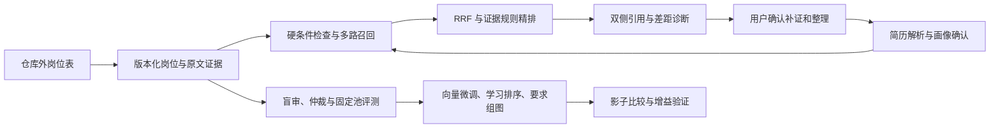

# 职向 · Job Agent

**以岗位需求理解与双侧证据为核心的人岗匹配智能体工作台。**

面向应届生与转岗求职者，先分析岗位需求，再带入简历、确认画像、检索候选、核对差距，最后将补证与表达整理带回下一次匹配。项目同时提供领域向量微调、要求组异构图、学习排序和固定候选池评测代码，用可复核实验检验模型是否真的改善推荐。

[快速运行](#快速运行) · [关键代码](#关键代码) · [实测与边界](#实测与边界) · [完整研究方案](docs/FULL_RESEARCH_PLAN.md) · [运行手册](docs/V2_RUNBOOK.md)


截图于 **2026-09-22** 从本机实际服务采集，使用完全虚构简历；岗位分析来自已有的 **14,118 条历史岗位内容版本、72 个职类**，企业名在推荐和详情截图中已遮罩。原表不随代码发布；下方演示命令使用另行手写的虚构岗位，因此数字和截图不同。

## 产品流程

1. **看需求**：按方向查看技能提及、经验、区域与广告薪资分布；未知字段保留未知。
2. **确认画像**：选择虚构样例或导入 TXT、文字型 PDF、DOCX；逐字段展示来源与冲突，确认后才推荐。
3. **检索与核验**：城市、薪资、年资、学历三态检查；BM25＋向量召回、RRF 融合、证据规则精排与公司去重。
4. **补证与整理**：匹配理由定位到简历和 JD 两侧；记录真实经历，经确认后重新匹配。整理器只调整完整经历块顺序。
5. **研究验证**：同一画像对比算法，维护盲审、仲裁、版本冻结与研究记录；未审核标签不自动进入正式训练。


| 证据与差距 | 算法对比 | 研究与标注 | 移动端 |
|---|---|---|---|
| [查看截图](docs/screenshots/04-evidence.png) | [查看截图](docs/screenshots/05-comparison.png) | [查看截图](docs/screenshots/06-research.png) | [查看截图](docs/screenshots/07-mobile.png) |

完整操作、采集方式与验收记录见 [运行截图说明](docs/SCREENSHOTS.md)。

## 算法与工程重点

**要求组与经历证据对齐。** 岗位要求保留嵌套 AND/OR、必需/优先、否定和主体信息；简历区分本人实践、技能自述与团队背景。已有 Python 证据可以覆盖“Python 或 Java”，不能因此推导出候选人会 Java。图模型预测的关系不能用作事实引用。

**训练与在线推荐共用合同。** 完整经历和项目块参与查询，35 维共享特征覆盖语义、技能、任务、条件与要求组支持程度；编码模型、模板、解析器、池化和数据版本均绑定摘要。排序器默认作为影子实验，不能凭训练完成自动上线。

**固定共同池的可复核评测。** 向量微调采用多正例对比学习与已审核难负例，未知关系不直接当负例；要求组图与显式逻辑、简单池化、保度随机图作对照。评测固定查询、候选池及标签版本，拒绝缺项或更换分母后的比较。接口模型标注明确标为弱监督，不冒充双人人工金标。



默认服务使用 BM25＋冻结向量＋证据规则；未配置编码器时，明确回退 BM25＋字符 TF-IDF。人岗微调、要求组 GNN 和学习排序的正式增益仍待共同标签池完成后验证。

## 快速运行

平台已在 **Python 3.11** 验证。最小演示不需要 GPU、模型权重、接口密钥或真实简历。

### Linux / macOS

```bash
git clone https://github.com/blues-kun/job-agent.git
cd job-agent
python3.11 -m venv .venv
source .venv/bin/activate
python -m pip install -r requirements-platform.txt

# 仅生成手写虚构岗位；输出必须在仓库外，已有文件不会覆盖。
python -m scripts.create_demo_data --output "$HOME/.cache/job-agent-demo/jobs.xlsx"
export JOB_AGENT_DATA="$HOME/.cache/job-agent-demo/jobs.xlsx"
python -m job_agent --port 8094
```

### Windows PowerShell

```powershell
git clone https://github.com/blues-kun/job-agent.git
cd job-agent
py -3.11 -m venv .venv
.\.venv\Scripts\python.exe -m pip install -r requirements-platform.txt
$env:JOB_AGENT_DATA = Join-Path $env:LOCALAPPDATA "job-agent-demo\jobs.xlsx"
.\.venv\Scripts\python.exe -m scripts.create_demo_data --output $env:JOB_AGENT_DATA
.\.venv\Scripts\python.exe -m job_agent --port 8094
```

访问 **http://127.0.0.1:8094**。远程 IDE 需要转发该端口。选择虚构简历→解析→确认画像→查看推荐。需要切换自己的授权岗位表时，将 `JOB_AGENT_DATA` 指向仓库外的 XLSX；没有原表时不会静默替换成演示数据。

真实编码器、本地 Qwen 辅助行动、研究快照、标注恢复与 GPU 训练配置见 [第二轮运行手册](docs/V2_RUNBOOK.md)。服务绑定本机，目前用于单机研究与演示。

## 关键代码

| 能力 | 入口 |
|---|---|
| FastAPI 与画像确认门 | [api.py](job_agent/api.py)、[profiles.py](job_agent/profiles.py) |
| 否定、主体、任务与要求逻辑 | [semantics.py](job_agent/semantics.py)、[domain.py](job_agent/domain.py) |
| BM25、向量与项目块召回 | [corpus.py](job_agent/corpus.py)、[dense.py](job_agent/dense.py)、[retrieval_contract.py](job_agent/retrieval_contract.py) |
| 35 维共享特征与证据排序 | [ranking.py](job_agent/ranking.py)、[workflow.py](job_agent/workflow.py) |
| 确认补证与事实保全整理 | [journey.py](job_agent/journey.py)、[coach.py](job_agent/coach.py)、[技能包](skills/) |
| 领域向量、人岗对比微调 | [train_embedding.py](research/train_embedding.py)、[train_person_job_embedding.py](research/train_person_job_embedding.py) |
| 保留要求组的异构图 | [group_graph.py](research/group_graph.py)、[train_group_graph.py](research/train_group_graph.py) |
| LambdaRank 与共同池实验 | [train_ranker.py](research/train_ranker.py)、[run_teacher_experiments.py](research/run_teacher_experiments.py) |
| 接口标注、规则校验与断点 | [api_annotation.py](research/api_annotation.py)、[annotation_supervisor.py](research/annotation_supervisor.py) |
| 盲审、仲裁与可比评测 | [annotation_workflow.py](research/annotation_workflow.py)、[review_contracts.py](research/review_contracts.py)、[score_rankings.py](research/score_rankings.py) |
| 静态前端与回归测试 | [web/platform](web/platform/)、[tests](tests/) |

原 `agent.py`、`search/`、`training/` 等保留作旧系统参考；新版入口为 `python -m job_agent`。旧系统 AUC≈0.57 不能代表当前平台质量，根因审计见 [仓库审计](docs/AUDIT.md)。

## 实测与边界

| 项目 | 已完成验证 | 能得出的结论 |
|---|---|---|
| 平台 API | 7 份虚构简历；190 处双侧引用；9 项确认门检查 | 工程路径可运行，引用跨度可回查 |
| 特征一致性 | 90 对样本、3,150 个线上/离线特征值最大差为 0 | 本次回放的训练与推理特征一致 |
| 回归 | 本次发布 183 项 CPU 测试通过；核心实现阶段另有 37 项模型测试及 8 个子测试通过 | [实现与验收记录](docs/V2_IMPLEMENTATION.md)，模型测试不等于推荐效果评测 |
| 标题代理微调 | Qwen3-Embedding-0.6B LoRA，600 步；开发 Recall@10 0.6016→0.7539 | [标题检索收益](docs/EMBEDDING_RESULTS.md)，不能当作真实人岗收益 |
| 历史图模型实验 | 三模式×三种子；真实边与随机边检索表现相同 | [当前没有图结构增益证据](docs/GRAPH_RESULTS.md) |
| 可信评测 | 固定池与完整性门禁、规则/模型双通道、对抗夹具 | 人工金标仍为 0；旧评测器判别力失败也[公开记录](docs/EVALUATOR_RESULTS.md) |

本次公开截图时，指定接口模型 `gpt-5.6-terra / max` 保留 **98/493** 个人岗结果与 **38/120** 个抽取结果，严格校验通过分别为 **75、37**；遇到 HTTP 429 会暂停并保留断点。这些是阶段状态，正式人岗模型胜负表尚未生成，后续状态以实际研究产物为准。

评测维度覆盖相关性与召回、硬条件准确性、引用支持、需求逻辑、技能匹配、幻觉、追问校准、事实保全、建议可操作性、多样性、鲁棒性及成本。研究方案、参数和消融设计见 [FULL_RESEARCH_PLAN.md](docs/FULL_RESEARCH_PLAN.md)，当前实现和限制见 [V2_IMPLEMENTATION.md](docs/V2_IMPLEMENTATION.md)。

## 数据与复现

- 原始 Excel、派生岗位行、真实简历、反馈日志、接口配置和模型权重不随本次代码发布；旧版本曾跟踪的数据已从当前版本索引移除，本地文件保留，Git 历史未改写。
- 岗位来自历史快照，没有可靠的招聘有效状态和采集时间字段；系统用于需求研究与匹配辅助，不能承诺岗位当前在招。
- 完整简历默认不落库；用户主动保存的单条补证材料有确认步骤和有效期。数据使用须取得相应授权。
- [数据剖析](docs/DATA_PROFILE.md)基于本环境可访问的既有原表，不能与不可访问的外部 Windows `merged_data.xlsx` 混称。虚构演示不复现真实库统计或模型质量指标。

CPU 回归命令：

```bash
python -m pip install -r requirements-research.txt pytest
python -m pytest -q tests \
  --ignore=tests/test_research_generation.py \
  --ignore=tests/test_research_graph.py \
  --ignore=tests/test_research_embedding.py \
  --ignore=tests/test_models_v2.py \
  --ignore=tests/test_prepare_group_vectors.py
```

该组测试使用虚构数据；GPU 模型测试与实际训练分别按研究手册运行。公开截图可通过 `scripts/capture_screenshots.py` 在本机复采，[清单](docs/screenshots/manifest.json)记录时间、尺寸、健康状态和文件摘要。
