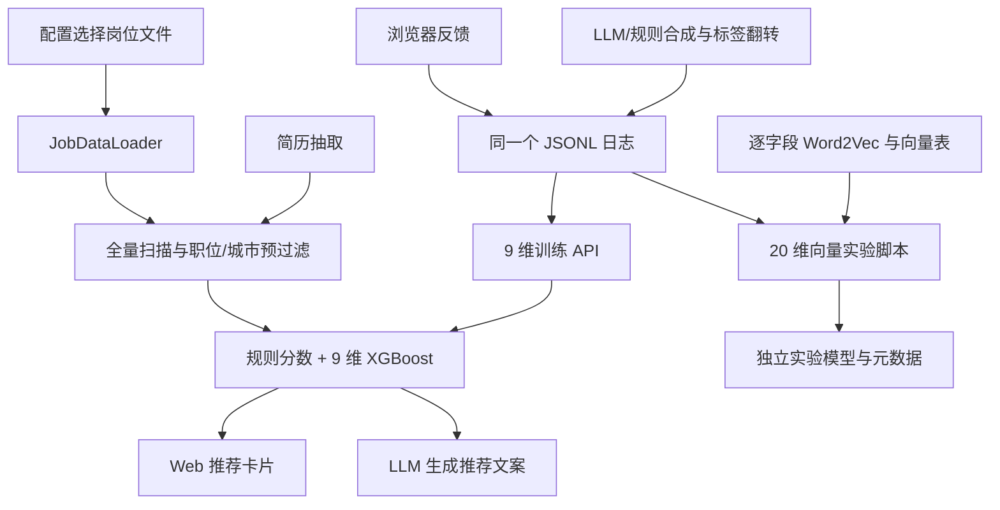

# 现有仓库审计报告

审计日期：2026-09-20。审计对象：本地 `/storage/xukunbo2/job-agent`，审计开始时版本为 `0074035`，工作区无已有未提交变更。实际环境是 Linux / Bash / Python 3.11.5，并非任务描述中的 Windows。未发现适用的 `AGENTS.md`。本报告只新增文档；未修改业务代码、数据、模型或 Git 配置，未执行提交、推送。

## 一、核心判断

项目适合作为学习型原型：已串起结构化简历、规则筛选、模型打分、推荐展示、用户反馈和训练入口。但目前尚不具备可信的推荐实验闭环，主要阻碍是**标签污染、失效的向量特征、训练与服务分叉，以及无法追溯的评测口径**。单纯更换更大的模型或增加训练轮数不能解决这些问题。

首先纠正一个关键数字：**0.5739 是 20 维高级 XGBoost 在训练过程中出现过的最佳验证 AUC，不是当前线上 9 维模型的 AUC，也不是该高级模型最终落盘时的验证 AUC。** 当前元数据中，线上 9 维模型验证 AUC 为 **0.552620**；高级版末轮为 **0.549053**。这些是仓库保存的历史记录，本次没有重训，不能视为独立复现结果。

优先级定义：P0 为阻断可信数据流、功能或实验结论的问题；P1 为 MVP 上线前需要处理的问题；P2 为之后的维护与扩展问题。

## 二、真实架构与模块覆盖

当前实际存在数条并行路线，并非一套统一的“Word2Vec + XGBoost + Agent”流水线。



| 已审模块 | 当前实现与结论 | 建议 |
|---|---|---|
| `agent.py`、`main.py` | 定义 LangChain Agent，但 CLI 又自行 `bind_tools` 并执行工具循环；Web 不走该 Agent。工具循环无轮数上限，默认推荐参数存在属性错误 | 保留工具能力名称与交互意图，重写统一的应用服务编排 |
| `config.py` | 环境变量密钥方式正确；岗位文件优先级、模型路径与模块级默认值散落，部分依赖当前工作目录 | 迁移环境变量约定，改为经验证的集中配置 |
| `models.py` | Pydantic 简历骨架有价值；缺少稳定岗位 ID、技能证据、缺失/推断状态、抽取置信度、版本；薪资/经验没有非负约束 | 扩展为带来源与状态的业务数据模型 |
| `search/matcher.py` | 全库扫描；职位类别和城市在排序前截断召回；没有 BM25/向量索引/多路召回 | 重写召回层 |
| `search/scorer.py` | 规则加权分与 XGB 概率乘 5 混合；经验、学历、薪资只是加分，并非硬约束；异常静默降级 | 保留规则作为显式基线，重写候选资格校验及排序 |
| `search/scorer_xgb.py` | 使用 9 维提取器；每个岗位重新加载 Booster | 改为常驻模型、批量推理、特征版本校验 |
| `search/scorer_vectorized.py` | 使用独立 20 维提取器，但不是 `JobMatcher` 默认路径；读取通用 `model_meta.json`，每次评分加载向量器 | 不直接迁移，实现统一模型接口 |
| `similarity/` | 正则切连续中文串，Jaccard + 词频余弦；不是中文语义向量召回 | 留作固定旧基线，另建中文分词与语义检索 |
| `features/extractor.py` | 9 维规则/词面特征，含确定性冗余；经验解析抓任意首个数字 | 重写统一特征服务 |
| `features/vectorized_extractor.py` | 标称 20 维，三个简历语义相似度存在恒零路径，薪资 API 不匹配 | 原实现不用于新训练 |
| `resume_extract/` | JSON 抽取与深度合并有参考价值，但 prompt 强制填默认城市/学历/薪资，文本备用路径也补造画像 | 保留接口构想，重写抽取约束和持久化 |
| `training/` | 已覆盖所有训练脚本、工具、API、模型管理；重复加载/匹配逻辑多，无独立测试集、分组评测或数据血缘 | 统一训练 CLI、数据集契约、模型登记与评估 |
| `data_preprocess/` | 全部模块已审；薪资、地址有规则基础，但 API、字段名和空值含义不一致；包初始化强制导入重依赖 | 迁移经过测试的规则，重写规范化管道 |
| `preprocess_job_data.py` | 输出 CSV/Parquet 与元数据的方向正确，实际调用不存在的薪资接口；已有向量模型按存在与否复用，无语料版本判断 | 保留 Parquet 和元数据思想，重写可复跑管道 |
| `web/unified_server.py`、`web/app.js` | 展示、反馈和补问流程可迁移；重复推荐事件处理器、同步阻塞服务、日志隐私与反馈 ID 问题 | 保留页面资产与交互，用统一 API 替换业务逻辑 |
| `requirements.txt`、CI、测试 | 依赖大多只有下限、无锁定；CI 仅编译与两个仓库卫生测试，不能发现当前运行时问题 | 建独立环境、锁依赖，增加业务契约与端到端验收 |

核心入口证据：[`main.py:149`](../main.py#L149)、[`agent.py:48`](../agent.py#L48)、[`web/unified_server.py:222`](../web/unified_server.py#L222)、[`search/matcher.py:47`](../search/matcher.py#L47)。

## 三、AUC 与训练数据：先统一事实口径

### 3.1 仓库保存的指标

下表来自 JSON 元数据，而非展示页面，也不是本次新实验。小数保留六位。

| 产物/路线 | 特征维数 | 训练样本/验证样本 | 训练 AUC | 验证 AUC | 备注 |
|---|---:|---:|---:|---:|---|
| `xgb_model.json` / `model_meta.json` | 9 | 2,567 / 642 | 0.949436 | 0.552620 | 默认线上模型；样本总数 3,209，切分数量由混淆矩阵求和 |
| `xgb_model_optimized.json` | 20 | 2,560 / 640 | 0.726295 | 0.567402 | 保存模型的目标实际为 `reg:squarederror` |
| `xgb_model_advanced.json` 末轮 | 20 | 元数据未单列；关联实验为 3,200 总样本 | 0.831023 | 0.549053 | 350 轮，多阶段训练 |
| 高级版训练历史最高值 | 20 | 同一高级版验证集 | — | **0.573901** | `best_val_auc`；不是最终保存结果 |
| MLP | 20 | 2,560 / 640 | 0.601469 | 0.570166 | README 的 0.5482 与该元数据不一致 |
| CNN | 20 | 2,560 / 640 | 0.582222 | 0.553696 | 输入是表格特征，而非原始 JD 文本序列 |
| LSTM | 20 | 2,560 / 640 | 0.515068 | 0.504414 | 20 个特征被作为时间步，缺乏自然序列意义 |

证据：[`models/model_meta.json:15`](../models/model_meta.json#L15)、[`models/xgb_advanced_meta.json:22`](../models/xgb_advanced_meta.json#L22)、[`models/xgb_advanced_meta.json:52`](../models/xgb_advanced_meta.json#L52)、[`models/xgb_optimized_meta.json`](../models/xgb_optimized_meta.json)、[`models/mlp_meta.json`](../models/mlp_meta.json)、[`models/cnn_meta.json`](../models/cnn_meta.json)、[`models/lstm_meta.json`](../models/lstm_meta.json)。

不能将高级版的“全训练过程最佳值”与另一模型的“末轮值”混在同一排行榜，也不能将不同数据快照下的 MLP 数字直接作百分比提升结论。README 关于模型稳定性等断言没有对应的多随机种子原始运行记录，尚不能复核。相关位置：[`README.md:324`](../README.md#L324)。

### 3.2 当前日志的只读聚合

| 指标 | 实际值 |
|---|---:|
| JSONL 非空记录 | 3,209 |
| `type=cold_start` | 3,200（99.72%） |
| `type=feedback` | 9（0.28%） |
| 全体 like / skip | 1,601 / 1,608 |
| 合成 like / skip | 1,600 / 1,600 |
| 反馈 like / skip | 1 / 8 |
| 全字段标准化 JSON 后的唯一简历 | 21 |
| 合成唯一简历 / 反馈唯一简历 | 20 / 1 |
| 全字段标准化 JSON 后的唯一岗位对象 | 2,867 |
| 有显式 `label` 字段 | 0 |
| 有持久化 `id` 字段 | 0 |
| 不同时间戳 | 10 |
| 完全相同简历与岗位对的重复额外行 / 冲突标签对 | 0 / 0 |

“3,209 样本”不是 3,209 名独立真实用户。有效用户多样性主要只有 20 份合成简历，用户反馈仅来自 1 份画像。没有推荐曝光 ID、候选池版本、展示位置、模型版本、点击原因等记录，无法估计展示偏差，也无法验证“跳过”是否意味着不相关。

### 3.3 AUC 低的根因：按证据强弱排序

**P0，直接观察：标签被人为随机翻转。** `logs/generate_realistic_samples.py:349-369` 为把总体比例拉到约 50/50，直接把部分 `skip` 改成 `like`，或反向修改，不再依据真实匹配关系。LLM 失败时的备用路径还会以 20% 概率翻转分类结果（第 316-321 行）。这与重采样或类别权重不同，会直接破坏监督信号。当前合成日志恰好为 1,600/1,600，与该生成逻辑相符；但日志没有保存翻转前标签、LLM 原响应和生成运行 ID，因此**无法恢复每一条标签究竟被哪个分支生成或翻转，也无法给出准确污染比例**。

**P0，直接观察：标签与真实能力没有充分联系。** LLM 标注 prompt 给出了期望职位、城市、薪资、学历、工作年限和短岗位要求，却没有给完整简历正文或完整岗位职责，无法依据项目证据判断能力匹配；还指示不同情形下以 75%/10% 等概率表达兴趣（[`logs/generate_realistic_samples.py:171`](../logs/generate_realistic_samples.py#L171)）。简历首先从随机抽到的职类生成，并非根据真实 JD 反推；多个期望职类可以彼此不一致（第 101-151 行）。它学到的主要是合成偏好和噪声，不是实际 person-job fit。

**P0，直接观察：向量实验的简历向量恒零。** 向量器只加载 `岗位名称`、`岗位职责`、`岗位要求` 三个模型（[`features/vectorized_extractor.py:37`](../features/vectorized_extractor.py#L37)）；代码却检查未加载的 `full_resume` 模型，没有它就调用 `_simple_text_vector`，而该函数直接返回全零数组（第 140-159、183-186 行）。于是正常加载岗位模型时，三个 `resume_*_sim` 都为 0。即便补一个独立训练的简历 Word2Vec，也不能直接与另外三个独立训练的坐标空间计算有意义的跨空间余弦。需要使用同一个共享文本编码器，或有监督对齐的双塔。

**P1，直接观察与合理推断：9 维中语义信息有限。** 常规线上模型有 `text_sim/jaccard/cosine_cnt/title_intent/location_match/salary_ratio/salary_negotiable/education_match/experience_ratio` 九项；`text_sim` 是两项相似度的均值，经舍入后几乎完全冗余。正则把连续中文看成整段 token，中文改写几乎没有词级共享；没有技能熟练度、项目证据、职级或通勤信息。经验特征取岗位要求中任意首个数字，可能把编号或“985”当作经验年限。证据：[`features/extractor.py:43`](../features/extractor.py#L43)、[`similarity/text.py:14`](../similarity/text.py#L14)、[`similarity/engine.py:11`](../similarity/engine.py#L11)。

只读运行当前 9 维提取逻辑得到 3,204 个不同特征向量；`title_intent=0` 有 2,860/3,209 条，`location_match=0` 有 766 条，`salary_ratio=0` 有 117 条。三个词面相似度全为零的记录为 49 条。**这说明不能简单写成“特征全是常数”**；问题是特征语义弱、部分解析错误与标签噪声的组合。

**P1，直接观察：样本切分与业务目标不匹配。** `training/training_utils.py:102`、`train_xgb_advanced.py:292` 等对“简历—岗位行”随机分层 80/20，未按简历或岗位簇隔离。相同合成简历可以出现在训练和验证两侧，不能估计新用户泛化。此类泄漏通常使验证过于乐观，**不是低 AUC 的解释**；它说明在宽松口径下仍很低，更应先修数据。当前没有独立测试集、按用户 nDCG/Recall、置信区间及反馈来源分层评测。

**P1，元数据观察：过拟合明显，调参不能替代新监督。** 9 维模型训练 AUC 0.9494、验证 0.5526，差距约 0.397；高级版从历史最好 0.5739 下降到末轮 0.5491。存在过拟合迹象，但不能从单个保存结果精确分摊“样本量、特征、标签”各自损失了多少。必须使用清洁标注集，依次做去标签翻转、修特征、分组切分的消融实验。

**P1，直接观察：训练是二分类而非按查询学习排序。** 多数 XGB 代码使用 `binary:logistic`，没有 query group 和 listwise/pairwise 目标（例如 [`training/train_xgb.py:138`](../training/train_xgb.py#L138)）。全局 AUC 衡量随机正负样本区分，不等价于同一求职者 top10 推荐质量；把 AUC 当项目唯一成效指标会掩盖召回失败、硬条件不符和伪造理由。

## 四、可复现性与运行时阻断

| 优先级 | 问题与实际后果 | 代码证据 |
|---|---|---|
| P0 | `SalaryNormalizer` 只有 `normalize_to_annual`，大量调用却是不存在的 `normalize`；返回键是 `type`，调用方读取 `salary_type`。当前预处理、合成规则标签、向量特征流水线不能按原代码完整复跑 | [`salary_normalizer.py:13`](../data_preprocess/salary_normalizer.py#L13)、[`preprocess_job_data.py:51`](../preprocess_job_data.py#L51)、[`data_processor.py:88`](../data_preprocess/data_processor.py#L88)、[`vectorized_extractor.py:87`](../features/vectorized_extractor.py#L87)、[`generate_training_data.py:129`](../training/generate_training_data.py#L129) |
| P0 | `training/train_xgb.py` 和 `train_vectorized_xgb.py` 只读 `label`、缺失置 0。当前 3,209 条全用 `action`，按该入口读取会变成 3,209 个负例；训练 API 的 `training_utils` 才同时支持两种模式 | [`train_xgb.py:27`](../training/train_xgb.py#L27)、[`train_vectorized_xgb.py:52`](../training/train_vectorized_xgb.py#L52)、[`training_utils.py:40`](../training/training_utils.py#L40) |
| P0 | `agent.find_job()` 未指定 limit 时读取不存在的 `MatchConfig.DEFAULT_RECOMMENDATION_COUNT`。默认值实际上在模块级，默认工具调用会报属性错误 | [`agent.py:123`](../agent.py#L123)、[`config.py:67`](../config.py#L67) |
| P1 | 优化版搜索时临时加入分类目标与 AUC，返回参数时丢掉这两项；最终训练直接使用不含这两项的参数。保存的模型 JSON 的目标确为 `reg:squarederror`，`best_score=0.495058...`，代码却把它打印为“最佳验证 AUC” | [`train_xgb_optimized.py:212`](../training/train_xgb_optimized.py#L212)、[`train_xgb_optimized.py:253`](../training/train_xgb_optimized.py#L253)、[`train_xgb_optimized.py:268`](../training/train_xgb_optimized.py#L268) |
| P1 | 高级版虽记历史最大 AUC，但未保存该时刻 checkpoint；阶段训练没有 early stopping，最后保存末轮。README 的“早停”说明与此实现不符 | [`train_xgb_advanced.py:78`](../training/train_xgb_advanced.py#L78)、[`train_xgb_advanced.py:359`](../training/train_xgb_advanced.py#L359)、[`README.md:319`](../README.md#L319) |
| P1 | 多个训练器覆盖同一个 `xgb_model.json`，9 维与 20 维模型共用名字和多种元数据格式；线上仍固定用 9 维，维度或特征名不一致异常被吞掉，用户只得到规则分数 | [`train_vectorized_xgb.py:166`](../training/train_vectorized_xgb.py#L166)、[`model_manager.py:17`](../training/model_manager.py#L17)、[`search/scorer.py:244`](../search/scorer.py#L244) |
| P1 | 当前 20 维提取器读取字段正文重新计算，未使用向量表中保存的 300 个逐维特征；“预计算向量表用于训练”的成本没有转化为实际使用 | [`train_with_vectorized_data.py:150`](../training/train_with_vectorized_data.py#L150)、[`vectorized_extractor.py:149`](../features/vectorized_extractor.py#L149) |
| P2 | 训练脚本以职位名+公司遍历匹配，返回首个同名岗位；多地点/多薪资职位容易关联错，时间复杂度高。构造 `_job_key` 后又不直接查询 | [`train_with_vectorized_data.py:126`](../training/train_with_vectorized_data.py#L126)、[`train_xgb_optimized.py:85`](../training/train_xgb_optimized.py#L85) |

历史模型元数据存在，并不代表当前源码可以复现它。缺少依赖锁文件、训练数据散列、提取器版本、运行命令、随机状态和真实训练日志，无法确定“当时能跑的版本”与现在代码的对应关系。新实验应保存这些血缘，旧结果一律标作历史参考。

## 五、数据流与产品行为问题

### 5.1 输入、规范化与硬条件

`config.py:29-39` 只优先根目录 `岗位数据.jsonl` / `岗位数据.csv`，否则读取 `data/job_data.xlsx`；并未优先选取现有 `data/job_data.jsonl`。CSV、嵌套 JSONL、Excel 和向量化表没有统一的版本与字段契约。

`JobDataLoader._load_jsonl` 将年薪除以 12,000 后向下取整，重新拼成 K 月薪字符串，丢失原始发薪月数和精度，再由评分器解析回来；职责、要求等字段又被扁平化，来源定位没有保留。`JobDataProcessor.save_processed_data(..., format='jsonl')` 输出的是扁平记录，而该加载器期待嵌套记录，二者不能直接往返。证据：[`loader.py:71`](../data_preprocess/loader.py#L71)、[`loader.py:87`](../data_preprocess/loader.py#L87)、[`data_processor.py:193`](../data_preprocess/data_processor.py#L193)。

薪资规则存在明显口径分歧。以下为人工构造的非隐私字符串、通过原函数只读运行所得：

| 输入 | 常规评分器 `DataCleaner` | `normalize_to_annual` | 判定 |
|---|---|---|---|
| `15-25K·14薪` | 年薪 21–35 万 | 年薪 21–35 万 | 一致 |
| `2.5-3.5K` | 无法解析 | 年薪 3–4.2 万 | 小数 K 在两路线不一致 |
| `10K-15K` | 年薪 12–18 万 | 年薪 12–12 万 | 标准化器丢失上界 |
| `1-2万/月` | 无法解析 | 当成全年 1–2 万 | 标准化器混淆月薪与年薪 |
| `200-300元/天` | 无法解析 | 按 250 天换算为 5–7.5 万 | 250 天只是推算，不能冒充明确年包 |
| `面议` | 未知 | `negotiable` | 应保留未知，不能自动通过或拒绝薪资条件 |

地址处理对空地址和未知地址默认填“深圳”，`_process_location` 还会覆盖原有城市；这会将“未知”伪装成“同城”。证据：[`location_processor.py:122`](../data_preprocess/location_processor.py#L122)、[`data_processor.py:117`](../data_preprocess/data_processor.py#L117)。

现有 `matcher` 只硬过滤职类与城市；薪资、经验、学历未达标的岗位仍可因为其他加分进入推荐。`scorer.py:135` 仅比较岗位薪资上界是否够到个人底线，不检查区间重叠和发薪周期。职类的过早截断又会漏掉相邻职类和转行候选。新方案应区分用户明确的硬条件、用户偏好、岗位明确门槛、未知字段，不把低置信抽取直接当硬规则。

### 5.2 简历抽取与优化闭环

`ResumeExtractor` 把职类列表截到前 50 项；缺城市默认北京、缺学历默认本科、薪资按经验猜测，且要求任何字段不得为空（[`extractor.py:67`](../resume_extract/extractor.py#L67)、[`extractor.py:79`](../resume_extract/extractor.py#L79)、[`extractor.py:104`](../resume_extract/extractor.py#L104)）。这会制造不存在的硬条件，与深圳应届生场景尤其冲突。`full_resume_text` 也交给 LLM 回传，未强制恢复为原始输入，不保证逐字保真。

`ResumeStorage` 的 TXT 备用解析默认上海、Java、30 万、3 年，且 `exp or 3.0` 会把真实 0 年变成 3 年（[`storage.py:74`](../resume_extract/storage.py#L74)）。结构化画像缺少技能项及项目证据，更谈不上确定“了解/熟悉/精通”的级别差异。

Web 已有缺城市/目标职类/薪资时追问的结构，值得保留（[`unified_server.py:205`](../web/unified_server.py#L205)）。但抽取器预先填默认值后会绕过这些检测；`resume_enhance` 又把 `is_complete` 直接交给 LLM，返回画像未做最终 schema 验证（第 306-327 行）。当前模块是“补齐资料”，尚不是带证据的差距分析、可控简历改写与重新匹配闭环。

### 5.3 推荐理由与多入口不一致

Web 文案生成只传候选列表及规则理由，未显式传简历证据、要求每个主张引用字段、验证岗位 ID 或检查输出主张（[`unified_server.py:243`](../web/unified_server.py#L243)）。现有句子即使真实，也不能定位到原始数据版本和文本片段。CLI 与 Web 的逻辑分离，导致同一输入可能进入不同路径。

前端 `runBtn` 在 `app.js:20` 和第 51 行各注册了一次点击处理器；第一次立即推荐，第二次尝试完善简历后再推荐。一次点击可能发起重复请求，并绕过第二个处理器希望建立的信息收集前置条件。前端本地规则函数、后端规则函数、训练特征函数三份实现也容易逐渐偏离。

### 5.4 反馈与隐私

反馈思想值得保留，当前存储需要重写：

1. `/api/feedback` 未校验 action 枚举、岗位 ID 是否存在或画像 schema，直接信任客户端并追加完整简历和岗位（[`unified_server.py:344`](../web/unified_server.py#L344)）。
2. 事件列表临时 ID 仅由 action + 职位名 + 公司计算，不含用户/简历/时间；本次按原算法聚合得到 **195 组碰撞、198 条额外重复 ID**。删除会删除全部同 ID 记录，备注更新又只匹配持久化 ID，而当前 3,209 条都未保存 ID。证据：第 398-405、431-452、467-484 行。
3. 真实反馈和冷启动合成共写 `logs/recommend_events.jsonl`，合成脚本可以覆盖/搬移原日志（[`generate_training_data.py:263`](../training/generate_training_data.py#L263)、[`generate_realistic_samples.py:384`](../logs/generate_realistic_samples.py#L384)）。不能用同一文件既作不可变反馈账本又作可重建训练集。
4. 请求处理打印完整 payload；浏览器也打印完整简历（[`unified_server.py:87`](../web/unified_server.py#L87)、[`app.js:20`](../web/app.js#L20)）。`git ls-files` 确认 `resume.txt`、推荐事件日志和岗位数据产物均已被跟踪，应在未来发布前分级审查；本次不展示其个人内容，也不擅自删除或改写历史。
5. 服务仅监听 `127.0.0.1`，静态文件目录被限制在 `web/`，这是有益边界；但 CORS 为 `*`，没有会话认证，接口可读完整岗位和事件并可改写事件/触发训练。不能原样作为多人部署服务。此判断不声称当前已对公网开放（[`unified_server.py:21`](../web/unified_server.py#L21)、第 37、497、524 行）。

前端 Markdown 渲染当前经过 `escapeHtml` 后再插入格式标签，未见可直接据此断言的裸 HTML 注入；不应仅因使用 `innerHTML` 就认定已经存在 XSS。证据：[`app.js:25`](../web/app.js#L25)。

## 六、评测展示的特殊问题

`GET /xgb_showcase` 明确调用 `generate_fake_xgb_showcase`（[`unified_server.py:62`](../web/unified_server.py#L62)）。该函数手工设定混淆矩阵，按准确率与随机数构造 AUC，损失曲线也是模拟序列（[`training/xgb_api.py:227`](../training/xgb_api.py#L227)）。页面可见标题是“XGBoost 模型性能展示”“训练损失曲线”“模型性能对比”，未出现“模拟数据”提示（第 391-470 行）。在主 `web/index.html`、`web/app.js` 未查到该路径的直接按钮，但独立 URL 可访问。

**该页面不能作为真实评测结果提交。** 它可以在后续明确标注为界面样例，或替换成读取真实 `run_id` 的报告。这个发现只针对该页面；不能据此断言所有已保存模型元数据均为伪造。历史元数据的正确处理是“记录存在、当前未复现、须补全血缘”。

从混淆矩阵本身无法恢复概率排序的 ROC AUC，把准确率乘系数再加噪声也不构成 AUC 计算。比赛所要求的好/中/差判别力、双人标注一致性、重复评估方差和对抗样本检测，在当前仓库均未发现可执行的完整材料。

## 七、保留、重写与近期验收

| 分类 | 具体内容 | 迁移时必须补齐 |
|---|---|---|
| 保留产品资产 | `web/index.html`、样式、岗位卡片、like/skip 交互、简历补问流程 | 统一请求处理、证据展开、未知状态、模型/数据版本与历史数据时间提示 |
| 保留接口意图 | `ResumeProfile`、简历抽取与深度合并、`find_job` 工具、模型元数据思想 | 原文片段、可信度、技能事实、不可变原文、版本化变更记录 |
| 保留固定基线 | 原 Jaccard/词频余弦、规则打分、Word2Vec 平均池化对照 | 修输入口径，仅用于对比；显式标注适用范围，不混同新生产管道 |
| 重写核心 | 数据规范化、岗位 ID、候选召回、排序特征与训练、反馈账本、评测运行器 | 使用同一 schema 和特征实现；可追溯数据切分、可复现模型注册 |
| 停止用于真实结论 | 随机翻转标签、隐式默认画像、模拟模型展示、按特征字母顺序伪造时序的 CNN/LSTM 主线 | 干净标注、真实运行指标；研究模型有明确假设时再加入 |

建议近期三个验收门槛：

1. **数据与契约可复跑**：外部只读原始数据经单一解析器生成规范化岗位；未知薪资/经验/学历显式保留；岗位 ID、快照散列、字段来源齐全；新增边界样例能揭示小数 K、万/月、双单位范围等错误。
2. **先建立可信检索基线**：统一 API 下跑结构化过滤 + 中文 BM25 + 冻结 embedding，人工判断的独立简历集按用户隔离；记录 Recall@K、nDCG@10、硬条件违规率、证据正确率和延迟。缺证据时追问或保留不确定性。
3. **再进入训练**：移除标签翻转；合成标签与真实反馈分库存储、保留来源权重；训练与推理特征严格一致；模型、数据和评测报告统一 `run_id`；微调必须对未微调基座做盲测消融，不承诺 AUC 必然达到 0.85。

具体重构方案、训练参数和比赛评测协议见 [REDESIGN.md](REDESIGN.md)。数据规模及可用性以 [DATA_PROFILE.md](DATA_PROFILE.md) 中的实际可访问数据口径为准，不把仓库旧数据冒称为外部 `merged_data.xlsx`。

## 八、本次验证、限制与聚合复跑方法

本次读取全部上述核心源码、全部训练模块和已有模型元数据，并对日志执行只读聚合；未启动 HTTP 服务、未调用 LLM、未加载 PyTorch pickle 模型、未重训。当前运行环境缺少 `xgboost`、`jieba`、`langchain`；已装 Pydantic 不提供 `model_validate`（属于 v1 接口），已装 scikit-learn 导入时因 NumPy 2.4.4 与旧 SciPy 的二进制接口不兼容失败。没有修改系统环境来掩盖这些问题。

为验证纯逻辑，薪资/9 维特征探针通过内存中的包壳跳过 `data_preprocess.__init__` 强制导入的可选 NLP 依赖，并用当前 Pydantic 的 `parse_obj` 实例化同一简历模型。该结果是函数级诊断，不是整个应用可运行或训练已复现的证明。向量恒零与 API 不匹配的结论来自源码控制流及方法定义核验。

已有验证结果：`python -B -m unittest discover -s tests -v` 的 **2 项仓库卫生测试通过**；只读 AST 检查当时可见的 **42 个 Python 文件，语法错误 0**。这些检查未覆盖推荐逻辑，不能视为业务验收。

以下只读脚本只输出聚合，不输出简历或岗位原文，可保存到仓库外运行；`repo` 改为实际绝对路径即可。在 Windows PowerShell 中可把该段保存为临时 `.py` 文件再执行 `python -B <文件路径>`。

```python
from collections import Counter
from pathlib import Path
import json

repo = Path('/storage/xukunbo2/job-agent')
rows = [json.loads(line) for line in
        (repo / 'logs/recommend_events.jsonl').read_text(encoding='utf-8').splitlines()
        if line.strip()]

def canonical(value):
    return json.dumps(value, ensure_ascii=False, sort_keys=True)

summary = {
    '记录数': len(rows),
    '来源': dict(Counter(row.get('type') for row in rows)),
    '动作': dict(Counter(row.get('action') for row in rows)),
    '唯一简历数': len({canonical(row.get('resume')) for row in rows}),
    '唯一岗位对象数': len({canonical(row.get('job')) for row in rows}),
    '显式标签数': sum('label' in row for row in rows),
    '持久化事件ID数': sum(bool(row.get('id')) for row in rows),
}
print(json.dumps(summary, ensure_ascii=False, indent=2))

for path in sorted((repo / 'models').glob('*meta*.json')):
    meta = json.loads(path.read_text(encoding='utf-8'))
    print(path.name, json.dumps({
        '特征数': len(meta.get('feature_names', [])),
        '指标': meta.get('metrics', {}),
        '历史最好验证AUC': meta.get('best_val_auc'),
    }, ensure_ascii=False))
```

该脚本用于审计历史记录，不能替代新的冻结评测集和完整实验。当前最关键的工程工作是让“数据—特征—标签—模型—评测—服务”可以逐环节核对，再讨论更复杂的向量训练、知识图谱和强化学习。
