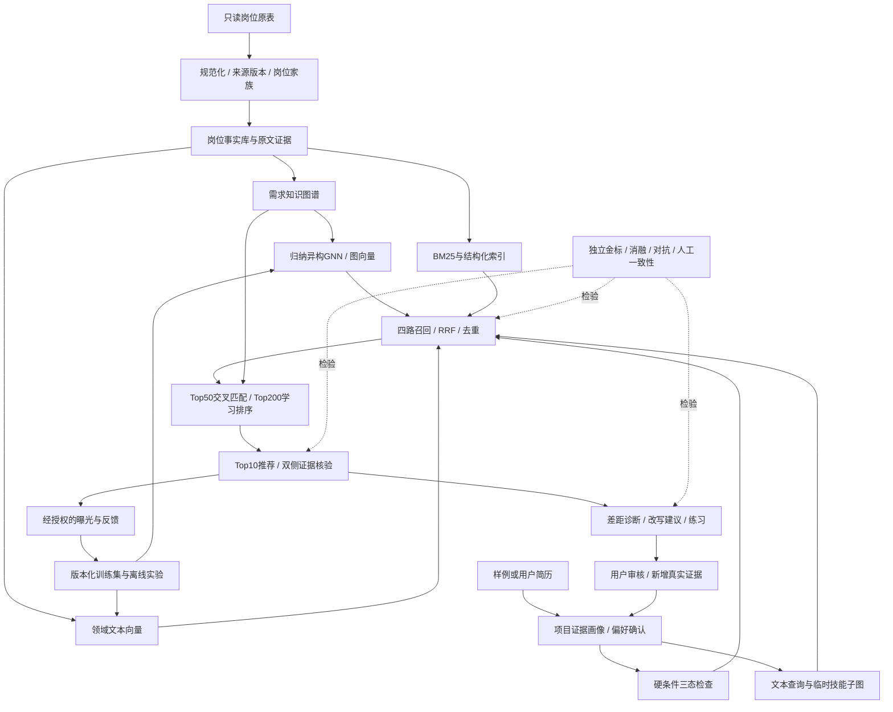

# 面向现有数据的完整升级方案：需求知识图谱、领域微调、异构GNN与证据智能体

> 实施进度（2026-09-22）：第一轮代码、数据版本、向量微调与图对照已执行。实际结果、失败及未完成的人审门槛见 [实施报告](IMPLEMENTATION_RESULTS.md)，不要将本文全部研究路线理解为已完成。

日期：2026-09-22。本文是下一轮工程与研究的实施方案。**现有平台已经运行过冻结BGE与规则排序；本文新增的知识图谱、GNN、微调、学习排序和LLM诊断尚未训练或完成，文中的训练规模与验收阈值均为计划。**

## 1. 核心决策

建议将项目定位为：**从深圳技术岗位需求出发，帮助求职者发现适合的岗位、识别简历尚未证明的要求，并通过真实项目证据逐步完善求职材料。**

算法主线升级为：

> 有出处的岗位需求图谱 → 文本与图的两种表示 → 多路召回 → 人岗交叉匹配与学习排序 → 主张核验 → 简历迭代与反馈。

知识图谱进入主架构，承担需求归一化、逻辑约束与证据定位；**领域向量微调和归纳式异构GNN是两条并行实验线**。GNN是否进入默认排序，由独立人工评测决定，不能因已经实现就必须上线。LLM主要承担复杂抽取、跨措辞证据对齐、解释和改写，不能越过事实校验修改硬条件。

三个需要验证的研究问题：

1. **结构是否有用？** 在相同文本模型与技能词典下，需求组和图邻域能否提高冷启动、转岗、长尾技能样例的检索质量？
2. **证据是否有用？** 区分“提及、了解、项目使用、否定、未来计划”并理解AND/OR，能否降低假匹配和假缺口？
3. **闭环是否有用？** 改写能否提高表达完整性和可操作性，同时保持事实不变？新增真实项目证据是否改变合理匹配，而单纯堆词不能获得不合理收益？

不能用“GNN＋LLM＋知识图谱”这一组合本身声称科研创新。贡献应来自具体任务定义、数据构造、模型设计和可重复的消融结果。

## 2. 数据基础与当前能力边界

### 2.1 已核实的输入

当前实际路径为 `/storage/xukunbo2/job-agent`，运行环境为Linux。Windows外部 `E:\file\note\profile\merged_data.xlsx` 仍未取得可访问路径；现有 `data/job_data.xlsx` **未确认与其同源**。

| 资产 | 已核实事实 | 能提供的监督 | 不能推断的事情 |
|---|---|---|---|
| 岗位表 | 14,118行×8列，1个sheet；现业务键去重后14,115行 | 岗位文本、标题、分类及可解析约束 | 不是14,115条人岗匹配标签 |
| 分类 | 72种职位类型、9个技术大类 | 分层采样、职类辅助监督、需求分布 | 分类相同不代表任意两个岗位可互换 |
| 企业 | 6,950个不同原始字符串 | 去重辅助、公司分组留出与结果多样性 | 没有可靠企业行业、规模或信誉标签 |
| 地址 | 缺失3,544条，原表缺失率25.10% | 有出处的城市/区域筛选 | 不能把缺失自动填成深圳，也不能推断通勤时间 |
| 年资 | 去重后至少3年9,293条；明确在校/应届233条 | 硬条件、分层评测和薪资分组 | 不能把“经验不限”全部当应届岗 |
| 薪资 | 去重后月薪13,609条；日薪418、时薪71、周薪5、面议5、缺失7 | 带单位、周期和发薪月数的薪资约束 | 不是实际offer、到手工资或市场总体均值 |
| 技能 | 没有独立原生技能标签列；已有93项词典与原文定位 | 弱监督抽取、别名归一化、需求图初稿 | 词典漏掉的不等于岗位不要求；提及不等于必须 |
| 旧事件 | 3,209条中3,200条合成、9条标为用户反馈；仅21个不同简历画像 | 格式迁移和故障回归参考 | 不能当大规模真实偏好图或人工金标 |
| 新平台 | 7份虚构简历、BM25＋冻结BGE、规则证据精排、4个技能流程 | 基线与评测入口 | 还不是训练过的ranker、GNN或生成式智能体 |

数据及原审计见 [DATA_PROFILE.md](DATA_PROFILE.md)、[AUDIT.md](AUDIT.md)。现平台已执行的17项测试与239组引用定位，仅证明相应工程检查通过，不证明推荐质量提升，见 [PLATFORM_RESULTS.md](PLATFORM_RESULTS.md)。

**缺失的关键资产**：独立人工相关性标签、经授权的真实简历、连续曝光与结果反馈、可靠发布时间/失效时间、录用结果。没有时间字段时不能伪造时间切分；没有录用结果时不能声称预测录用率。

2026-09-22新增只读核查带来四个更具体的设计约束，聚合结果归档于 [research_assets_20260922.json](evaluation/research_assets_20260922.json)：

- **重复多于业务键所见**：14,107条非空职责经去空白、小写规范化后只有13,970个不同值，84组重复、137条额外重复；48组跨公司、33组跨职类。结合“同企业＋规范标题”可得到13,944个保守防泄漏种子簇，仍不是语义近重复金标。代码中的`Job.family`当前只是9个大类，不能当岗位家族。
- **图已有足够原料但没有可信关系标签**：11,426个岗位有词典技能，2,689个没有；57,190条岗位—技能提及，1,438个OR组涉及1,325个岗位。都是现解析器结果，需标注准确率。
- **简单共现图过密**：93个技能共有4,278种可能配对，3,657种在样本中共现，占85.5%。应按训练折、职类和支持度裁边，不能把“曾一起出现”直接当强语义关系。6,950家公司中4,776家只有1个岗位，首版公司边不用于传播。
- **交互仍不构成训练集**：3,200条合成事件来自20份画像，每份恰好160条；9条旧反馈来自另1份画像。21份画像不等于21名真实用户。新私有账本本轮只读聚合为20次曝光、0条反馈，且没有可复现画像/特征；现有CSV、JSONL和向量表是同一岗位表的派生副本，不能累计为额外样本。

### 2.2 必须修订的数据身份设计

当前按“标题＋企业＋薪资”去重是初版方便策略，可能把不同职责合并。正式流水线保留三层ID：

- `source_record_id`：来源快照、sheet与原始行的定位，保留每条原记录。
- `job_version_id`：规范化字段与原文内容的hash；相同岗位内容变化即产生新版本。
- `job_family_id`：标题、企业、职责相似度、地点等形成的近重复家族，用于划分与展示去重；不直接代替真实招聘单号。

没有来源招聘ID时，明确“推定家族”。先查职责完全重复，再用字符n-gram/MinHash召回疑似近重复，结合字段与人工抽样校准阈值。近重复聚类必须在训练样本合成前完成。原文只读保留在私有存储，Git只放脱敏样例、schema、脚本与许可允许的聚合结果。

## 3. 产品流程与整体架构



保留三个已有页面，并逐步完善：

| 页面 | 用户真正完成的任务 | 需要新增的能力 |
|---|---|---|
| 岗位需求 | 选方向，看技能、年资、薪资结构 | 按年资/学历分层；技能共现与替代关系；抽取不确定性；点击统计回到样本证据 |
| 简历匹配 | 选择样例或上传简历，确认条件后比较岗位 | PDF/DOCX分段与版面来源；能力证据卡；方向相符与能力差距分别显示；历史岗位状态提示 |
| 简历成长 | 核对差距，补充真实经历，审核改写 | 原文/改写事实差分；学习计划与已有能力分栏；项目实践反馈和针对性面试练习 |
| 研究评测 | 比较模型、查失败样例 | 固定数据版本、真实实验表、人工标注台、逐项消融、置信区间与成本记录 |

“下拉样例”先继续使用虚构简历，可扩展职业方向和难度；不需要为了样例去采集公开个人简历。后续真实用户材料须单独授权和脱敏。姓名、联系方式、性别、照片、婚育信息等不进入排序特征。

## 4. 知识图谱：保存需求含义与来源

### 4.1 为什么不只画技能共现网络

下面这条虚构要求包含不同逻辑：

> 熟悉Python或Java，能够使用SQL处理数据；有推荐系统经验优先。

应表示为：`必需组OR(Python, Java)`、`必需组SINGLE(SQL)`、`优先组SINGLE(推荐系统经验)`。不能把三项语言都变成同时必需，也不能把“推荐系统经验优先”变成硬门槛。

采用**带证据的需求组图**：RequirementGroup作为节点保留AND/OR/至少k项及优先级；Skill/Task保留技能和工作任务语义。AND/OR的最终满足判定由显式逻辑执行，不能指望普通GNN的邻居平均自动严格实现逻辑运算。

### 4.2 节点和关系

| 节点 | 来源/属性 | 主要关系 |
|---|---|---|
| JobVersion 岗位版本 | 原表、snapshot、有效性unknown | belongs_to_role、has_group、mentions_task |
| Role 职类 | 原始72类型与9大类，保留原标签 | subcategory_of；分类噪声单独标记 |
| RequirementGroup 要求组 | 原文跨度、operator、required/preferred/unknown | has_option、requires_task；作用域只在当前JD |
| Skill 技能概念 | 规范名、别名、定义、外部ID可选 | alias_of、is_a；关系需有维护来源 |
| Task 工作任务 | 如“构建ETL流程”，独立于某具体工具 | uses_skill，仅有明确依据时成立 |
| Evidence 原文证据 | 来源hash、字段、字符范围、抽取版本 | supports_statement |
| Company / Location | 企业匿名ID、可确认区域 | publishes、located_in；默认不参与GNN偏好学习 |
| Resume / Project | 请求内临时节点，或授权私有版本 | describes_project、claims_skill、supported_by |

需要区分两套数据：

1. **事实图**：原表明示事实、原文中的提及、已审阅的规范化需求，以及维护过的别名关系。`mentions`仅断言提及；`requires`还要有语义与作用域依据。
2. **候选关系表**：统计共现、模型预测关联、可能的技能迁移、可能的学习前置关系。保存方法与分数，不得升级为“JD明确要求”或“用户已经掌握”。

LLM给出的`confidence=0.9`不直接解释为90%正确。保留未经校准的原始分数，依据独立抽取标注集做置信校准或分档审阅。未经人工确认的抽取仍是“原文支持的机器解析”，不是外部世界事实认证。

### 4.3 最小存储契约

以下仅为虚构格式示例，不是已经抽取的真实数据：

```json
{
  "statement_id": "示例声明001",
  "job_version_id": "虚构岗位版本甲",
  "relation": "has_requirement_group",
  "group": {
    "operator": "ANY",
    "skills": ["Python", "Java"],
    "priority": "required"
  },
  "evidence": {
    "snapshot": "示例快照哈希",
    "field": "requirements",
    "start": 0,
    "end": 14,
    "quote": "熟悉Python或Java。"
  },
  "extraction": {
    "method": "规则与模型交叉核对",
    "version": "示例版本",
    "review_status": "待审阅"
  },
  "assertion_type": "原文需求解析"
}
```

字符跨度采用Python Unicode码点、左闭右开；前端不得直接用JavaScript UTF-16索引重新切片，引用文本由后端返回。PDF/DOCX另保留页码、段落和提取文本hash；归一化文本与原文本必须保存偏移映射。

### 4.4 构建流程与质量控制

1. 用规则解析明确薪资、学历、年资和常见技能；用已有词典作候选入口。
2. 用LLM按固定schema抽取任务、要求组、否定、优先和熟练度，必须给原文跨度；格式错误、引用不一致直接退回。
3. 别名归一化先精确字典，再向量候选，再审阅。Java≠JavaScript，SQL≠MySQL；PyTorch/TensorFlow可能是某岗位的替代选项，不能全局合并成同一技能。
4. 第一批人工审阅600个JD片段，覆盖OR/否定/优先/复合要求与无技能片段。片段继承第9节统一岗位家族主划分，在相应分区分别抽300训练、100开发、200测试片段；抽取器训练、词典修订、合成与图统计不得使用归纳测试分区。既有规则输出只能算银标。
5. 从93项扩到约200–400个经过审阅的常见概念是工作量预算，不是已发现的规模。长尾词保留原词和unknown，不强行吸附到最近概念。
6. 计算技能共现时使用去重岗位、分职类统计；起点为支持岗位数≥10、限制每节点top20、加频次收缩，避免罕见组合的PMI虚高。统计边与原文边使用不同关系类型和来源。

外部词表可参考ESCO的技能/职业概念与稳定URI；其官方语言列表没有中文，本项目需要本地中文别名与人工映射，不能直接称为中文招聘标准。这里只导入经过核对的语义，不导入“欧洲职业需要某技能”作为某条深圳JD的事实。[ESCO官方数据与API说明](https://esco.ec.europa.eu/en/use-esco)

### 4.5 存储选型

主线使用SQLite/PostgreSQL关系表＋Parquet边表＋PyG图张量。需求量级约万级岗位，复杂度主要在质量与语义，暂不需要独立图数据库才能完成训练。Neo4j可作为图查询/可视化插件，须有实际多跳查询收益后引入，不能让应用只有依赖Neo4j才能启动。

Graph-RAG采用**先检索具体岗位，再获取该岗位的要求组和证据子图**，默认1–2跳，限制证据数量。技能共现路径可帮助探索邻近方向，不能作为任意推荐结论的充分证据；不先做全库社区摘要来替代原JD。

## 5. 向量微调：把简历语言和岗位语言对齐

### 5.1 模型组合

| 用途 | 首选 | 对照/升级 | 决策理由 |
|---|---|---|---|
| 低成本现有基线 | BGE-small-zh-v1.5 | BM25、字符TF-IDF、修正后的旧Word2Vec | 保留现平台可复现基线 |
| 领域向量主线 | Qwen3-Embedding-0.6B | BGE-M3；Qwen3-Embedding-4B冻结推理 | 先验证数据构造与目标，不让大模型掩盖无效监督 |
| 文本交叉重排 | Qwen3-Reranker-0.6B | 4B冻结教师；同输入的轻量cross-encoder | 处理项目经历与具体要求之间的细粒度相容性 |
| 图表示 | 文本初始化的两层Hetero-GraphSAGE | 技能池化MLP、R-GCN | 优先支持新岗位和新简历，且能检查图相对简单聚合的价值 |
| 抽取/诊断/改写 | 经本地评测选出的指令模型 | 提示词基线→小规模LoRA | 与embedding/reranker分开，职责和评测目标不同 |

Qwen3-Embedding的0.6B/4B/8B默认输出维度分别为1024/2560/4096，支持32K上下文；本项目起点只用1024–2048token。Reranker是成对相关性模型，不生成可复用岗位向量；输出分数也不是录用概率。[Qwen官方系列说明](https://qwenlm.github.io/blog/qwen3-embedding/)

BGE-M3支持dense/sparse/multi-vector，应先比较其dense路径。多向量后交互可作为长JD的后续对照，不能将多向量压成一个普通向量后声称使用了完整M3能力。[BGE-M3模型卡](https://huggingface.co/BAAI/bge-m3)

### 5.2 输入表示

简历塔：`目标方向＋经用户确认的条件＋项目职责/行动/结果＋技能证据`；岗位塔：`标题＋职类＋工作任务＋要求组`。主语义向量先以职责和能力为主，薪资、地点、学历保持单独约束与排序特征，避免仅因薪资不同把相同技术职责推远。

长材料拆为标题摘要、职责、要求三种视图，或512–768token块、重叠64token；先比较“1024token整体输入”和“分块取top2聚合”。块分数回归岗位时采用max或固定top2均值，并做长度分层评测，防止长JD因块数多获利。相同划分、相同候选预算下比较，禁止不同模型读取不同份关键证据。

共享编码器可用不同查询/文档指令形成双塔；“双塔”不要求训练两套独立大模型。池化、模板、归一化和维度遵循基座规范；Qwen的最终有效token池化不能换成BGE的CLS池化。[Qwen0.6B模型卡](https://huggingface.co/Qwen/Qwen3-Embedding-0.6B)

### 5.3 训练样本从哪里来

必须先固定岗位家族与评测划分，再构造训练数据。下面均为**预算上限**，达不到质量标准宁可保留更少样本。

| 数据层 | 构造方法 | 初期预算 | 能学到的东西与局限 |
|---|---|---:|---|
| 领域自监督 | 标题/任务摘要↔职责；要求组↔JD | 从训练分区选8,000个岗位，每岗最多2对，约16,000对 | 学领域词汇；不是人岗相关性金标 |
| 高置信JD-JD | 同细类、职责相容、年资接近，排除同源近重复 | 2,000–4,000对 | 学同义表达；同标题不足以成正例 |
| 合成简历-JD | 基于真实训练JD反推有项目证据的简历，加入不完全覆盖和转岗条件 | 约2,000个JD种子×2份独立画像，目标4,000份 | 形成跨文本格式监督；必须防止照抄JD与模板泄漏 |
| 排序弱监督 | 每份合成画像检索后评审8–12个候选 | 约32,000–48,000个人岗对 | 提供组内排序；多对不等于同样多独立用户 |
| 人工抽取金标 | 要求组、技能、否定、优先、证据跨度 | 600个JD片段 | 用来校验/训练抽取；与人岗qrels不同 |
| 人工推荐评测 | 独立编写或授权脱敏简历，盲审多系统候选池 | 起步48份简历，约1,800–2,400个人岗判断单元 | 仅足以做初步判别；后续扩展150–300份 |

弱监督教师分别输出`职责相关性、能力证据覆盖、硬条件、意向匹配、unknown、原文依据`，再映射组内偏好。规则只裁决明确字段；规则与模型冲突进入待审阅。先抽查200个人岗对估计噪声，再扩大生成。来源、生成模型、prompt、种子、所依赖JD与模板家族都入账。

合成简历只依据训练分区，不能把保留测试岗位变成合成训练简历。独立评测简历也不能照着单条待推荐JD写成完美答案。隐去公司名、特有项目名，限制连续复制片段，并按技能覆盖程度分层；不能把真实JD中的所有要求一次性写成候选人都掌握。

### 5.4 难负例与目标函数

每个查询先配1–3个可接受正例、2–4个核验难负例。难例包括：字面相近但任务不同；同方向但需要的能力与项目证据明显不相容；技能相同但“否定/未来计划/了解”被误当实践。薪资或地区单项冲突作为硬条件难例供排序和过滤评测，**不自动作为语义embedding负例**。

同方向的其他岗位、未曝光岗位和未标注岗位都是未标注，不自动判负。训练可使用低权重采样负例，但记录其来源并屏蔽已知多正例与近重复；测试绝不把未标注项当负例。

多正例InfoNCE建议起点：

$$
\mathcal L_{text}=-\frac1{|Q|}\sum_q w_q\log
\frac{\sum_{p\in P_q}\exp(s(q,p)/\tau)}
{\sum_{p\in P_q}\exp(s(q,p)/\tau)+\sum_{n\in N_q}\exp(s(q,n)/\tau)}.
$$

其中相似度为归一化向量内积，`w_q`按样本来源而非教师口头置信度加权。初期人工确认1.0、双通道一致弱标0.5、自监督0.2只是调参起点，不是统计概率。多正例softmax、自定义掩码和来源权重需要明确实现，不能声称默认损失自动具备全部能力。

| 参数 | 首轮起点 | 必做对照 |
|---|---|---|
| 序列长度 | 1024token | 长JD分块；需要时2048 |
| 训练顺序 | 领域适配最多1epoch→人岗对齐1–3epoch | 不做领域适配，直接人岗对齐 |
| 微调方式 | LoRA r=16、alpha=32、dropout=0.05；attention投影先起步 | 同数据全参0.6B；冻结基座 |
| 学习率 | LoRA 1e-4；全参1e-5 | 各减半，观察遗忘和验证损失 |
| 负例池 | 逻辑对比batch128；显存微批次4–8 | batch64/256；同家族/多正例掩码 |
| 温度 | 0.05 | 0.02、0.1 |
| 优化 | BF16、梯度检查点、warmup10%、梯度裁剪1.0 | 先小批次前后向检查数值 |
| 模型选择 | 开发集pooled nDCG@10和Recall@50 | 3个固定种子，不挑测试最优检查点 |

普通梯度累积不会扩大单次softmax的负例池；使用GradCache式`CachedMultipleNegativesRankingLoss`或经验证的跨卡gather，并在缓存和多正例掩码同时工作时核对梯度。`scale=20`对应温度0.05。[Sentence Transformers损失文档](https://sbert.net/docs/package_reference/sentence_transformer/losses.html)

优先使用Sentence Transformers＋PEFT统一训练入口；BGE-M3全功能训练再考虑FlagEmbedding。LoRA目标层须从实际模型模块名解析并记录，不能假设不同基座层名相同。[PEFT LoRA文档](https://huggingface.co/docs/peft/en/developer_guides/lora)、[FlagEmbedding官方工程](https://github.com/FlagOpen/FlagEmbedding)

## 6. GNN：学习岗位需求上下文，服务新岗位与新简历

### 6.1 模型选择与职责

| 方法 | 本项目安排 | 判断依据 |
|---|---|---|
| 技能加权池化＋MLP | 必做无消息传播对照 | 检查收益是否仅来自技能输入，而非图关系 |
| 统计图特征/一步传播 | 必做低成本对照 | 检查复杂GNN是否超过共现或路径特征 |
| 两层异构GraphSAGE | GNN主线 | 文本和技能初始化，学习可用于新节点的聚合函数 |
| R-GCN | 关系类型消融 | 比较关系特定变换；文本初始化和归纳协议仍不可省略 |
| LightGCN | 暂不作为主线 | 原设定依赖用户—物品交互；不能把合成画像边冒充真实协同行为 |
| TransE/RotatE | 小规模关系补全对照 | 检验别名/类型关系表示，不直接预测“这个人会某技能”或是否适合岗位 |
| HGT/大型图Transformer | 后置研究 | 简单图模型与独立标签没有证明收益前，复杂模型增加解释和复现成本 |

GraphSAGE侧重基于属性与邻域对未见节点生成表示；R-GCN侧重多关系变换；LightGCN原论文的核心是用户—物品交互图上的协同过滤。上表是结合本地数据作出的选择，不是这些方法对招聘任务的已验证排名。[GraphSAGE原论文](https://arxiv.org/abs/1706.02216)、[R-GCN原论文](https://arxiv.org/abs/1703.06103)、[LightGCN原论文](https://arxiv.org/abs/2002.02126)

TransE和RotatE的关系得分可用于发现待核验关联，但通常的实体ID训练方式不能自然处理全新简历；即使另加文本编码器，也必须重新验证。任何补全边不进入事实引用图。[TransE原论文](https://proceedings.neurips.cc/paper/2013/hash/1cecc7a77928ca8133fa24680a88d2f9-Abstract.html)、[RotatE原论文](https://arxiv.org/abs/1902.10197)

### 6.2 第一版图的实际规模

基础节点：14,115个岗位＋93个技能＋72个职类＋9个大类＝14,289个；提及边57,190＋职类归属14,115＋类别层级72＝71,377条正向边，不含逆边。加入1,438个OR组节点后约15,727个节点，边结构根据要求解析重新生成。单技能要求可保留带优先级的直接边；复杂要求保留组节点，不必将所有单项要求都实体化。

这是现有规则能生成的图规模，**不等于71,377条已经人工验证的知识**。首版不把企业ID、薪资相近或用户假设边加入消息传播。约万级节点的小图不需要分布式图训练，首先把文本编码缓存好。

### 6.3 表示与在线冷启动

先冻结文本编码器，岗位文本、技能定义和任务描述分别编码；职类/大类使用其规范名与定义文本，要求组使用局部原文文本加operator/priority的one-hot。遮蔽任务必须先遮掉组原文和名称中的目标技能再编码。各节点类型通过该类型共享投影映射到128维，256维作对照。不使用每个岗位专属的可训练ID向量作为核心特征。

关系特定均值聚合的建议形式：

$$
h_v^{\ell+1}=\mathrm{LN}\left(W_0h_v^\ell+
\sum_r W_r\frac{\sum_{u\in N_r(v)}a_{uv}h_u^\ell}{\sum_{u\in N_r(v)}a_{uv}+\epsilon}\right).
$$

`a`只取可解释的来源/质量分档权重，未校准时不当成概率。实现可使用PyG的`HeteroConv`与`SAGEConv`并添加残差；若该层不支持边权，需要显式实现加权聚合，不能把权重字段存下来就声称模型使用了它。[PyG异构图官方说明](https://pytorch-geometric.readthedocs.io/en/2.5.1/notes/heterogeneous.html)

将文本投影与图表示保留为两个可消融分支，融合候选形式为：

$$
z_j=\operatorname{norm}(W_tx_j+\beta W_gh_j),\qquad \beta\in\{0,0.1,0.3\}.
$$

首次上线实验优先把图相似度当独立排序特征，暂不替换文本索引。只有能提高人工确认的候选召回时，才开启独立图召回路；这能分清图究竟改变了召回还是精排。

新简历不创建必须积累历史交互的永久用户节点。根据已有证据技能，加权聚合冻结的技能节点表示，与简历文本投影对齐得到临时查询图向量。没有技能证据时退回文本通道并按需追问；不得把简历的图邻居当成该用户也会的技能。请求结束后删除临时图，不影响其他用户或全局岗位图。

第一版固定查询端定义为`p_r = Σ_s e_r(s)·h_s / (Σ_s e_r(s)+ε)`，`z_r = norm(W_q·x_r + β_q·W_s·p_r)`；只聚合有非否定证据的技能，unknown另有掩码。`W_q/W_s`与图参数在训练画像上学习，`β_q`候选0/0.1/0.3；推理沿用同一参数。图分支的匹配分固定为`s(r,j)=z_rᵀz_j/0.05`用于下述pairwise损失；该温度在开发集比较，分数不是概率。生产最终ranker把未缩放内积作为一项特征，不与树模型总分混用。

新岗位的归纳推理只使用自身可见文本和冻结技能节点，不反向更新共享节点、不通过测试岗位彼此传消息。已见库全图更新与新岗位归纳是两种不同实验协议，见第10节。

### 6.4 严格逻辑分支与图学习分开

令`e_r(s)`是简历中技能`s`的证据强度，不是实际掌握概率。对于原文明示的组：

$$
c(r,g)=\begin{cases}
\max_{s\in g}e_r(s),&g\text{为OR}\\
\min_{s\in g}e_r(s),&g\text{为AND}
\end{cases},\qquad
C(r,j)=\frac{\sum_g w_g c(r,g)}{\sum_g w_g}.
$$

排序可把未知证据映射到低支持度，并额外保留unknown掩码；诊断界面必须仍写“简历未证明”，不能说“不会”。初始明确要求权重1、优先项0.5；未明确要求性质的提及另设低权重。复杂作用域无法判断时保留原文并追问，不强制建立AND/OR。

GNN传播学习相近需求的上下文；上式负责可核对的满足关系。两者分开才能避免图平滑把“会Python”扩散为“也会Java”。

### 6.5 如何训练GNN

训练信号分为三类：

1. **文本—图对齐**：同一训练JD的文本视图与图视图为正对，岗位家族与多正例屏蔽，冻结文本编码器；检查图不是只复制岗位文本投影。
2. **遮蔽技能/要求组恢复**：从训练JD隐藏约20%的观察边，预测该JD原本提及的技能。严格结构能力实验同时移除逆边、组名称里的技能、原文别名及由该JD贡献的共现统计，并重算受影响文本向量；否则只能算基于文本的关系抽取实验。未观察技能不是确定负事实，类型约束负采样需低权重并报噪声。
3. **人岗弱监督排序**：用第5节生成且经校验的画像与候选关系，对同一画像的有序岗位对学习。初期图预训练与排序分开；弱监督匹配成立后再联合优化，不使用测试qrels。

$$
\mathcal L_{pair}=\sum_{(r,j^+,j^-)}w_r\log(1+\exp[-(s(r,j^+)-s(r,j^-))]).
$$

联合目标可从`L_pair + 0.2 L_mask + 0.1 L_align`起步，各损失先按有效样本数归一化，权重仅在开发集选择；预训练阶段没有`L_pair`时仅训练后两项。图边恢复上升不是人岗推荐提升，必须分别报表。

为使损失能直接实现，首版进一步固定：`L_align`将`norm(P_g·h_j)`与冻结的`norm(P_t·(x_j−μ_train))`对齐，`P_t`取仅在训练岗位文本向量上拟合的128维PCA投影（256维实验同步调整），均值和投影一起冻结。采用温度0.05的批内InfoNCE，正例为同岗位、屏蔽同家族和已确认多正例；只有图侧及`P_g`接收该损失梯度。对齐目标可使用完整训练JD文本，但它只进入监督目标，不能作为遮蔽评估的编码器输入。`L_mask`的正集合为本次隐藏的原文技能组成员，负集合为同类型但当前完整标注/银标未观察的采样技能，正负比1:4、未确认负例损失权重0.2，使用双线性解码器`σ(h_jᵀW_rel·h_s)`的加权BCE，剔除已知正项。该负集合仍可能含漏标，独立人工审阅子集上的关系指标单独报告；不得把补全分数写回事实图。

| 项目 | 首轮GNN实验起点 |
|---|---|
| 结构 | 2层、hidden128；256维对照；残差与LayerNorm |
| 采样 | 每种关系每层15/10邻居；本图也可先全批，记录真实边数与峰值内存 |
| 正则 | dropout0.2、weight_decay1e-4；不做会破坏OR含义的任意增广 |
| 优化 | AdamW，lr1e-3，最多20epoch，开发集连续5轮不升停止 |
| 排序batch | 每批64份弱监督画像，每份1正＋最多4个已核验难负例 |
| 种子 | 42、43、44；按查询而非按事件行统计方差 |
| 进入联合训练 | 图在冻结基座上超过简单聚合后，文本lr1e-5、图lr3e-4，1–3epoch |

必须包含“相同技能输入的池化MLP”“相同度分布的随机边图”“去掉OR组”“去掉能力证据权重”“去掉文本残差”对照。若随机边也一样好，尚不能证明需求关系有用。

## 7. 召回、交叉重排与最终排序

### 7.1 召回预算

在确认用户条件后，对明确冲突先过滤，unknown单独保留；学历/年资抽取低置信时不自动成为硬拒绝。城市、薪资、岗位有效性都要保留数据日期和未知状态。

| 路由 | 默认候选预算 | 用途 |
|---|---:|---|
| BM25词级检索 | 100 | 技术缩写、工具与明确关键词 |
| 微调文本向量 | 150 | 简历与JD措辞不同的语义匹配 |
| 图表示/图扩展 | 50，验证通过才开启 | 可追溯技能邻域与相邻方向 |
| 结构化意图 | 50 | 防止标题方向被通用“开发”词覆盖 |

各路RRF常数60起步，融合与岗位家族去重后保留最多200候选；同等预算比较有图/无图，不能让GNN路线仅靠多拿候选取胜。全局高相似但硬条件失配时按过滤后候选自适应扩深，不悄悄放宽用户条件。

14k岗位用精确内积检索足够作为基线；索引扩张或延迟实测需要时再改FAISS HNSW。CPU、GPU索引一致性、过滤后的召回率和增量删除必须有回归。

### 7.2 约40组可用特征

特征维度会随来源one-hot、缺失标记展开，以下是特征契约分组而非声称已有固定40维实现。

| 分组 | 示例 |
|---|---|
| 文本检索 | BM25归一化分、文本余弦、职责块top1/top2分、标题意图、cross-encoder分 |
| 图结构 | 图向量相似度、已证据技能邻域覆盖、经裁剪的共现相容度、图缺失率、证据路径长度 |
| 要求满足 | 必需/优先覆盖、OR满足率、AND未满足项、否定冲突、自述/项目证据比例、熟练度差、未知要求比例 |
| 硬条件与质量 | 年资差、学历差、薪资区间重叠及单位一致性、城市三态、字段缺失和解析置信档 |
| 用户明确偏好 | 方向、区域、岗位类型、薪资偏好；只使用已提供项 |
| 来源与冗余 | 召回来源标记、多路命中、岗位家族重复、公司重复、多样性边际代价 |

公司规模、行业、通勤时长没有可靠来源时不生成特征。公司名/学校名不能简单转成“优质程度”；岗位薪资高也不代表更适合。现有规则技能覆盖不是训练标签或独立评测金标。

### 7.3 学习排序和重排器的分工

先用规则/开发集固定融合完成基线；有约1,000份独立弱监督画像和足够组内差异后，训练LightGBM LambdaRank或XGBoost `rank:pairwise`。`query_id`是同一简历版本＋偏好版本，组内标签为0–3级；不能把不同简历混成全局二分类后只看AUC。

树模型起点：31叶、深度4–6、min_data_in_leaf50、learning_rate0.03、最多500轮、开发集早停50轮；视有效画像数减小复杂度。教师来源与权重在训练集记录，线上只需统一特征提取。蒸馏目标和人工相关性要分开报告。

**交叉匹配路线**：固定“相同融合top200→不含交叉分的初排→相同top50”，只在这50个候选上比较“仅重排器”“仅树模型”“树模型使用重排器分数”，三种方法共用训练/推理候选选择过程。50个从同一个冻结初排器产生，剩余150个不与它们混排；另报初排top50召回损失。全200候选的无cross-encoder树模型作为独立端到端对照，不把未计算的交叉分填0。冻结Qwen3-Reranker-0.6B先起步，更大的4B仅作教师或离线对照；无需默认连续叠加树模型、cross-encoder和LLM listwise三次。

Qwen重排器需保留官方模板和yes/no分数计算。训练可选同查询pairwise logistic，或0–3等级对应的有序目标；若改做yes/no completion监督，要明确是二分类，不把等级直接当成概率。输入1024–2048token、LoRA lr5e-5至1e-4、微批次1–4对、1–3epoch作起点。验证官方推理与训练实现分数一致后再扩大。[Qwen Reranker模型卡](https://huggingface.co/Qwen/Qwen3-Reranker-0.6B)、[CrossEncoder官方训练说明](https://www.sbert.net/docs/cross_encoder/training_overview.html)

最终MMR从lambda0.8起步，同公司最多2条、同岗位家族最多1条；比较相关性与多样性取舍。只对经过硬检查的候选重排，输出不足时说明原因，不强凑10条。

## 8. 智能体与简历微调：让语言能力建立在事实之上

### 8.1 用可观测流程组织智能体

保留当前状态机，升级为：

`输入解析 → 用户确认画像 → 需求检索 → 条件检查 → 双侧证据对齐 → 排序 → 主张核验 → 诊断/改写 → 人工确认 → 重新匹配`。

不要求引入多Agent互相自由讨论。逻辑角色可以分为需求分析、证据匹配、改写、核验四类，由同一调度器控制白名单工具；任何JD/简历中的“忽略规则”只作为文本处理。

| 技能包 | 输入 | 输出 | 失败行为 |
|---|---|---|---|
| demand-analysis（拟新增） | 方向、年资、岗位快照 | 需求分布与原文例证、口径说明 | 样本不足不输出稳定市场结论 |
| resume-diagnose | 原简历、用户确认条件 | 带证据的能力画像、必要追问 | 不猜学历/年资或默认精通 |
| gap-analysis | 画像＋目标岗位要求图 | 硬冲突、未证明项、优先项、OR可选路径 | 未写明与确实不会分开 |
| resume-rewrite | 原文事实清单＋目标岗位 | 建议改写、每句事实来源、待用户补证字段 | 新公司/年限/指标/技能被核验器拒绝 |
| mock-interview | 岗位要求＋已有项目证据 | 针对性问题、评分依据、追问 | 不把自述答案认证为真实能力 |

推荐理由每个原子主张都带`claim_type、job_evidence、resume_evidence、支持/矛盾/未知、核验版本`。引用定位只做第一关，第二关判断原文是否支持主张；还要扫描正文中未被主动列入claims的事实句。

### 8.2 三种微调不要混在一起

| 微调对象 | 目标 | 训练材料 | 主要验收 |
|---|---|---|---|
| embedding | 把相容简历/JD召回 | 正对、多正例、核验难负例 | Recall/MRR/nDCG与成本 |
| reranker/GNN | 同一画像下排序 | 同查询岗位等级/偏好对、图预任务 | 人工qrels、冷启动分层与消融 |
| 生成式LLM LoRA | 正确抽取、诊断、克制改写 | 人工审阅的结构化抽取和事实保全示例 | 引用支持、夸大率、可执行性、schema正确率 |

生成模型先做提示词基线。抽取和改写失误具有重复模式、已积累约2,000–5,000条审阅示例后再考虑3B–8B指令模型LoRA：r16/32、学习率5e-5、长度2048、1–2epoch，小批次起步，按任务混合并保留拒答/追问样例。具体基座先比较中文抽取、结构化输出、许可证与显存；复用已有GPU服务前核对模型版本、服务用途与数据处理边界。

训练好/坏改写偏好对时，负例应包括“了解→精通”“课程练习→商业上线”“没有指标→虚构提升30%”，先用SFT约束事实，DPO作为后续对照。不要以推荐名次上升作为改写奖励，防止模型用造假优化排名。

技能模块化沿用Agent Skills的输入输出与按需加载思路；之前提到的“苏神skill”仍没有唯一确证出处，不能把通用SKILL.md结构写成某个人的专属算法。[前次核查](RESEARCH.md)

### 8.3 真正的“简历训练”闭环

区分三条轨迹：`表达改进`只重组事实，`证据补全`补充已做项目，`能力成长`完成新的真实练习后由用户提供材料。学习计划、推荐技能和图预测关系不进入已有能力栏。

建议输出最多3项优先行动，每项说明目标岗位中多少条明确要求、自己缺少什么证据、可做的练习、如何验收。技能先修关系只有在课程/官方资料或人工维护关系可引用时才使用，不能从共现图直接推导“先学A才能学B”。

## 9. 数据划分、训练闭环与隐私设计

### 9.1 两种评测设定必须分开

**设定A：固定候选库、新简历。** 可以用全库无标签JD建立检索索引，也可以声明使用全库的无监督内容图；测试简历、测试qrels、测试来源JD反推的画像不得参与监督训练。报告名称为“已知岗位库上的查询冷启动”，不能称为完全未见岗位归纳。

**设定B：新岗位归纳。** 在生成样本之前，按近重复家族并结合公司组进行约70/15/15划分，组大小导致比例偏移时如实报告。只用训练分区学习技能共现、图参数、弱监督和文本适配；词表与归一化策略也从训练/外部版本化词表确定。测试岗位本身文本在推理时可见，但只接入冻结技能节点，不更新共享节点、不参与训练损失。

同时保留两类压力测试：按公司组留出、按岗位家族留出。若两种分组交叉产生大连通分量，则取连通分量一起分配并报告偏差，或将公司冷启动单列实验，不能强行按行拆开重复内容。

禁止全图预训练后仅删test人岗边并称为归纳实验。逆边、由标签推导的相似边、同源模板、合成画像及数据增强都随源组一起划分。职类分类辅助任务若预测职类，输入中必须移除该目标分类边，避免直接读取答案。

### 9.2 版本化样本契约

建议每个人岗样本记录：

```text
sample_id / query_id / resume_version / preference_version
source_job_family / template_family / split
job_version_id / source_snapshot / text_template_version
label_grade / label_axes / label_source / annotator_or_teacher_version
evidence_refs / disagreement_status / sample_weight
negative_origin / candidate_policy / consent_scope
```

label缺失就拒绝进入有监督训练，不能默认置0。词面向量、模型向量、岗位图、特征schema与排序模型必须拥有版本契约；维度/顺序不一致时显式报错或标明降级，不吞异常继续展示“模型分”。

### 9.3 反馈分为运行账本与授权研究集

当前SQLite仅保存会话、run、岗位、快照、曝光位置、动作和时间，**没有可还原的简历画像与特征**。24小时清理是在启动/推荐请求时触发，不是后台定时删除；本轮只读检查仍有过期曝光，但没有执行清理或改动用户数据。

继续保留这个临时账本。另设用户可选择的研究授权流程，保存脱敏画像/特征快照、画像与偏好版本、候选池、曝光位置、模型版本、反馈原因及可删除标识。不默认扩大原有保留期，也不把简历hash当作可复现训练输入。

喜欢、收藏、投递、面试、录用是不同事件；跳过可以因为重复、已投、暂不考虑，必须有曝光与原因。没有随机探索策略或可靠propensity就不声称做了无偏IPS评估；未来经同意的有限探索需记录真实分配概率，权重裁剪与方差同时报告。

## 10. 完整评测协议

### 10.1 样本集和人工工作量

首轮48份独立简历覆盖6个方向：Python后端、Java后端、前端、数据分析、测试开发、算法/LLM应用。每方向8类场景：2份应届、2份1–3年、1份转岗、1份资深、1份信息残缺、1份关键词堆砌。样例不是用户画像统计分布，用于分层压力测试。

建议12份开发、36份冻结试点评测：每个方向取1份完整画像及1份特殊场景进开发集，总计6份可推荐、3份残缺、3份关键词堆砌；测试集剩30份完整、3份残缺、3份堆砌。完整画像也可能没有相关岗位，因此进入nDCG的测试查询最多30份，报告时列出实际分母。这48份不同时拿去训练ranker；训练使用独立来源弱监督画像。抽取金标是单独任务，但必须继承同一岗位家族主划分。约1,800–2,400个判断单元包含推荐候选、近邻干扰、硬冲突和需追问场景，不强求每份不完整简历也凑50个岗位。

每份推荐简历合并各基线top10、随机候选与定向难例形成约40–60候选池；人员不知道结果来自哪个模型，随机顺序双人独立标注。按每次30–60秒，2,400单元双标约40–80标注人时，加仲裁与试标；不是一小时能完成的流程。若超预算先做24份开发试点并保留结论不确定，不减少难例后继续声称完整验证。

初期人工试点评测样本少、相关性池不完备，只报告pooled nDCG和pool-relative Recall，不能当全库真实Recall。每个系统top10必须100%已标注；新模型带来未标注候选就补标并给评测集新版本。可选扩展为约500岗位完整小库，选10–20份简历全面标注，共5,000–10,000判断单元、双标约83–333人时，用于精确Recall审计；这项不属于首期必交付，也未计入第13节40–80人时推荐标注预算。

指标口径预先冻结：`IDCG=0`或完整已判定候选中无相关项时nDCG/Recall记N/A，进入无匹配动作评测；候选池没有相关项但标注不完整时只记“池内未找到”，不能宣称全库无匹配。固定K=10，存在足够有效岗位却少返时缺位按0增益计，不能把K改成返回数。确实不足10个符合任务条件的岗位另报条件覆盖与返回率，统一豁免规则不因模型而变。

### 10.2 至少十个维度与操作定义

| 维度 | 操作标准 | 建议初期门槛，尚未达成 |
|---|---|---|
| 推荐相关性 | 人工0=不适合、1=方向相近但关键证据不足、2=可合理考虑且主要要求有支持、3=方向与主要任务高度匹配；记录能力、意愿、硬条件分轴；nDCG gain=2^grade−1 | 图/微调相对强基线nDCG@10绝对增益≥0.02，并报告CI |
| 召回 | 相关定义grade≥2；Recall@10/50、MRR@10；明确完整小库或候选池分母 | 不以提高精排分牺牲明显召回；逐职类报告 |
| 硬条件与事实 | 城市、薪资单位/区间、学历、年资逐字段对原文；known失败进入推荐算违规，unknown声称通过也算错误 | 测试集中已确认硬违规0；单独报适用项数量 |
| 证据有效性 | 引用能定位且原文蕴含主张；匹配结论要双侧支持；扫描未列入claims的事实句 | 有效支持率≥98%；伪造岗位/引用0 |
| 要求逻辑 | AND/OR/优先/否定/熟练度组级准确率与F1；人工判断假缺口 | 假缺口率相对简单集合差减少20%，同时报告绝对值与CI |
| 技能匹配 | 声称匹配的技能确有双方证据且强度不夸大；同时报precision/recall | precision≥95%，不靠少说内容虚增精确率 |
| 追问与拒推 | 人工标注应推荐/应追问/无匹配；混淆矩阵、macro F1、risk-coverage | 三类分别报告；阈值在开发集校准，禁止全拒答刷分 |
| 改写事实保全 | 新增/删除/矛盾的公司、时间、职责、技能、数字逐主张检查；纯表达变化不算新增事实 | 伪造事实0；事实保留≥98%，人工核验歧义 |
| 建议可操作性 | 0=捏造或无关；1=泛泛建议；2=指出具体缺口；3=缺口＋行动；4=来源＋行动＋验收标准且不代填未有经历 | 中位数≥3，长度不进入正向评分 |
| 多样性与覆盖 | 同公司/同家族重复、职类覆盖、用户选择的目标范围；与相关性共同画曲线 | 公司最多2、同家族最多1；不强塞无关方向 |
| 稳健性与切片 | 同义改写、技能堆砌、性别/姓名替换、空技能、长JD、跨职类重复 | 同义改写结果稳定；无关个人属性替换不改变排序；报告失败率 |
| 成本与延迟 | 每查询耗时、P50/P95、GPU峰值、生成token、离线训练时长 | 目标检索排序P95≤1秒/单并发；LLM诊断另计；均须实际压测 |

上述门槛是预注册的候选标准，不是已实现成绩，也不是所有维度加权成一个分数的理由。硬违规、伪造和事实夸大为独立失败门；不允许用语言流畅或篇幅抵消。

假缺口率具体定义为`被人工判为错报的缺口组数 / 系统报告且已人工判断的缺口组数`；同时报告`真正缺口被报告的组数 / 人工标出的全部缺口组数`。OR中已有选项被满足却报缺口、优先项说成必需、忽略简历已有证据，都计为错报。没有报告缺口时前者为N/A，不是满分；人工有缺口而系统全不报，召回为0。相对减少20%的目标必须同时满足真实缺口召回≥80%、相较基线不下降超过2个百分点，并给分母和CI；基线错误为0时只报告绝对错误，不计算相对下降。

### 10.3 评估器本身的有效性

- **判别力**：从30个独立场景各构造好/中/差三档输出，总90份；只改变有清晰依据的错误，盲测三档完全排序率、成对排序率。初期目标分别≥80%/90%，不是已测得结果。
- **一致性**：两人先在开发样例对齐rubric，冻结后独立标注。二元项报告Cohen's κ；0–3有序等级报告预先约定权重的weighted κ；汇总连续分可报明确模型的ICC(A,1)。同时给原始一致率、混淆矩阵、CI与仲裁比例，避免类别不平衡下只看κ。
- **重复性**：同一输出由同一固定版本judge独立评3次，温度0、seed若支持则固定，记录均值/标准差/极差与中位数。固定seed不保证服务完全确定，规则通道应保持确定性。
- **抗评测器投机**：伪造ID、真引用假结论、技能堆词、了解改精通、篇幅注水、对judge下指令、只拒答、不列claims但在正文造假。报告攻击检测率和正常样本误报率。
- **独立性**：生成器与judge尽量不同模型/提示体系，人工金标是最终参照；多Agent一致不等于独立证据，更不能以“多个模型都同意”替代标注。

具体八维0–4分档与比赛材料组织可继承 [REDESIGN.md第7节](REDESIGN.md)，使用前核对统一分母和本轮新图指标。首次试点的人工与生成式评审尚未完成，不能引用已有规则测试称为κ已通过。

### 10.4 实验矩阵与否证条件

| 编号 | 固定组件下的变化 | 要证明什么 |
|---|---|---|
| E0 | BM25＋相同硬过滤 | 词面基线 |
| E1 | E0＋冻结BGE/Qwen文本向量 | 语义召回增益 |
| E2 | E1＋需求组逻辑与相同技能特征 | 显式逻辑是否减少假缺口 |
| E3 | E2＋领域向量微调 | 微调是否超过冻结基座 |
| E4 | E3＋技能池化MLP或统计图特征 | 图输入本身的价值 |
| E5 | E3＋异构GraphSAGE | 消息传播相对E4的增益 |
| E6 | E5换R-GCN；另做去OR/去证据/随机边/去残差 | 关系结构的真实贡献 |
| E7 | 最优前序＋学习排序/交叉重排，各自及组合 | 精排是否值得成本 |
| E8 | E7＋有证据的LLM诊断与核验 | 事实正确性、行动价值，不假称检索提升 |
| E9 | E8＋简历迭代 | 表达与事实保全，用户补真实证据的单独实验 |

保留比赛A=无数据LLM、B=真实向量RAG、C=训练召回排序、D=核验与闭环阶梯；A没有真实job_id时相关性记N/A，单测岗位虚构与诚实说明，不能凑同一nDCG表。E矩阵用来隔离阶梯中每个因素。

训练配置用3个种子；对相同查询的指标差做配对、分层/家族级bootstrap，建议2,000次，报告95%区间。不能把同一简历的50个人岗对当50个独立查询计算显著性。多模型探索仅用开发集，正式测试一次性冻结，避免反复看测试集调参。

GNN默认上线门槛建议为：相对E4强基线nDCG点估计至少＋0.02、95%增益区间下界>0、硬违规不增加、证据有效性不退步。图分支额外P95预算先设50ms并实测。样本太少导致CI过宽就承认无定论，扩充独立评测，不挑一组好结果。

如果统计图特征与GNN相当，发布简单版本；如果只有全图随机边划分提升，不能宣称解决新岗位；如果仅图补全指标提升，保留为负结果，不包装成人岗推荐突破。

## 11. 算力与训练安排

四张RTX5090不代表四张空闲卡。2026-09-22本轮只读查看时，四卡剩余显存约17.9/1.6/17.7/17.9GiB，已有其他进程；没有启动训练或终止任何进程。任务启动前重新探测负载，GPU利用率和剩余显存都要满足预算。

5090官方为32GB、无NVLink；多卡不能当透明128GB池。DDP每卡保留模型副本，FSDP/ZeRO才是分片；共享环境先单卡、短序列、小批次测峰值，再决定并行。[NVIDIA官方规格](https://www.nvidia.com/en-us/geforce/graphics-cards/50-series/rtx-5090/)、[PyTorch FSDP说明](https://pytorch.org/blog/introducing-pytorch-fully-sharded-data-parallel-api/)

| 任务 | 资源起点 | 本轮安排建议 |
|---|---|---|
| 冻结基线、JD编码 | 一张有余量GPU，batch按token预算 | 不抢占现有服务；索引在仓库外缓存 |
| 0.6B embedding LoRA | 可用显存约16–24GB起试，微批次2–4，1024token | 先测实际峰值并预留至少数GiB；不足则降512或排期 |
| 0.6B全参 | 一张完整24–32GB卡更稳妥 | 当前共享余量不足时不强行并发 |
| 冻结文本＋小GNN | CPU或一张有余量GPU | 与大模型编码错峰；不需要四卡 |
| 4B重排/生成LoRA | 一张完整32GB、微批次1、1024–2048token起试 | 仅在资源空闲与小模型有效后进入 |
| 8B与联合端到端 | 研究对照 | 暂不列为关键路径；量化/分片兼容性单独验证 |

以上为工程估算，不是实测可行性保证。BF16权重约为参数量×2字节；0.6B/4B/8B约1.2/8/16GB，仅含权重。常规全参Adam状态可按每参数12–20字节粗估，另加激活、通信缓冲和框架开销；LoRA大幅减少可训练状态，但基座和激活仍占显存。

资源预算先以实验数管理：3个冻结文本基线、0.6B的2种微调、3个图基线、1–2个重排器；开发集筛选后仅对入围配置跑3种子。记录真实GPU小时、成本与P95，不提前承诺“几小时训完”或“保证AUC达到0.9”。

## 12. 工程模块与接口

沿用FastAPI＋现前端，逐步抽离当前`corpus.py/domain.py/workflow.py`职责。下面为拟新增目录，不是已经存在的实现清单：

```text
job_agent/
  ingestion/       # 原表、版本、实体与岗位家族
  schemas/         # 岗位、画像、证据、图声明、反馈
  ontology/        # 技能别名、职类映射、外部词表版本
  graph/           # 构图、关系校验、训练折统计、归纳查询
  retrieval/       # BM25、文本向量、图向量、RRF
  ranking/         # 统一特征、ranker、cross-encoder、多样性
  agents/          # 流程状态、工具白名单、技能路由
  verification/    # 引用、蕴含、事实差分、拒答
  feedback/        # 临时运行账本、单独授权研究集
research/
  datasets/        # 样本构造代码，不放原始简历
  training/        # 文本/GNN/重排/生成各一个入口
  configs/         # 分组划分、参数、模型revision
evaluation/
  schemas/        # qrels、rubric、标注分歧
  runners/        # 指标、评估器验证、置信区间
  reports/        # 允许公开的聚合结果
web/platform/     # 现工作台迭代
skills/           # 输入输出和证据约束
```

SQLite先支撑单机，研究标注多人并发后再迁PostgreSQL；训练与编码进程从API分离，任务队列/状态可查询。模型登记至少包含数据与分组hash、代码版本或文件hash、模型revision、tokenizer/pooling、图schema、特征次序、配置、随机种子、指标及失败样例。

已有接口保留兼容：`overview/recommend/diagnose/rewrite/interview/compare`。增量接口为`evidence/{id}`、`requirements/{job_version}`、`evaluation/runs`和授权研究反馈。API返回明确的`retriever_version/ranker_version/graph_version/verification_status`，模型不可用时标明降级；不将运行缓存、权重和私有样本落进Git目录。

## 13. 实施路线与验收交付

以下按一名主要开发者、另有两位可投入标注时间的协作者估计；人日不等于连续日历时间，GPU等待和标注协调另计。

| 阶段 | 工作与交付 | 验收门槛 | 估计投入 |
|---|---|---|---:|
| P0 数据与研究契约 | 原表身份确认、版本化岗位、近重复簇、技能本体v1、600片段标注schema、48画像评测设计 | 引文100%可定位；schema/划分可复跑；训练与测试家族交集0；技能/逻辑抽取报告 | 开发5–7人日＋标注20–35人时 |
| P1 文本检索与需求图 | 冻结模型基线、要求组图、规则/LLM抽取对照、500岗位种子×2画像的小试点，再扩4,000画像 | 至少200人岗弱标复核；BM25/冻结向量实测；所有图边分来源；候选池与人工qrels开始冻结 | 开发6–9人日＋推荐双标40–80人时 |
| P2 微调与GNN | embedding LoRA/全参对照；池化/统计图/GraphSAGE/R-GCN；学习排序与重排对照 | 完整消融、3种子、归纳切分、成本记录；是否进入默认路径由第10节门槛决定 | 开发10–15人日＋GPU排期 |
| P3 智能体与完整平台 | 有证据LLM诊断、改写差分、授权反馈、标注台、浏览器验收、演示脚本与2分钟视频 | 无伪造事实；人工一致性与对抗报告；端到端可回放；降级可用 | 开发7–10人日＋标注/体验复核10–20人时 |

整体约28–41开发人日，配合标注通常需6–10周；可先在前2–3周交付“需求图＋冻结检索＋人工评测试点”。如果只有一人且无法获得双人标注，降低对外结论级别，不用LLM互评伪装人工一致性。

每阶段都应产生可运行版本、真实结果表、失败case归因和下一步决策。GNN研究无增益时继续保留需求图与强文本路径，平台交付不被大型研究实验阻塞。

## 14. 进阶研究项与进入条件

1. **技能图嵌入/超图**：两层异构模型确认有价值后，比较更严格的需求超边、R-GCN与RotatE关系任务。复杂AND/OR嵌套先有金标，不能只改网络名。
2. **多向量后交互与蒸馏**：当整体向量明显漏掉长项目/长JD细节时，以cross-encoder教师蒸馏到分块或多向量检索；与同长度分块基线对比，计入索引容量。
3. **协同过滤与双向匹配**：积累经授权、可复现、跨用户的曝光和偏好后，报告有多少用户具有≥5次有效交互、图连通度、岗位覆盖，再决定LightGCN/内容协同融合；不能只设一个事件数阈值。缺雇主反馈就只做求职者侧匹配，不假造企业偏好。
4. **学习检索控制器**：先规则路由/上下文bandit，输入为信息完整性、查询方向、候选分布，动作限定改写、召回路数、预算、追问。至少有约1,000个独立可评查询和稳定奖励后，再小规模研究GRPO；该数量是试验起点，不是保证充分。奖励同时约束相关性、硬违规、引用、延迟，不奖励篇幅。不能把评测器分数最大化等同真实用户价值。
5. **个体学习路径**：在用户授权的纵向项目证据与可靠先修图上研究，不用一次静态简历推断学习能力、人格或未来录用。

招聘系统论文中，JobBERT支持技能辅助标题表示的研究思路，但其任务不是完整人岗录用预测；LinkedIn的图检索工作利用了确认录用等信号，本地没有这些标签，不能声称同等设定。[JobBERT原论文](https://arxiv.org/abs/2109.09605)、[Learning to Retrieve for Job Matching](https://arxiv.org/abs/2402.13435)

PJFNN/APJFNN可借鉴要求与经历的联合/细粒度匹配；注意力分数不是事实证据。先把“哪条经历支持哪项要求”做成可标注任务，再考虑更复杂交互网络。[PJFNN原论文](https://arxiv.org/abs/1810.04040)、[APJFNN原论文](https://arxiv.org/abs/1812.08947)

## 15. 首轮执行决策

**推荐投入顺序：数据与金标 → 需求知识图谱和文本微调并行 → 小型归纳GNN与强简单基线对照 → 重排与事实约束智能体 → 平台完整验收。**

立即可开展的前三项工作：

1. 核对外部原表能否映射到服务器；在当前可访问快照上完成岗位版本/家族与600片段需求标注规范，不等外部文件才开始。
2. 固定48份独立评测画像，构造500个岗位家族种子的小型弱监督试点，验证质量后扩容；不再使用旧随机翻转标签。
3. 同一划分下启动冻结Qwen/BGE、0.6B微调、技能池化与GraphSAGE四条实验，按人工指标选上线版本；随后接入有事实差分的LLM闭环。

这条路线允许使用更强模型、知识图谱和GNN，同时每一步都有独立问题、输入、训练目标和否证条件。当前限制不是“只有哪种算法可以用”，而是必须补齐能够判断算法是否有效的监督和实验协议。
