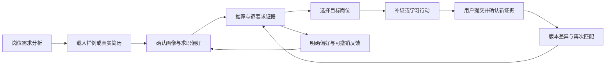

# 现有问题分析与下一轮完善方向

日期：2026-09-22。范围：当前本地平台、数据与训练代码、已有实测记录，以及本轮只读复核。本文补充并修正实施顺序；长期研究目标仍见 [完整研究方案](FULL_RESEARCH_PLAN.md)。

**当前最需要补齐的是：正确理解需求与个人经历、建立可信的效果判定、连接用户确认与反馈。已有工程和实验基础值得保留；继续增加模型之前，应先使这三条链路成立。**

本轮没有修改业务代码、启动训练或执行 Git 提交。反例仅使用完全虚构材料；数据统计来自仓库既有 `data/job_data.xlsx` 对应的版本化材料，不能当作外部 `merged_data.xlsx` 的分析。聚合统计、反例输入输出与源码摘要见 [本轮复核记录](evaluation/problem_analysis_20260922.json)。

## 1. 对当前阶段的判断

| 已有基础 | 当前能支持的结论 | 尚未解决的事情 |
|---|---|---|
| 岗位版本、家族划分、来源与引用跨度、私有材料目录 | 数据处理和实验具备复跑基础 | 自动解析未通过人工质量评估；家族仍是启发式种子簇 |
| BM25、冻结 BGE、结构化过滤、规则排序、平台 API | 本地推荐与诊断路径能够运行 | 对经历语义的利用不足，画像和偏好可能混入样例残留 |
| Qwen3-Embedding-0.6B 实际 LoRA | 标题/类别检索代理任务开发 nDCG@10 从 0.399507 到 0.505040 | 真实人岗匹配收益未知，研究模型也尚未接入线上 |
| 三类图模型、三种子、九组训练 | 训练与对照流程能够复跑 | 真实图没有超过随机图，当前任务不能识别图结构价值 |
| 48 个虚构场景、1,981 对候选材料、600 条抽取材料 | 可用于试标、开发和压力测试 | 人工金标仍为 0；48 个场景也不是 48 个独立真实用户 |
| 引用规则检查与本地 LLM 评审 | 可以暴露部分伪造与语义不支持错误 | 好/中/差判别实测为 2/1/1；三档排序未通过 |

以上实验数字来自 [实施实测记录](IMPLEMENTATION_RESULTS.md)，不把功能完成数当作推荐有效性的证据。

历史 AUC 也应纠正口径：最佳 **0.573901 对应旧的 20 维高级模型**；默认 9 维模型验证 AUC 为 **0.552620**。旧样本主体是 20 份画像的 3,200 条合成事件，另外只有 9 条标为用户反馈的事件。随机翻转标签、画像覆盖小、按事件切分、特征与线上路径不一致共同限制了结果；不能只归因于 XGBoost 或维度不足。依据见 [原仓库审计](AUDIT.md) 和 [重构方案核实表](REDESIGN.md)。

## 2. 已确认的问题与优先级

P0：会改变用户事实、错误放行硬条件，或使模型比较失去共同口径。P1：阻断推荐质量和用户闭环。P2：有前置条件的研究与扩展。

### 2.1 P0：真实简历可能沿用默认样例的条件

页面初始化会选中 Python 应届样例；上传文件只替换正文，保留原表单的城市、意向、学历、年资和薪资。后端优先采用这些表单值。因此，上传后的真实经历可能仍按样例条件过滤。这是代码路径确认的问题，本轮未运行浏览器复现。

定位：[默认样例](../web/platform/app.js#L218)、[上传处理](../web/platform/app.js#L204)、[画像解析](../job_agent/domain.py#L159)。

改进：在推荐前增加明确的画像确认步骤。每个字段保存 `值、来源、原文跨度、确认状态`，区分样例值、文本抽取值、用户偏好。新上传撤销样例来源的确认；用户已经明确设置的偏好可保留，但要显示与文本的冲突。画像版本同时覆盖正文、偏好和解析版本。

验收：先选应届样例，再上传另一方向的资深简历，不得静默沿用未确认条件；改变意向或薪资必须产生新画像版本。未确认字段保持未知。

### 2.2 P0：否定、条件作用域与技能证据解析存在反例

以下均是本轮执行现有函数得到的虚构反例，不代表真实岗位的错误发生率。

| 输入 | 当前实际结果 | 应表达的含义 |
|---|---|---|
| 岗位：不要求 Python 经验，熟悉 SQL | 仍产生 Python 缺口；SQL 简历覆盖分 0.5 | Python 不是该句要求 |
| 岗位：应届生勿投，要求 3 年以上 | 年资下限为 0，应届画像通过 | 应届否定不能触发“零年”规则 |
| 岗位：大专学历不符合要求，须本科及以上 | 门槛为大专，大专画像通过 | 门槛应根据肯定要求确定 |
| 简历：为 Python 开发团队完成招聘工作 | Python 被认定为实践，覆盖“熟悉 Python”要求得 1.0 | 句子证明招聘工作，未证明本人使用 Python |
| 岗位：加分项：熟悉 Python；必需：熟悉 SQL | 两者都按非优先项处理 | 前置标题应有各自作用域 |
| 岗位：掌握 Python 和 SQL，或者掌握 Java 和 MySQL | 拆成四个独立要求 | 这是两个组合之间的 OR |
| 岗位：Spring Boot 或 Django | OR 组之外又增加 Spring 要求 | 先解决别名与重叠跨度，再组装要求 |
| 职责：Python 或 Java；条件：Python 经验优先 | OR 组被覆盖，只会 Java 时覆盖分为 0 | 跨字段要求应合并证据，不能直接删除原组 |

定位：[技能证据](../job_agent/domain.py#L26)、[要求组](../job_agent/domain.py#L63)、[学历与年资](../job_agent/domain.py#L92)、[跨字段合并](../job_agent/domain.py#L137)。

当前 `evidence_verified` 主要核对两侧引用是否真的位于原文。它无法单独证明“这句话支持该能力结论”。例如上表招聘反例中的 Python 引用确实存在，但能力判断错误。

改进应包括局部否定、主体—动作—对象关系、模态作用域、复合技能归一化，以及嵌套要求表达。现有词典保留为候选识别器；LLM 结构化抽取负责补充语义，所有输出都要绑定原文并允许未知。不能只增加几条正则后宣称理解问题已解决。

验收：八类反例及独立改写变体通过；另用未参与修复的分层人工样本测需求组准确率、否定误放行率和假实践率。合成反例通过与真实数据准确率分开报告。

### 2.3 P0：评测分母可能随模型变化

[评分函数](../research/score_rankings.py#L26) 对每个模型分别使用“基础池 ∪ 该模型 topK”，再用这个子集计算 IDCG 和相关项总数。当模型带来不同的池外结果时，两个模型可能不再使用同一分母。

已复现：基础池只有一个 0 级岗位，完整虚构标签另有 A=3 级、B=2 级。系统甲只返回 A，系统乙只返回 B，当前两者 nDCG@10 都是 1、池内 Recall 都是 1。固定共同池后，nDCG 应分别约 **0.78715 与 0.33735**，Recall 均为 **0.5**。显式传入完整共同补标池可以规避，但当前入口没有强制。

目前人岗金标指标保持空值，因此这个问题没有推翻已发布的人岗分数；它是正式比较之前必须修正的入口。

改进：冻结查询清单、候选宇宙、所有系统 topK 并集与盲审池，保存共同哈希；新增池外候选时统一补标并生成新版。不能按模型、已标子集或返回查询子集改变分母。

验收：上述反例得到不同 nDCG；两个模型的共同查询、qrels 和池哈希一致；遗漏预定查询或存在未审 topK 时拒绝正式比较。

### 2.4 P0：段落保留不等于画像事实保留

本轮实际执行 [简历整理](../job_agent/workflow.py#L134)，输入为两段虚构经历：

> 5年工作经验，负责需求沟通。
> 使用Python完成接口开发，有2年开发经验。

整理把 Python 段前置后，解析年资从 **5 年变成 2 年**，接口仍返回 `facts_preserved=true`。原句和数字没有改动，问题在于“首次正则命中”混用了总年资与专项年资，事实校验又只比较技能等级。

改进：把工作总年资、某项技能年资、项目日期分别建模；冻结已确认的画像事实。重排以项目/任职经历块为单位，保留标题、组织、日期、职责和成果的归属。校验教育、时间、数量、身份角色及能力断言；无法确认的语义关系交给用户复核。

验收：纯表达整理不得改变确认事实或硬条件结果。新增真实证据可以改变画像，但必须作为单独变更展示，不能混在自动整理中。

### 2.5 P1：查询丢掉了项目经历，排序对重要差异不敏感

线上查询是 `求职意向 + 正向技能词`，见 [查询构造](../job_agent/workflow.py#L54)。履历中的任务、场景、个人贡献和结果没有进入语义检索。

本轮用两个虚构岗位复现：一份简历做订单后台接口，另一份做营销报表；意向和 Python、SQL、自动化测试相同。两者生成完全相同的查询，推荐顺序和分数也完全相同。把第一份简历的段落换序，结果仍相同。此例并不要求任何细微措辞都导致重排；它说明系统无法利用被丢弃的任务差异。

改进：保留三种可消融查询——意向摘要、去身份后的完整经历、按项目组织的结构化画像。向量召回使用经历语义；词典与确认偏好用于辅助检索和解释。对长简历按完整项目分块，避免 512 token 截断主要证据。

验收：独立人工判定的“相同技能、不同职责”对照上，正确岗位的相对次序改善；无关修辞或段落换序不应显著改变结果。先测冻结模型，再决定是否需要新微调。

### 2.6 P1：研究、特征物化与线上尚未使用同一套约定

当前线上是 BGE 与固定权重；研究 Qwen 使用另一套查询、正文与池化方式。32 维特征物化未传检索上下文，BM25、dense、graph、RRF 缺失，来源标志为 0；画像没有 `salary_max`，薪资 IoU 也未生效。现有 48 查询缺少 ranker 要求的 `profile_family_id`，且只有开发/测试材料，不能直接接成正式排序训练集。

定位：[语料编码](../job_agent/corpus.py#L88)、[特征定义](../job_agent/ranking.py#L10)、[物化入口](../research/prepare_ranker.py#L25)、[查询生成](../research/build_benchmark.py#L98)。

另一个维护风险是：读取版本化岗位后，又在 `Job` 构造时用当前代码重新解析。原始快照不变并不意味着特征不变。需要把解析器、技能体系、人工修订版本纳入材料与缓存哈希。

改进：统一编码器、查询/正文模板、截断、归一化、特征生成与候选过滤；每次实验记录基座 revision、adapter hash、解析版本、索引版本。补齐独立 train 画像、仲裁导出和检索特征回放，再训练 ranker。

验收：同一输入、候选和模型下，离线与服务的向量、逐项特征及 top10 在声明误差内一致。模型或模板变化使旧索引失效。保留当前规则排序作为可解释基线和回退路径。

### 2.7 P1：反馈、补证和“简历训练”尚未形成持续闭环

点赞/跳过已写入本机会话记录，但推荐没有消费这些记录，且会按短期保留策略清理。曝光缺少画像版本、模型版本和特征上下文，不能直接用于可靠的学习排序。当前改写主要是原段排序，面试是问题模板，尚无行动完成、回答评价、证据确认和复测状态。

定位：[会话数据与反馈](../job_agent/api.py#L117)、[补证行动](../job_agent/coach.py#L27)、[应用整理](../web/platform/app.js#L130)。

改进：先实现明确、可撤销的会话偏好，例如不考虑某公司、薪资不足、方向不符；再建设“目标岗位→待补证项→用户行动→新证据→人工确认→重新匹配”。研究留存由用户单独选择，默认不保存完整简历；保存必要的去身份特征、版本与曝光位置。跳过不能直接当不匹配标签。

验收：明确排除公司后下次推荐生效，撤销后恢复；补证后能指出具体关闭的缺口及引用。仅改排版时不要求分数上涨，也不把它表述为能力提升。

## 3. 数据对产品定位的实际限制

### 3.1 词典覆盖不等于需求理解覆盖

正式内容版本为 **14,118 条、72 职类、9 个技术大类**。93 项词典在职责/条件中命中 11,428 条，占 80.95%；**2,690 条未命中，其中 2,682 条仍有非空职责**。

| 分组 | 总岗位 | 命中词典岗位 | 命中率 |
|---|---:|---:|---:|
| 后端开发大类 | 3,542 | 3,308 | 93.39% |
| 技术项目管理大类 | 1,096 | 648 | 59.12% |
| 销售技术支持大类 | 671 | 207 | 30.85% |
| 客户成功职类 | 153 | 59 | 38.56% |

“未命中”应进入未知与语义补充流程，不能表示没有要求或用户没有能力。库内 222 条 Spring 与复合技能跨度重叠记录可作为审核队列，不能直接算作 222 条已确认错误。上述样本全部来自技术类目，不能外推全行业覆盖率。

第一版质量承诺建议限定到 Java/Python 后端、前端及数据分析等少数明确方向，逐类验收后扩展；岗位需求分析仍可浏览全库。沟通、交付、需求分析等任务能力需要进入技能体系，避免把技术岗位也简化成工具清单。

### 3.2 现有库不能直接代表应届市场或当前招聘供给

源字段只有二级分类、企业、岗位名称、岗位地址、岗位职责、岗位薪资、岗位要求、职位类型名称。没有采集日期、发布日期、截止日期或在招状态；研究清单的生成时间不能补作采集时间。

| 当前规则解析的经验下限 | 岗位数 | 比例 | 可解析月薪数 | 广告月薪区间中点中位数 |
|---|---:|---:|---:|---:|
| 0 | 1,987 | 14.07% | 1,934 | 22,250 元 |
| ＞0 且 ≤3 年 | 7,112 | 50.38% | 7,065 | 19,000 元 |
| ＞3 年 | 4,633 | 32.82% | 4,613 | 37,500 元 |
| 未知 | 386 | 2.73% | 0 | 不可计算 |

这些是未经人工校正的规则统计。“0–3 年下限”9,099 条包含 **4,661 条下限为 3 年**的岗位，不能视为应届可投。条件字段出现“应届”字样仅 **233 条（1.65%）**；零年组还混有经验不限、一年以内，未知组中有 379 条每周出勤要求。因此 22,250 元不能解释为应届行情，未知年资也不能等同于不适合实习。

产品应显示快照与有效状态未知，并允许用户输入当前目标 JD 做诊断。薪资参考按职类、岗位级别、用工形式与已知地区分层；展示样本数、缺失和样本偏向，避免用全库中位数给个人定价。后续增加合法获取且有日期的岗位数据，再研究岗位过期与时间漂移。

## 4. 算法创新应聚焦的三个可验证问题

### 4.1 需求逻辑与经历证据对齐：优先级最高

建议将核心研究问题写为：**理解要求组合与个人实际任务，能否减少“看起来技能相同”的假匹配和错误缺口？**

岗位侧保留“岗位→要求组→任务/技能”，每个要求包含模态、逻辑、适用范围、原文跨度与审核状态。简历侧保留“经历块→本人职责/行动→所用方法→结果/材料”，明确自述、文本支持、用户确认和外部核验是不同状态。

每个要求叶子返回支持、冲突或信息不足。AND 组全部支持才支持，任一明确冲突则冲突；OR 组任一支持即可支持，所有选项明确冲突才冲突，其余保持信息不足。优先项单独评分。**没有写到的经历先解释为缺少证据，不直接断言用户不会。**

抽取结果建议至少包含：

| 对象 | 必要字段 |
|---|---|
| 岗位要求 | 要求 ID、所属组、AND/OR、必需/优先/未知/否定、任务或技能、适用级别、原字段与跨度、抽取器版本、审核状态 |
| 简历证据 | 经历块 ID、本人角色、行动、对象与场景、所用技能、时间、结果、自述级别、原文跨度、确认状态 |
| 对齐判断 | 要求 ID、证据 ID、支持/冲突/信息不足、依据、生成器与核验器版本 |

这使“文本有引用”和“引用支持具体主张”成为两个独立检查。图上的预测关联仍进入假设表，不补作候选人的经历或岗位事实。

### 4.2 向量与排序：先对齐真实任务

保持 BM25 和冻结向量基线。BEIR 在多任务检索中发现 BM25 仍是稳健基线，也提示单一、同质代理任务不足以说明跨场景泛化；这支持本项目保留多路对照，不能据此直接推断招聘收益。[BEIR 原论文](https://arxiv.org/abs/2104.08663)

下一轮先在相同 JD 文本和候选集合上比较三种查询：仅意向、去身份后的经历、结构化经历摘要。冻结 Qwen 与已有 LoRA 都参与，量化“标题代理收益”是否迁移到简历任务。

之后训练：

1. 从独立训练岗位家族构造并审核简历—岗位多级关系，允许多个合理正例；不要将“不是生成该简历的种子 JD”自动标负。
2. 难例优先包括同技能不同任务、同方向不同年资、只有团队背景没有本人实践、满足一个 OR 选项、学历或薪资明确冲突。未知条件不当确定负例。
3. 延续 0.6B LoRA 起点，用多正例对比学习和审核难负例；先做少量明确超参数对照，再扩大训练。保留三种子与家族隔离，不因算力可用就扩大未审样本。
4. 用同一画像内 0–3 级候选训练 LambdaRank。检索、证据覆盖、任务对齐、约束与未知比例都来自同一特征生成器；缺失率和消融决定保留哪些特征。
5. 交叉重排器作为独立对照，候选规模可从 top20–50 起步；生成式重排还要报告位置敏感性、成本和依据支持率。

### 4.3 GNN：正式研究保留，重新设计判别任务

当前图输入投影丢失 OR 组归属。例如：

- 岗位甲：`(Python 或 Java) 且 (SQL 或 Redis)`。
- 岗位乙：`(Python 或 SQL) 且 (Java 或 Redis)`。

画像只支持 Python 与 SQL 时，甲的两组均有支持，乙的第二组没有支持。当前图却生成相同四条技能边。文本分支仍可能区分原句；这个反例证明的是图表示丢失信息，不能推断最终向量必然相同。

另外，当前训练把完整 JD 文本向量作为输入与残差，再要求找回自身文本。真实图与随机图三个种子的 R@1/MRR 逐一相同、R@10 全为 1，说明这一预任务无法体现图增益，详见 [图模型报告](GRAPH_RESULTS.md)。

保留 GraphSAGE 作为新节点归纳候选有方法依据，但原论文不保证其在本项目有增益。[GraphSAGE 原论文](https://arxiv.org/abs/1706.02216)

下一项实验比较：**相同文本输入 → 相同技能简单池化 → 显式要求组执行器 → 保留要求组节点的图模型 → 度数保持随机图**。图中保留岗位、要求组、技能和任务节点，简历通过自身证据归纳编码，不能借测试标签连到正例岗位。

若做技能遮蔽，必须同步去掉文本目标及别名、关联边、反向边和派生统计，再重新编码；否则文本旁路仍可恢复答案。所有共享统计仅来自允许的训练信息。

图模型只有在独立人岗评测上超过简单池化与规则组执行器，且随机图消融表明关系结构确实有贡献时，才值得晋升线上。技能补全改善可以单独作为研究结果，不等同于推荐改善。GRPO 与生成 SFT 排在这个判断之后；当前尚无可靠奖励或足量审核生成样本支撑它们。

## 5. 评测与标注的下一步设计

### 5.1 建立两套用途明确的样本

现有 48 份场景由六种方向项目模板和八类人设组合，同方向文本跨开发/测试存在重用。它们适合保留为开发和对抗材料；不能作为 48 个独立用户来估计真实泛化。当前发现的模板重用也不等同于已经发生训练岗位家族泄漏。

先完成一个小试点：从现有 600 条抽取材料分层抽 120 条，从 1,981 对候选材料抽 300 对，由两位真实评审独立标注并仲裁。覆盖肯定、否定、OR、优先项、无词典命中、真实经历不足等类型。它用于改良规范，不作最终模型胜负依据。

随后建设独立撰写或经授权脱敏的画像家族，所有改写/扰动随原画像同分区。正式集从约 60–100 个独立画像家族起步；每个画像审阅共同候选池，数量按实际模型并集确定，预计需要数千对判断。若人力不足可分批进行，但不把模板扩写数当新增独立样本，结论允许无定论。

标注相关性 0–3 级时，同时记录理由和硬条件状态。硬冲突、任务不相关、部分可迁移、充分支持分别有具体例子；人工也无法确认的材料标为待补充，不强行判负。报告仲裁前的原始一致率、二次加权 κ、争议类型与区间。

### 5.2 统一比较口径，分离各组件的贡献

| 实验 | 固定条件 | 要回答的问题 |
|---|---|---|
| BM25 / 冻结向量 / 二者融合 | 同查询、JD、过滤、候选宇宙 | 多路召回的独立贡献 |
| 冻结 / 现 LoRA / 人岗对齐 LoRA | 同文本模板和候选 | 微调有没有真实人岗迁移收益 |
| 规则排序 / LambdaRank / 交叉重排 | 同一召回候选 | 排序器是否改善前列相关性 |
| 技能集合 / 要求组 / 组节点图 | 尽量相同可用输入信息 | 逻辑与图结构各贡献多少 |
| 原因模板 / LLM 诊断 / 逐主张核验 | 同推荐岗位和证据 | LLM 是否提高可读性、行动价值并保持事实 |
| 原简历 / 表达整理 / 新增真实证据 | 固定目标岗位与事实版本 | 表达改善和证据补充分别产生什么变化 |

“不给岗位数据的 LLM 直接推荐”可作伪造风险对照；正式排名比较使用同一真实岗位宇宙。整条 A/B/C/D 产品阶梯可用于演示，但不能替代以上组件消融。

主要指标是共同已审池上的 nDCG@10、池内 Recall@50、MRR。未穷尽全库相关岗位时，明确使用“池内”名称。需要追问的场景单独测动作校准，不能混入常规推荐 nDCG。

同时记录硬条件违规、引用定位、语义支持、需求逻辑、技能误匹配、追问、改写事实保全、建议可执行性、多样性、对抗鲁棒性与延迟/成本。每个比例给出分子、分母和置信区间，避免只展示综合分。

### 5.3 对 LLM 评审保留独立校验

现有 12 例挑战中好/中/差得 2/1/1，重复三次无波动只能说明本次调用稳定。LLM 评审还可能受位置、篇幅和自身生成偏好影响；这些局限已有研究，因此本项目要用独立人审验证，不引用其他模型的历史一致率替代本地模型结果。[LLM-as-a-Judge 原论文](https://arxiv.org/abs/2306.05685)

岗位 ID、薪资、出处等程序可验证事实先独立评分，避免被高可读性抵消。语义支持按逐条主张判断，跨顺序评审、盲掉模型来源；比较 judge 与人工仲裁的一致程度。长答案本身不判差，检验的是无关重复、术语堆砌和无依据的额外主张。

调提示词使用开发挑战集；独立留出新的伪造、夸大、缺引用和伪相关案例。生成器与 judge 同基座时报告相关错误风险；另一模型的意见也不自动构成人工金标。

### 5.4 建议的晋升门槛

以下是下一轮预注册的工程起点，不是已有成绩或行业通用标准。必须先冻结，再看结果。

| 对象 | 建议验收条件 |
|---|---|
| 画像与硬条件 | 已知反例和独立变体通过；分层人工集无已确认的否定误放行；同时报告样本数与错误率区间 |
| 需求理解 | 假缺口率相对词典基线下降至少 20%，真缺口召回至少 80% 且下降不超过 2 个百分点；判定“缺口”时区分能力冲突与证据不足 |
| 标注规范 | 试标二次加权 κ 目标 ≥0.70，同时报告原始一致率与区间；达不到先检查类别定义与争议，不用仲裁后满分代替 |
| 微调、ranker 或 GNN | 在共同人岗集上 nDCG@10 绝对增益目标 ≥0.02，按画像家族配对重采样的 95% 区间下界 >0；硬违规不增加，池内 Recall@50 不下降超过 0.02 |
| 简历整理 | 确认事实和硬条件结果不变，错误或无法确认时返回待审核；独立评审验证可读性收益 |
| 评审器 | 新的好/中/差对照能严格排序；逐维报告与人工的一致性、对抗漏检和重复波动，不能只用平均分批准上线 |
| 服务晋升 | 同输入的离线/线上输出一致；影子回放完成；同时记录延迟、资源与失败回退，不以实验名称代替模型版本 |

小样本下区间可能很宽，此时结论为未证实。训练种子波动和查询抽样不确定性分别报告；正式留出集不能反复用来挑提示词、训练步数或阈值。

## 6. 平台与工程的完善顺序

保留现有数据版本、引用结构、混合检索、标注工作台、本地服务和实验脚本。通过共享核心接口逐步收敛，避免再建立一套与现有线上分离的数据/排序路径。

产品主流程应连成：

| 阶段 | 具体交付 | 完成依据 | 工作量估计 |
|---|---|---|---|
| 第一阶段：纠正事实与评测入口 | 画像确认、需求反例回归、年资/经历块保全、固定评测池、解析版本 | 本文 P0 问题各有独立验收；旧数据可迁移或明确失效 | 3–5 个开发人日 |
| 第二阶段：可信标签与统一推理 | 试标规范、仲裁导出、独立画像家族、离线/线上模板和特征共用 | 标注分歧可解释；同输入回放一致；train/dev/test 不混用 | 4–7 个开发人日，另需标注人时 |
| 第三阶段：检索与排序证据 | 查询表示消融、人岗对齐试训、LambdaRank、随机图与组图对照 | 共同人工集完整报告；增益未证实则保留简单模型 | 4–7 个开发人日，取决于金标就绪 |
| 第四阶段：用户闭环与演示 | 可撤销偏好、行动完成、简历版本差异、事实核验、真实操作演示 | 用户完成一次需求分析到补证复测；后续另做浏览器与移动端验收 | 3–5 个开发人日 |

这是聚焦完善的估计，总计约 14–24 个开发人日；不包含全量人工标注、重新获取数据或研究不达预期后的迭代。人工工作不能由程序生成的审核代号替代。

当前 14,118 条规模下，全量内存候选检查和向量计算通常不是首先要解决的问题。先记录真实瓶颈，再决定是否改 ANN、拆微服务或上分布式图训练。生产多用户部署需要单独完成身份、任务隔离、资源限制和恢复验收；本地演示状态不能直接等同于公网平台完成。

## 7. 最先做的三件事

1. **修正 P0 链路**：样例条件残留、需求否定/证据作用域、重排年资漂移、评测共同分母。将本轮反例扩成独立变体回归，并统一画像/解析版本。
2. **完成双人试标与共同人岗基线**：先审 120 条抽取、300 对匹配材料，改良规范后建设独立画像家族；同步比较意向、经历和结构化查询，验证系统能利用真实任务差异。
3. **按证据逐项接入模型与闭环**：统一离线/线上特征，先验证人岗 LoRA 与 ranker，再验证 GNN；把补证、确认和复测做成可追踪产品流程。任何新增模型都应有超过简单基线的独立结果。
