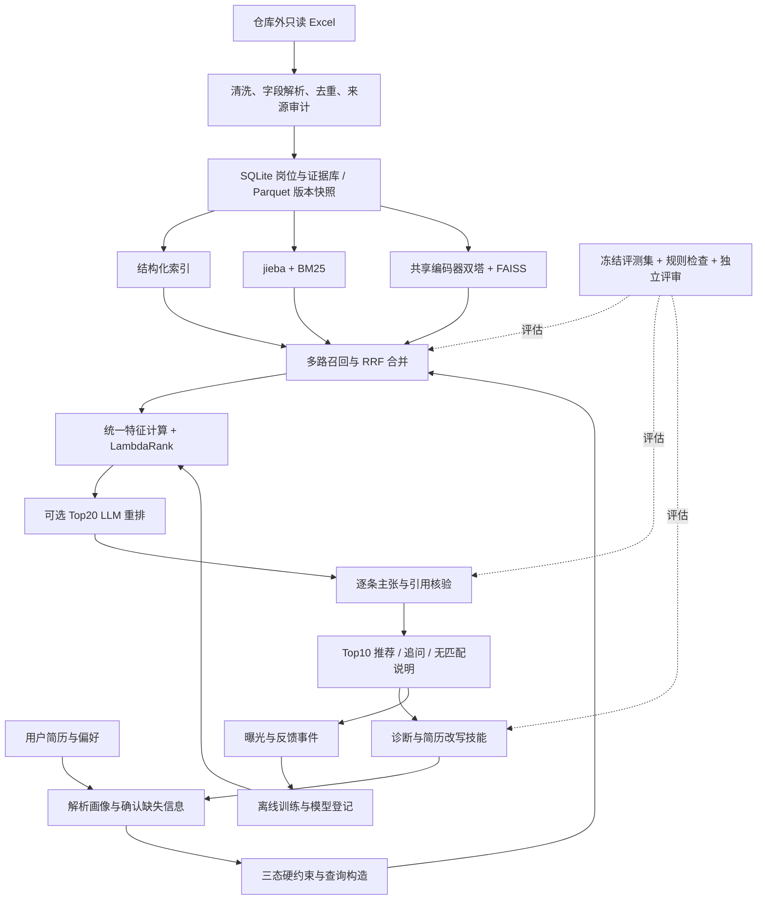

# 智能职位推荐与简历成长助手：重构设计方案

> 核查日期：2026-09-20。目标用户：深圳大学及深圳地区应届生、毕业三年内求职或转岗者。本文是基于代码审计、可访问数据实测及一手资料形成的实施设计，**不是已经重写、训练或上线的系统说明**。

2026-09-22更新：在本方案基础上，新增 [完整研究与实施方案](FULL_RESEARCH_PLAN.md)，将需求知识图谱纳入主架构，并详细设计领域微调、归纳异构GNN、图/文本消融和资源安排。后续模型路线与实验设定以新文档为准；本文件保留原始审计依据及详细评测rubric。

## 1. 决策与事实边界

建议把项目主线收敛为：**真实岗位库上的混合检索 → 可解释精排 → 有原文证据的差距分析 → 不编造经历的简历迭代**。科研贡献放在领域向量训练、困难样本、证据约束及可信评测上。先修复数据与验证链，再决定是否训练更大模型。

本轮实际环境为 Linux，仓库位于 `/storage/xukunbo2/job-agent`，已有 origin 指向用户仓库，无须克隆。题述 Windows 路径 `E:\file\note\profile\merged_data.xlsx` 在当前环境不可访问；相关目录未找到同名文件。**不能把仓库现有 `data/job_data.xlsx` 等同于该原始文件**。以下数据数字仅指仓库 Excel；取得原始文件服务器路径后，用 [剖析脚本](../scripts/profile_data.py) 重跑，再更新选型与数据结论。Windows 复跑方式见 [数据报告](DATA_PROFILE.md)。

| 核实事项 | 当前证据 | 对设计的影响 |
|---|---|---|
| 仓库 Excel | 14,118 行、8 列、1 个工作表；72 个职位类型、9 个二级分类 | README 的 105 类型/8 大类不能作为当前数据事实 |
| 字段 | 岗位名称、企业、岗位薪资、岗位要求、岗位职责、岗位地址、职位类型名称、二级分类 | 学历、经验需从要求字段解析；公司行业/规模不可假装已具备 |
| 地址缺失 | 3,544 条，25.10% | 位置未知不等于非深圳；未知记录不得直接声称满足通勤要求 |
| 样本偏向 | 9 个大类全部技术相关；至少 3 年经验的岗位 9,294 条，65.83% | 当前先聚焦技术求职；应届生岗位供给不足，需补足数据再宣传覆盖广泛 |
| 监督样本 | 3,209 条事件中 3,200 条合成、9 条反馈；仅 21 个不同简历 | 行数不是用户覆盖；无法支持复杂兴趣模型或招聘成功率结论 |
| 历史指标 | 20 维高级模型最佳验证 AUC=0.573901，最终值=0.549053；默认 9 维模型验证 AUC=0.552620 | 明确模型、检查点、划分与指标；禁止挑最佳值混称线上效果 |
| 算力 | 4×RTX 5090，每张约 32 GiB；1 号卡有已有 vLLM 进程 | 可做中小型向量模型实验；不占用或中断已有服务 |

详细证据及行号见 [仓库审计](AUDIT.md)，模型与论文依据见 [网络调研](RESEARCH.md)。本轮仅新增中文文档与明确要求的数据剖析脚本，不改业务实现，不执行 git add、commit、push 或远端操作。

### 1.1 产品价值与比赛场景

一次完整演示应回答四个实际问题：我该投哪些岗位；哪些硬条件不满足；简历没有证明哪些岗位要求；怎样用真实经历改写后再检查。面向求职者辅助决策，不做雇主自动淘汰候选人的系统，也不输出“录用概率”。

LLM 的作用是把非结构化简历整理成有出处的画像、解释简历与 JD 之间的措辞差异、生成可执行改写和追问。规则适合硬条件，向量适合语义召回；这些方法也能承担部分文本理解，因此不应宣称“没有 LLM 就完全不能做”。可验证的假设是：在保持事实与检索质量的前提下，LLM 提高诊断覆盖和建议可执行性。通过第 7 节的消融验证其增益。

界面建议分成“确认画像—浏览岗位—查看匹配证据—诊断简历—审核改写”五步。每个岗位卡片同时显示匹配点、限制项、数据日期及证据入口；每个改写建议显示原句、建议句和待用户补证项。把“文本表达变好”与“候选人能力提高”分开记录。

### 1.2 必须先解决的旧实现问题

1. 合成脚本为平衡 like/skip 随机翻转标签；某些失败降级也加随机翻转。立即停止沿用该标签作为可信金标准。类别不平衡应通过采样/权重处理，不能更改事实标签。
2. 常规提取器 9 维中 `text_sim` 与 Jaccard、词频余弦线性冗余；中文被连续汉字段整体切词。向量路径还有全零简历向量、薪资方法名错配等缺陷。扩大特征维数本身不能解决这些问题。
3. 事件只有 `action`，基础训练脚本读 `label` 并默认 0；部分特征和模型文件在线离线路径不一致。需要强 schema 和版本契约，而不是继续增加训练入口。
4. 随机按事件行切分使同一简历出现在训练与验证，不能证明新用户泛化。当前少量画像也不支持复杂深度排序模型。
5. 展示接口中存在模拟模型评测数据，不能作为实验结果；真实训练元数据与演示图表必须清晰区分。当前 Web 与简历存储还需隔离会话、训练任务和静态文件访问。

## 2. 总体架构与工程骨架



**技术选型**：Python 3.11；FastAPI + Pydantic；SQLite（WAL，仅本机服务写入）+ Parquet；jieba + BM25；FAISS CPU；sentence-transformers/FlagEmbedding；LightGBM `LGBMRanker`；前端第一阶段迁移现有 HTML/CSS/JS。不需要先上微服务、Neo4j、Kubernetes 或训练大型生成模型。树模型在 CPU 上足够，GPU 用于编码和向量训练。

设计依据是招聘匹配中的文本表示、职业路径与分阶段检索思想。JobBERT研究职位名称与技能的关系，来自Ghent–imec/TechWolf，不能错误归给BOSS；BOSS参与的person-job fit研究支持关注经历路径与岗位要求，而不是仅比较标题词频。论文结果只提供假设依据，不能直接推断本数据的收益，具体一手论文与机构核对见 [RESEARCH.md](RESEARCH.md)。

14,118×1,024 维 float32 向量约 **55.15 MiB**，先用 `IndexFlatIP` 对归一化向量做精确检索，既简单又可作为 ANN 正确性基准。Linux 优先 FAISS；Windows 优先 WSL2；本机安装困难可对这个规模直接使用 NumPy 点积。增长到数十万岗位或实测延迟超标再换 HNSW，起点 `M=32, efConstruction=200, efSearch=128`，必须报告相对于精确检索的 Recall 与延迟。这里的参数是实验起点，尚未实测。

```text
job-agent/
  pyproject.toml                    # 按 api/data/train/eval 分可选依赖并锁版本
  configs/                         # 数据、召回、模型、评测配置及版本
  src/job_agent/
    schemas/                       # 岗位、画像、证据、事件、输出契约
    data/                          # 只读导入、规范化、去重、来源记录
    retrieval/                     # 过滤、BM25、向量、RRF
    ranking/                       # 统一特征、规则基线、LambdaRank、MMR
    evidence/                      # 原文定位、主张核验、保守降级
    agents/                        # 显式状态机、模型适配器、技能路由
    feedback/                      # 曝光、偏好、事件校验、增量数据集
    api/                           # 会话鉴权、路由、后台任务
  skills/
    resume-diagnose/SKILL.md
    gap-analysis/SKILL.md
    resume-rewrite/SKILL.md
    mock-interview/SKILL.md
  training/                        # 构造训练对、挖负例、训练、评估
  evaluation/
    schemas/                       # JSON Schema、rubric、标注指南
    validators/                    # 规则通道与语义评审通道
    public_fixtures/                # 完全虚构的公开例子
  web/                             # 迁移旧 UI
  scripts/                         # 数据剖析、索引、评测命令
  tests/                           # 契约、解析、泄漏、证据、会话隔离
  docs/                            # 设计、数据卡、模型卡、评测、演示稿
```

真实 XLSX、简历、真实评测文本、索引、训练缓存放仓库外 `JOB_AGENT_PRIVATE_ROOT`，通过环境变量引用；代码不以当前目录推断数据位置。不设置或改写系统的 `HOME`。公开目录只放可发布的代码、协议、合成示例和聚合结果。

### 2.1 数据契约与可追溯性

每个岗位需要：`job_id`、`source_record_id`（若存在）、`source_snapshot_sha256`、`sheet`、`row_number`、`job_version`、`jd_family_id`、脱敏发布 ID、原始文本与解析结果。岗位身份与文本版本分离：优先来源 ID；没有 ID 则用企业/标题/地点规范化键并检测碰撞，JD 文本 hash 只作版本和近重复依据。稳定去重不能只靠 Excel 行号。

字段包括 `title/category/company_id/city/district/business_area`、`salary_raw/min/max/unit/months/currency`、`experience_min/max/education_min`、`skills`、`requirements/responsibilities`，及每个字段的 `source_span/parser_version/confidence/status`。岗位是否仍在招单独记录为 `active/expired/unknown`，不得从历史 Excel 推断 active。

保留原文和清洗文本的定位映射。引用统一为 `{job_id, job_version, field, start, end, quote}`，字符偏移以 Python Unicode code point 为准；浏览器用返回的 quote 展示，避免 JS UTF-16 下标直接切片造成错位。若用于匹配结论，同时给 `{resume_version, field, start, end, quote}`。数据中嵌入的“忽略规则”等文字一律作为材料，不作为 Agent 指令。

岗位要求“3-5年本科”必须拆成经验范围与学历，并保留原句；“本科优先”是偏好，不能当作必需学历。缺失、解析失败、面议、明确不限是不同状态，不一律变成 0。“深圳数据集”是采集背景，不能替代缺失岗位地点的原文证据。

### 2.2 薪资与历史数据口径

`15-25K·14薪` 保存月薪 15,000–25,000 元、14 薪及名义年包 210,000–350,000 元；未注明月数时的 12 薪换算标明假设。面议为未知；日薪/时薪和全职年包分开，除非用户明确工作日和月份，不强行年化。`1.5-2万/月` 与 `20-30万/年` 不能因为都有“万”而归同一周期。

“市场偏离”实际应写“相对于这份历史招聘样本”：按职类×级别×区域统计 P25/P50/P75 和样本数；不足 30 条向上回退，仍不足就不报百分位。区间中点分布是**职位广告区间的统计**，不是实际成交工资，更不是候选人录用报价。职位过期与样本选择偏差必须在界面说明。具体数字与解析覆盖率引用 [DATA_PROFILE.md](DATA_PROFILE.md)，不能以待取得的 merged_data 或 2025 样本宣称 2026 深圳实时行情。

当前月薪记录 13,612 条（96.42%），广告月薪中点总体 P25/P50/P75 为 15,000/23,500/40,000 元，明显受技术与资深职位构成影响。以下按“岗位名+企业+薪资”去重、仅纳入月薪，使用同一职类/经验分组，适合做历史样本的有条件参照：

| 职类与经验 | 样本数 | 月薪中点 P25 / P50 / P75（元） |
|---|---:|---|
| Python，1–3年 | 87 | 10,250 / 15,500 / 20,750 |
| Python，3–5年 | 99 | 16,500 / 21,500 / 32,500 |
| 数据分析师，1–3年 | 59 | 9,000 / 11,000 / 14,250 |
| 数据分析师，3–5年 | 69 | 15,000 / 20,000 / 25,000 |
| Java，1–3年 | 31 | 11,000 / 14,500 / 22,750 |
| Java，3–5年 | 114 | 14,125 / 22,000 / 30,000 |

例如，1–3年数据分析方向提出20K期望，可以说“高于此分组广告中点P75=14,250元，建议检查技能/行业差异”；不能说“不可能拿到20K”。三职类应届月薪分别只有6/4/4条，均不足30，**不输出应届薪资百分位**，不把“经验不限”擅自当应届。数据供给本身是P0需要解决的产品限制。

## 3. 推荐算法：先保障候选，再学习排序

### 3.1 三态硬过滤

每条约束返回 `pass/fail/unknown`。只有明确 fail 才剔除；unknown 留在待确认通道，展示“待确认”，不能计入“全部硬条件满足率”。用户勾选严格模式时可不显示 unknown，但必须解释因此损失的候选数。城市按目标城市而非仅按现居地；搬迁偏好单独处理；职位类别默认是软意图，允许相邻职类召回。

硬条件示例：明确工作城市、最低薪资、明确学历门槛、岗位必须的工作年限或证照、岗位类型（实习/全职）。工资区间在同币种同周期后判断重叠；只有最低期望时直接比较 JD 上界是否达到下限，不对无穷区间计算 IoU。用户未给城市/方向或简历完全无能力证据时先追问，最多一次 2–3 个必要问题；不是所有字段缺失都阻止一般性浏览。

### 3.2 多路召回与合并参数

| 通道 | 起点配额 | 实现与用途 |
|---|---:|---|
| 结构化/职类通道 | 80 | 从 pass 与允许的 unknown 集合按目标职类、标题和字段完整性取候选，稳定 ID 打破并列；不随机截前 80 行 |
| BM25 | 100 | jieba 自定义词典保护 C++/C#/JavaScript；字段权重标题 3、技能 2、要求 1.5、职责 1；起点 k1=1.2、b=0.75 |
| 共享编码器双塔 | 120 | 画像技能/项目摘要与岗位要求/职责共享语义空间；归一化内积；默认使用同一编码器，分别用合适的 query/document 模板 |

所有通道遵守同一个过滤掩码。14k 数据可直接对过滤后的向量精确计算；ANN 时先扩大召回到 3–5 倍再过滤，不足则补召回或精确兜底，不能静默少返回。各路合并最多 300 个，按 job_id 去重，近重复岗位版本只保留一个。

长文本默认先按职责/项目分块，每JD最多4块、每画像最多4块，块长不超过该基座支持的512 token并保留重叠64 token与来源；更长上下文作为单独消融。向量路的初版岗位分数取所有画像块与JD块相似度的最大值，先按job_id聚合再取120个岗位，不能让多块岗位挤占多个配额。max可能过度奖励局部关键词吻合，需与Top2块均值、技能覆盖加权做验证对比；chunk数量、截断丢失率、聚合版本与岗位级预算均写入run记录。前述55.15MiB为单向量/岗预算，4块/岗的向量存储上界约220.6MiB。

融合用加权 RRF：`Σ w_r / (60 + rank_r)`，初始权重均为 1，不把 BM25 原分与余弦直接相加。保留各路原分、路由命中和名次供精排使用。按召回路记录独有正例覆盖，配额与权重只在验证集调整。为了解释研发价值，单独做 BM25-only、dense-only、hybrid 消融。

### 3.3 精排特征与模型

每对画像/JD 只调用一个版本化 `FeatureExtractor`，训练和在线共用实现与特征顺序。建议以下 **32 个基础特征**；再加缺失掩码，不为了凑维数保留零方差或冗余项。

| 编号 | 特征 | 计算/缺失策略 |
|---|---|---|
| 1–4 | 主向量相似度、标题向量相似度、要求相似度、职责相似度 | 同版本编码器；无该字段时缺失，不以 0 冒充不相关 |
| 5–7 | BM25 标题分、正文分、RRF 分 | 固定分词词典；记录归一化版本 |
| 8–10 | 技能 Jaccard、JD 必需技能覆盖率、简历有证据技能精确率 | 技能归一、否定/熟练度识别，分母为空时记不可判定 |
| 11–14 | 薪资区间 IoU、最低期望满足比例、经验下限缺口、经验上限距离 | 一侧只有薪资下限则 IoU 缺失；经验未知不当应届 |
| 15–18 | 学历门槛差、目标城市匹配、区域偏好匹配、通勤时长 | 无路线/坐标时通勤缺失；不得把同区直接说成 30 分钟 |
| 19–22 | 公司规模偏好、标题意图命中、职类匹配、实习/全职匹配 | 当前数据无规模时禁用该项，非凭公司名推断 |
| 23–25 | 结构化召回命中、BM25 命中、向量命中 | 多热编码，一个岗位可命中多路 |
| 26–29 | 岗位关键字段完整率、技能证据覆盖率、必需项缺失数、简历项目职责覆盖率 | 关键字段集合固定，LLM 派生项保留证据及缓存版本 |
| 30–32 | 工作方式匹配、公司重复曝光次数、候选人明确偏好命中 | 无远程字段时缺失；没有历史事件时单独标记冷启动 |

不默认引入姓名、性别、年龄、家庭状态或学校 985/211 等排序信号；学历仅用于岗位明确门槛。岗位本身不合理的条件不转化为产品推荐偏好。做仅变更人口属性的配对公平性测试。

P1 无可信标签时先部署可解释规则分：验证集归一化后的语义 0.40、技能覆盖 0.25、意图 0.15、薪资偏好 0.10、区域偏好 0.10；缺失项的权重在可用项间重分配，并显示信息不足。硬违规先过滤，不靠负权重抵消。

有约 200 个独立画像查询、每个 20–50 条候选的可靠偏好后，使用 `LGBMRanker(objective="lambdarank", metric="ndcg", label_gain=[0,1,3,7])`。起点 `num_leaves=15, max_depth=4, learning_rate=0.03, n_estimators=1000, min_child_samples=30, colsample_bytree=0.8, reg_lambda=5`，按验证 nDCG@10 早停 50 轮；小样本若不优于规则基线就不发布。备选 `XGBRanker(objective="rank:pairwise")`，每个 query/group 必须连续且 group sizes 总和等于训练行数。

标签用 0–3：0=明确不适配/硬条件冲突；1=方向邻近但关键要求无证据；2=可投、有部分差距；3=方向与关键条件均有证据、优先投递。同查询内产生排序对；不能跨两个人比较 like 分数。`unknown/unjudged` 与 0 分不同，未标注候选不能自动当负例。

### 3.4 监督来源、反馈与防止 AUC 根因复发

| 来源 | 用途 | 质量控制与建议初始权重 |
|---|---|---|
| 两人独立标注并仲裁 | 冻结评测、小量高质训练 | 权重 1.0；保存岗位与简历双侧证据、分歧与原因 |
| 基于真实 JD 的 LLM 标签 | 扩大训练覆盖 | 权重 0.3–0.5；完整简历+要求+职责；教师版本、置信度和规则冲突记录；分歧送人工 |
| 明确规则伪标签 | 明确硬违规/明显技能吻合 | 0.2–0.4；仅代表对应条件，不把“薪资高”当总体喜欢 |
| 用户明确喜欢/不喜欢及原因 | 个性化偏好增量 | 与适岗性分开建模；“不喜欢公司”不能证明职业不匹配 |
| 曝光、点击、无反馈、跳过 | 观察数据 | 记录展示位置、候选集、策略概率；未点击/略过默认未标注，不强行当负例 |

事件包括 `event_id/session_id/anonymous_user_id/resume_version/query_id/job_id/job_version/position/policy_version/action/reason/timestamp/source`；写入前 schema 校验，幂等去重。`source=synthetic/human/user` 不可丢失。暂存合成历史事件作为噪声实验基线，不把它们混入人工金标准。

数据先按原始画像族、JD 近重复族分组再切分、再生成合成文本和训练对。模板改写、同一岗位换标题、同一简历换名都不算新独立样本。主验证使用未见画像及未见 JD 家族，另做公司隔离和按时间切分压力测试；当前缺乏可靠时间字段时不能宣称做了时间外推。训练类别分布通过抽样/权重调整，**永不随机改标签**。

记录全局 AUC 作为兴趣二分类辅助指标；主线用每查询 nDCG@10、MRR、候选覆盖与硬违规率。按画像 bootstrap 1,000 次报告 95% CI，不能对相关事件行做独立抽样。小样本差异不显著就写“尚无证据优于基线”。

### 3.5 Top20 重排、推荐理由、冷启动

对精排 Top20 可选一次 listwise LLM 重排：输入稳定 job_id、关键字段、简历证据与统一 rubric；要求只输出这 20 个 ID 的排列、相关性等级、支持与冲突证据。校验 ID 唯一、属于候选、数量完整、硬约束不反转；失败或超时回退树模型。配置起点温度 0、超时 20 秒、最多 1 次修复重试，模型版本与 token 成本入日志。先与不使用 LLM、Qwen3-Reranker 的延迟/效果比较，再决定是否默认启用。

推荐理由先生成结构化原子主张，再渲染自然语言。例如“JD 要求 Python；简历项目体现 Python，因此技能有交集”，引用分别来自两侧。JD 没写福利、地址不详、薪资面议时，禁止补成“五险一金/南山/20K”。“可能适合”也不是规避证据要求的方式。文本包含有效引用不代表主张被引用支持，必须做语义蕴含核验。核验失败则删主张、降级成字段展示，不能凭另一个 Agent 的赞同将其判真。

Top10 用 MMR 起点 `λ=0.8`，相关性归一后惩罚候选间相似度；原则上每公司最多 2 个、每近重复 JD 家族最多 1 个；在满足用户方向的候选充足时提供 2–3 个相邻职类。用户只求单一岗位时不强求跨职类多样性。无足够合格项返回少量结果并解释；不降低硬条件凑数。

## 4. 向量训练方案

### 4.1 基座与硬件路线

| 档位 | 模型与用途 | 参数/向量/最大上下文 | 本项目决策 |
|---|---|---|---|
| 即取即用 | `BAAI/bge-large-zh-v1.5` | 约 326M、1,024 维、512 token | 中文低复杂度基线；CPU 可离线编码，长简历分块，不能直接截掉末尾全部经历 |
| 长文本对照 | `BAAI/bge-m3` | 约 568M、1,024 维、8,192 token | 长文、多语场景；第一阶段仅用 dense，稀疏/多向量作为独立消融 |
| 主要训练候选 | `Qwen/Qwen3-Embedding-0.6B` | 0.6B、最高 1,024 维、32k token | 共享双塔微调主候选；先在 512–1,024 token 测效果/成本 |
| 更强基座对照 | Qwen3-Embedding-4B / 8B | 4B/8B、最高 2,560/4,096 维、32k | 优先测 4B 未微调；8B 只在小模型瓶颈明确后加入 |
| 备选 | `gte-multilingual-base` | 约 305M、768 维、8,192 token | 中文之外的简历、部署成本比较用，避免盲目扩展模型列表 |

以上模型规格依据官方模型卡，详见 [RESEARCH.md](RESEARCH.md)。没有一张通用榜单能证明哪个在这份招聘数据上“最佳”。Qwen 的 query 指令模板与 BGE 的 query 指令按各自模型卡使用，文档侧不盲目添加 query 前缀；推理与训练模板、pooling、归一化必须一致。

CPU 起点：BGE-large/GTE，编码 batch=8（内存紧张降到 1），先做 1,000 条测速并记录峰值内存；索引检索留在 CPU。一张空闲 5090 足够尝试 BGE 全参与 Qwen0.6B LoRA，实际 batch 由显存实测决定。大致权重下界：0.6B BF16 约 1.2 GB、4B 约 8 GB、8B 约 16 GB，**不含激活、梯度、优化器和运行开销**，不据此承诺 8B 全参能放入 32 GiB。

现场驱动 570.133.20、`nvidia-smi` 报 CUDA 12.8，默认 Python 尚无 torch，数据依赖还出现 ABI 冲突。后续训练先找已有可用隔离环境并验证 RTX 5090 的 sm_120 支持，用小张量 BF16 前向/反向检查；不要按网上旧命令直接更换系统驱动或给已有 vLLM 安装依赖。GPU 0 做训练、GPU 2 做离线编码、GPU 3 可做独立评审；这是资源计划，本轮未启动训练，GPU 1 原服务保持独立。

### 4.2 训练对的构造与筛选

第一轮目标为 **8,000–20,000 个通过质检的弱监督对**，是预算目标而非现有成果；宁可少量高质，不为数量复制模板。

| 类型 | 建议构成 | 具体规则 |
|---|---:|---|
| 标题/职类 → JD | 25% | 去除 JD 文本中重复标题后仍需有职责证据；相同查询多个正确 JD 用多正例训练，不能互作负例 |
| 有证据技能摘要 → JD | 15% | 从职责原文抽取、带 span；去掉抽取失败和纯福利标签；查询不逐字复制整段 JD |
| JD → JD | 20% | 同标题同职类只是候选；再要求技能/职责一致、级别可兼容及非简单副本；跨公司配对更有意义 |
| 合成画像 → JD | 40% | 从训练分区真实 JD 反推合理项目经历；写成简历语言，保留 source_jd_family_id；包含真实缺口，不把 JD 全部要求直接抄成简历 |

教师只见训练分区 JD，先生成匿名画像，再由不同提示词或独立模型检查：经历年限是否一致、项目和技能是否有上下文、没有电话号码或真实人名、是否近乎复述 JD、是否存在明显不可能的能力组合。按职类分层抽 10% 双人复核；质量低于 90% 的批次停止入库，先查生成模板与教师理由。LLM 产出的“匹配”是弱监督，不是事实证明。

难负例从未微调 BM25/dense Top50 挖掘，每个正对起点配 4 个：同城但职责不同；同职类而必须经验/资质冲突；BM25 字面相近但角色不同（Java 与 JavaScript、产品运营与生产运营）；语义相近但人工确认不适配。**同薪资档不同、同职类不同级别不自动等于语义负例**；只有用户硬偏好或明确职责冲突时才可作为人物—岗位负对，否则应交给结构化过滤/精排。

同职类中可能适合用户的候选、同一 JD 家族和已知多正例应从负例池 mask；不要仅依赖 `NO_DUPLICATES` 去掉完全相同文本。负例难度过高/标注冲突的例子入人工池。训练后挖一轮新难例即可，只有验证集显示覆盖不足才继续。

### 4.3 目标函数与可复现实验起点

采用 InfoNCE；归一化后的相似度为 s，对查询 q 的正确岗位 p：

`L(q) = -log [ exp(s(q,p)/τ) / (exp(s(q,p)/τ) + Σ合法负例 n exp(s(q,n)/τ)) ]`。

有多个正例时采用多正例分子或屏蔽其他正例，不能把它们塞进负例项。使用 in-batch negatives + 显式难负例；同 batch 的假负例屏蔽按来源家族和已知 qrels 实施。

| 配置 | 起点与搜索范围 |
|---|---|
| 长度 | 首轮所有基座使用≤512 token的同一分块策略以公平比较；M3/Qwen再单独消融JD 512–768、画像768–1,024的更长块，更新聚合/截断版本，保留原文定位 |
| Batch | 逻辑对比batch=128个查询，每查询1正+4难负；GradCache编码微批次从4–8条文本开始，注意单位是文本而非查询；一个查询组含6条文本。先测峰值显存再增大；不使用缓存时每卡查询数由显存实测决定 |
| 大负例池 | CachedMultipleNegativesRankingLoss/GradCache，或跨 GPU all-gather；普通梯度累积只增优化器有效 batch，**不自动扩大同一次 softmax 负例池** |
| 温度 | τ=0.05；在验证集比 0.02/0.05/0.10，不混用库的 scale=1/τ |
| 优化 | AdamW、weight_decay=0.01、warmup_ratio=0.1、gradient_clip=1.0；训练 1–3 epoch |
| 学习率 | BGE/M3 全参 1e-5 起点；Qwen0.6B LoRA 1e-4，LoRA r=16、alpha=32、dropout=0.05，目标 q/k/v/o 投影 |
| 对照 | Qwen0.6B 全参 1e-5；相同数据、查询模板、训练 token 预算与验证早停，不将两个方案不同标签量的提升归于 LoRA |
| 验证 | 每 200 step 或每 epoch，取更频繁者；以验证 nDCG@10/Recall@10 早停，两次无提升停止 |
| 随机性 | 至少 42/43/44 三个 seed；保存模型 revision、数据 hash、父模型、模板、batch 构成、峰值显存及训练日志 |

该路线是在预训练表示上进行领域适配，不从 14k 岗位从零训练 Transformer。原有 Word2Vec 保留为冻结基线；如要比较修复版，必须在同一词向量空间编码双方，单独命名，不能将旧路径全零当成 Word2Vec 的合理能力上限。

### 4.4 向量评估与发布门槛

使用同一冻结画像、候选库、qrels，对比：词频/BM25、修复且注明版本的 Word2Vec、未微调 BGE/M3/Qwen、领域微调模型。报告 Recall@10、MRR@10、nDCG@10、Recall@100、编码吞吐、检索 P50/P95、峰值内存/显存。如果只有候选池标注，指标命名为 **pooled Recall**，不能宣称全库绝对召回率。

预注册试点门槛：微调模型相对同基座 nDCG@10 提升至少 0.03（绝对值），画像级 bootstrap CI 下界大于 0；每个关键困难组nDCG绝对下降不超过0.03，少于20个独立画像的组记“无法判定”，扩充后再决定全面发布。这是验收目标，不是预期能保证的结果。样本小导致 CI 跨 0，则保留未微调模型并扩充标注，不通过挑 seed 或重新看测试集调参来“达标”。

### 4.5 研究扩展的进入条件

**技能共现图谱**：先从可追溯技能抽取构造 `JD—要求—技能` 与 `简历片段—证明—技能`。共现边带出现次数、PMI、时间范围及数据版本，它仅表示这个招聘样本中的关联，不是能力因果或技能可替代性。少量关系先用统计图；关系类型和带证据正例足够时，再对比 TransE/RotatE 与普通技能特征。自然语言表示和图表示不能直接当成同一坐标空间相加，需显式融合/训练对齐。

事实边状态为 `observed/verified`；模型推断边单独存 `hypothesis`，附提出模型、置信度与待核验状态。检索展示不得把 hypothesis 描述为已证实的职位要求，更不能混进人工金标准。图检索以 nDCG 与证据覆盖净增益决定是否保留。

**GRPO 检索控制器**：仅当确定性路由/查询改写在至少数百独立任务上仍存在稳定失败模式，且有数千可重放轨迹与可信 reward 后开展。动作空间限定为查询改写、路由选择、召回配额、是否调用重排；不能修改事实字段或标签。奖励以真实 qrels 的 nDCG/覆盖减去延迟与调用成本，硬违规给不可抵消惩罚；与启发式控制器、固定 hybrid、contextual bandit 先比较。先离线 replay、冻结测试、检查 reward hacking，不用自家 LLM 的“看起来不错”作为唯一奖励。它不是 P0–P3 的前置依赖。

## 5. 简历模块：技能包与事实保全

### 5.1 “苏神 skill”的核查结论

截至检索日，找到社区项目 `tianming23/SuGPT-kexue`，包含以苏剑林博客为材料的技能文件；但作者并非苏剑林，未找到能唯一指向用户所说“最近最火”的证据。**未找到唯一出处，按 Agent Skills（SKILL.md 模块化技能包）理解**，不能声称苏剑林本人发布或背书。[Anthropic 官方介绍](https://www.anthropic.com/engineering/equipping-agents-for-the-real-world-with-agent-skills)及候选项目的详细归因见 [RESEARCH.md](RESEARCH.md)。

采用渐进式加载：路由器先读技能 name/description，触发后读取 SKILL.md；只有需要时才读取该技能的 rubric、模板或执行受控脚本。Skill 是输入输出与流程的模块化约定，不等于训练权重、独立 Agent 或自动拥有系统权限。

| 技能 | 触发 | 输入 | 输出与验收 |
|---|---|---|---|
| resume-diagnose | 首次提交简历/更新版本 | 原文、解析画像、用户目标 | 字段缺失、矛盾、证据跨度、最多 3 个关键追问；无依据经历保持未知 |
| gap-analysis | 选择目标 JD 或 Top3 | 画像、真实岗位字段、历史分布 | 已证明匹配项、未证明技能、明确经验/学历冲突、薪资分位说明；每项双侧引用或明确“缺少证据” |
| resume-rewrite | 用户接受具体诊断项 | 原句、目标要求、事实清单、用户补充 | 原文/改文 diff、主张列表、引用、待补数字；不把了解升级为精通，不编项目、年限、业绩 |
| mock-interview | 用户准备目标岗位面试 | JD、已证明经历、差距项 | 5 个问题、追问路径、答案 rubric；问题来自真实岗位，评价不能当录用判断 |

参考技能包结构：

```text
skills/resume-rewrite/
  SKILL.md
  references/事实保全规则.md
  references/中文表达范式.md
  schemas/改写输出.schema.json
  scripts/validate_claims.py
```

SKILL.md 至少包含 name、中文 description、触发/不触发边界、输入 schema、步骤、输出 schema、错误处理。跨 skill 共用画像和证据库，不每次重新抽取造出不同事实。当前只交付设计，不声明这些技能已实现或安装。

### 5.2 闭环中的“训练”到底是什么

画像 V1 → 对 JD 的差距表 → 用户补充已有真实经历 → 改写 V2 → 逐主张事实检查 → 对同一冻结 JD 集重新匹配。一次闭环展示 nDCG/检索名次变化、证据覆盖变化、事实新增数、人工可读性分。

V2 仅改变措辞时，能力事实集合必须与 V1 相等；用户补充经历须有单独 `user_confirmed` 标记，不当成机器已验证。缺项目的建议写成学习/实践计划，完成并提供材料后再进入简历。目标不是让用户不断迎合关键词提高分数；如果堆词也能提分，这是评测要揭露的问题。

仅措辞变化时可沿用V1的qrels评价表达鲁棒性；V2新增能力事实时，必须重新盲标V2—JD相关性，并单列“新增信息”实验，不能直接使用V1金标准把名次变化解释为改写增益。

## 6. 评测数据与人工基准

### 6.1 首轮 48 份画像的构成

| 场景 | 数量 | 难点 |
|---|---:|---|
| 应届/实习 | 12 | 项目技能与工作经验区分，不能按 0 年全部淘汰 |
| 三年内转岗 | 12 | 可迁移技能与角色错配 |
| 资深压力测试 | 8 | 过度资格、级别/薪资冲突，不属于主要人群但必须揭示局限 |
| 信息残缺 | 8 | 只有技能、缺目标城市/方向、字段矛盾；区分必要与可选追问 |
| 对抗画像 | 8 | 关键词堆砌、了解冒充精通、注入指令、抄 JD |

48 份以完全虚构或取得同意的脱敏画像构建。按画像族分层分为开发 28、验证 8、封闭测试 12；不能把同一个模板稍改姓名分给两组。困难与反例在画像—岗位配对中至少占 40%：其中约 25%语义/硬条件难例、15%明确反例；残缺/对抗类别另外单列，百分比不重复计作总数。

每画像从各基线 Top20 的并集与硬负例池取至少 30 个候选，首轮约 1,440 对。去重后若池更大，不裁掉待比较系统独有 Top10；扩充标注并报告最终数量。两人盲标 0–3 相关性、硬约束、证据支持，仲裁分歧；按每对每人 1–2 分钟，约需 **48–96 人时**，属于路线图显式成本。LLM 可预填但正式一致性子集必须先独立盲标。

这只是评测流程试点，12 个封闭测试画像不足以证明稳定的总体提升。后续扩到至少 100 个独立测试画像，并补少量真实用户。全库的“未标注”不能当不相关：除 pooled 指标外，可额外建立 200 个岗位×12 个测试画像的完整标注小库，计算该闭合小库真实 Recall；不要混称成14k全库召回。

### 6.2 JSONL 契约示例

以下为格式示例，ID 与内容均虚构，不是已取得标注：

```json
{"case_id":"示例-001","split":"test","scenario":"应届","resume_id":"虚构画像-01","resume_family_id":"族-01","resume_version":"v1","resume_text":"本科，有Python数据清洗课程项目，希望在深圳工作。","preferences":{"city":"深圳","salary_floor_monthly":10000},"expected_action":"recommend","snapshot_id":"待填数据快照","qrels":[{"job_id":"虚构岗位-01","grade":3,"hard_status":"pass","evidence_ids":["岗位证据-1","简历证据-1"],"annotators":["标注员甲","标注员乙"],"adjudicated":true}],"unknown_job_ids":[],"provenance":{"kind":"synthetic_fixture","source_jd_family_ids":[]}}
```

另存 `jobs/evidence/qrels/outputs/judge_runs`，通过 ID 关联，避免输出混入期望答案。输出契约包含 `run_id/model_revision/retriever_version/prompt_hash/resume_version/recommended_jobs/claims/action/questions/latency_ms/token_usage`。评审只看材料、rubric 和匿名输出，看不到 A/B/C/D 名称。公开样本使用完全虚构 JD；真实 JD 评测私存、只发布允许公开的聚合与脱敏片段。

## 7. 八维评测、有效性验证与执行规范

### 7.1 基线阶梯与可比性

| 系统 | 定义 | 主要待验证命题 |
|---|---|---|
| A | 相同生成模型，给画像、不给岗位库 | 不接数据时能否避免把一般职业建议伪装成真实在招岗位 |
| B | 未微调向量召回真实岗位 + 相同生成模型 | 检索真实岗位是否降低虚构、提高相关性 |
| C | 混合召回 + 领域微调向量 + 特征精排 | 检索覆盖和人物—岗位排序是否超过 B |
| D | C + 逐条引用核验 + 简历优化闭环 | 事实质量与用户行动价值是否提升 |

A 如果只返回泛化建议，其 job_id/真实岗位相关性指标记“不适用”，不伪造 ID 凑可比 nDCG；另测其诚实说明率及虚构岗位率。B/C/D 固定岗位快照、生成模型与展示 K。进一步做 `C0=hybrid未微调`、`C1=C0+微调`、`C2=C1+ranker`、`D0=C+引用核验`，隔离每项贡献；D1 简历改写前后另作配对实验，不能把改画像造成的名次变化全归于排序器变好。

### 7.2 每维操作标准与 0–4 分 rubric

除说明外，以单次请求 Top10 为单位，固定 k，随后对请求做宏平均。返回不足 10 且存在足够可用岗位时，缺位按不相关；本来不足 10 或应追问的 case 用独立任务指标，不鼓励凑数。百分比指标同时报分子、分母和 CI。不可判定为 N/A，须报告覆盖率，不能按满分计算。

Recall/MRR的相关项阈值统一为 `grade≥2`；nDCG保留0–3分级增益。候选池标注不完整时，nDCG同样标为pooled nDCG，补报 `Judged@10=已标注返回项/返回项`，须达到100%才比较系统；未标注候选送标注而非默认grade=0。固定K下少返的惩罚与候选不足豁免条件写入每个case。

下表按“硬失败先判0，其余从4到1首次命中”为统一判分优先级，排除重叠；所有分档阈值在正式实验前冻结并附边界例子。涉及无足够候选/必要字段不可判定的情况另记N/A与任务完成率，不任意调低分母。

| 维度 | 操作定义 | 0–4 分判定（均为预注册起点） |
|---|---|---|
| ① 推荐相关性 | 人工 0–3 qrels 计算 nDCG@10，gain=2^grade−1；另报 MRR@10 | nDCG≥0.85为4；[0.70,0.85)为3；[0.50,0.70)为2；(0,0.50)为1；0为0。无相关项时不计算 nDCG，评价应拒推行为 |
| ② 硬条件与字段事实 | 分开报告字段与原库一致率、明确硬违规率、unknown 被声称 pass 的比例 | 任一明确硬违规或把unknown声称pass先判0；否则字段正确率100%得4，[98%,100%)得3，[95%,98%)得2，[90%,95%)得1，<90%得0。需具备工资/地点/学历等适用字段，漏输出必需字段不算正确 |
| ③ 证据可追溯性 | 原子主张有可定位引用 **且** 原文蕴含；匹配主张需双方证据；同时检查未标注进 claims 的事实句 | 有效支持率≥98%为4；[95,98)%为3；[85,95)%为2；(0,85)%为1；0或伪造引用为0；无主张输出记N/A且检查任务是否完成 |
| ④ 技能匹配精确率 | 声称“已匹配”的技能在画像/JD都有证据且无否定、熟练度不夸大；另报技能召回率防止只说一个容易技能 | 精确率≥95%且召回≥80%为4；精确≥90%且召回≥60%为3；精确≥80%为2；(0,80)%为1；0或把“了解”冒充“精通”为0 |
| ⑤ 幻觉与虚构岗位 | 检查ID是否存在、版本是否对应、薪资福利/经历等原子事实是否被证据支持；分主张幻觉率与请求发生率 | 4=0幻觉；3=(0,1]%主张错误且无虚构ID；2=(1,5]%；1=(5,10]%；0=>10%或任一虚构岗位/简历经历；少量输出同时受①和完成度约束 |
| ⑥ 追问/拒答校准 | expected_action=推荐/追问/无匹配；统计动作混淆矩阵、追问precision/recall、应推却拒率；有校准分再报risk–coverage/ECE | 动作错误先判0；动作正确时，从4分开始，每缺1个必要问题或无匹配原因扣1，每多问1个非必要问题扣1，最低1分；正确推荐且不附无谓追问为4。必要项集合由case事先标注 |
| ⑦ 理由可读与可执行 | 独立评审按4个二值项打分：明确匹配点、明确差距、给具体下一步、中文无重复且单岗≤180字 | 满足几项得几分；事实正确性由②–⑤另判，不能因文风漂亮抵消错误；“继续努力”不算具体下一步 |
| ⑧ 相关性内多样性 | 公司去重比例、近重复率、职类覆盖、ILD；以合格候选充足为条件 | 为多样性加入明确不合格岗位先判0；否则对“无近重复、每公司≤2、达到预设意图内职类数”3项，每违反1项从4扣1，最低1分。候选不足时按金标可实现目标和用户方向设case目标，不事后改变 |

所有维度单列展示。若比赛需要总分，仅对适用且完成任务的维度按预注册权重 25/15/15/10/15/10/5/5 加权并报告 N/A 权重覆盖；虚构 job_id、伪造简历经历、明确硬违规触发总体“不通过”，不能被可读性抵消。总分不是适岗概率。

附加工程指标：无 LLM 检索排序 P95 目标≤1秒、端到端 P95目标≤15秒（指定并发5、暖机/冷启动分别测）；每请求 token/费用、API失败率、会话隔离与隐私泄漏数。上述是验收目标，当前没有性能测量。公平性附测使用事实相同仅人口属性变化的画像，要求硬过滤与推荐分数不发生有意义改变。

拒答曲线不能把LLM自报“信心90%”直接当已校准概率。有足量验证数据后，以画像完整率、硬条件unknown率、Top1相关分和Top1/Top2间隔训练小型校准器，输出 `p=推荐任务可安全完成的概率`；正确事件定义为必要字段齐全、返回项存在grade≥2岗位、无硬违规。阈值t下coverage为选择推荐的请求占比，risk为这些请求中正确事件不成立的比例；ECE按验证集预定等频箱比较p均值与事件频率。没有独立校准器或样本不足时，只报告动作混淆矩阵，不报貌似精确的ECE。

### 7.3 自动/半自动评测流程

1. 冻结数据快照、画像/qrels、rubric、模型/提示词版本、随机种子，生成 run manifest；先检训练/测试的简历与 JD 家族重叠。
2. 同一请求跑 A/B/C/D 及关键消融；输出通过 JSON Schema 后落盘，失败也记录，不能静默丢弃失败 case。
3. **规则通道**检查 job_id、引用版本与偏移/quote一致、薪资单位、硬约束、技能否定词/熟练度、候选排列、重复岗位及必需字段。具体事实判定以数据库为准。
4. **语义通道**处理原文是否支持主张、技能同义表达、差距与建议可执行性；评审模型与生成模型尽量不同，输入包括真实原文、原子主张、rubric。只输出0–4整数、对应证据与失败原因，不采信无出处赞同。
5. judge 配置温度0、固定 seed（接口支持时），相同输出独立评3次取中位数并保留原分；温度0/seed都不保证服务端确定性。若三个结果恒定，另做提示顺序/模型独立复核，不把0方差当准确。
6. 规则与语义冲突、分差>1、引用缺失、关键幻觉全部入人工队列；人工结论保留而非覆盖原始评审记录。多个Agent只能发现分歧，不能以多数票代替证据。
7. 输出逐请求表、模型汇总表、分场景表、失败主张与归因、置信区间、成本；汇总时明确评测失败率，不能只统计成功请求。

### 7.4 评估器有效性验证

**判别力**：从24个场景各构造好/中/差输出，共72份：好=相关且证据正确；中=次优排序/部分未说明差距；差=硬违规/虚构。由人先盲审其等级，评估器再随机顺序评分。报告三档严格排序正确率、每对准确率、Kendall τ-b、95% CI；起点目标严格排序≥85%。防止用“差答案特别长/特别短”泄露等级。

**人工与评估器一致性**：至少120份输出、两位独立标注员，分别报告“人工甲—人工乙”及“judge三次中位数—人工仲裁标签”两套逐维一致性。前者检查标注规范，后者才直接检验评估器。0–4序数等级用二次加权 Cohen’s κ，动作类别用普通κ，连续合成分可用 ICC(2,1) 绝对一致型。公布原始交叉表、样本构成、CI、仲裁前与仲裁后区别。κ≥0.60、ICC≥0.75 是试点目标，不是通用达标真理。没有两人实际标注时填写“未执行”，禁止把两次模型调用称人工一致性。

**重复稳定性**：同输出3次评估，逐维报标准差、中位数、最大极差、极差>1分比例；目标中位SD≤0.25、极差>1占比≤5%。按画像聚类报告，不能只挑稳定案例。

**对抗验证**：至少40份输出/输入变体，覆盖不存在job_id、真实ID但虚构薪资、有效quote但不蕴含主张、把了解升级精通、技能词堆砌无经历、篇幅注水、JD/简历提示注入、复制别人的证据版本。每类报告识别率与正常样本误报率；目标关键伪造识别100%、正常误报≤5%。结果未达到就给出典型漏检、修复规则与重新冻结的评测版本，禁止原地修改金标准迎合系统。

### 7.5 结果表与如实交付

本轮未训练新检索模型、未调用生成/评审模型批量运行、未取得人工标注，不能填造 A/B/C/D 结果。下表为后续真实实验必须填的格式。已完成的 [规则评测试点](EVALUATION_PILOT.md) 使用12个完全虚构样本、实际运行36次；好/中/差顺序正确，但9个攻击变体只标记6个，漏掉语义不支持、技能堆词及注入意图。这验证了规则通道的局限，不可替代完整验证。

| 系统/版本 | 测试画像数 | nDCG@10及95%CI | pooled Recall@10 | 硬违规率 | 有效证据率 | 技能P/R | 幻觉率 | 动作正确率 | 可读分 | 多样性 | P95/成本 |
|---|---:|---|---|---|---|---|---|---|---|---|---|
| A | 未执行 | 视输出类型N/A | N/A | 未执行 | 未执行 | 未执行 | 未执行 | 未执行 | 未执行 | 未执行 | 未执行 |
| B | 未执行 | 未执行 | 未执行 | 未执行 | 未执行 | 未执行 | 未执行 | 未执行 | 未执行 | 未执行 | 未执行 |
| C | 未执行 | 未执行 | 未执行 | 未执行 | 未执行 | 未执行 | 未执行 | 未执行 | 未执行 | 未执行 | 未执行 |
| D0/D1 | 未执行 | 分开报告 | 分开报告 | 未执行 | 未执行 | 未执行 | 未执行 | 未执行 | 未执行 | 未执行 | 未执行 |

每个典型 case 的分析固定为：画像必要信息 → 原始 JD 与证据ID → 各系统候选与主张 → 规则/人工判定 → 根因（解析/召回/排序/生成/评审）→ 修复 → 复测。负面案例、无提升结果与成本倒退同样保留。

## 8. 四阶段实施与验收

工作量按熟悉 Python 的单人专注开发估算，标注以额外人时单列；可并行但不可跳过依赖。约 5–8 周完成可信课程/比赛作品，数据路径、许可或标注资源未落实会延长。

| 阶段 | 工作与交付物 | 验收标准 | 估算 |
|---|---|---|---|
| P0 数据与骨架 | 确认原始XLSX外部路径；可复跑剖析；数据schema/去重/解析；依赖隔离；新API骨架；修复/隔离旧标签和模拟结果 | 原文件hash不变；输入行数=有效+隔离+去重数且统计可解释；关键解析人工抽检准确率≥98%，失败保留unknown；训练/推理特征契约一致；仓库无新增私人数据 | 4–6人日 |
| P1 检索排序MVP | BM25+dense+结构化召回；规则精排；迁移UI；证据卡；曝光事件；冻结首批评测 | 20个验收画像可完成端到端；输出ID存在100%，明确硬违规0；unknown有标示；检索耗时实测；无LLM/接口失败可降级 | 5–7人日 |
| P2 向量与评测 | 8k–20k受控训练对；难负例；基座/微调对照；可信标签足够后ranker；八维评测和结果报告 | 无画像/JD族泄漏；按查询报告CI；不提升时保留基座；评估器判别力/一致性/稳定性已真实执行且公开未达项 | 6–10人日 + 首轮标注48–96人时 |
| P3 技能闭环与演示 | 4技能协议及实现；事实保全；对抗集；D0/D1消融；模型卡/报告/2分钟视频 | 改写无虚构经历；关键伪造检测达到冻结门槛或明确限制；演示失败可复现；全部结果来自run记录 | 5–8人日 |

### 8.1 旧文件的迁移决定

| 旧模块 | 决定 | 迁移边界 |
|---|---|---|
| models.py | 保留建模思路，重建schema | 扩展unknown、证据、版本；不沿用学校层次作为默认排序信号 |
| resume_extract/extractor.py | 保留结构化抽取流程/提示词经验 | 重写来源定位、字段确认、失败降级；禁止自行补造薪资/经历 |
| resume_extract/storage.py | 替换存储实现 | 用户/会话隔离、删除能力、访问控制；不共享单个resume.json |
| web/index.html、styles.css、app.js | 迁移界面资产和交互 | API适配、安全渲染、引用入口、错误状态；不直接搬运状态管理缺陷 |
| web/unified_server.py、api_server.py | 用FastAPI替换 | 静态目录仅web、会话隔离、任务队列/并发限制、鉴权，训练只后台管理员触发 |
| agent.py、main.py | 重写编排，保留CLI体验 | 显式状态机与结构化结果，模型负责文本理解/表达，不拥有数据库事实裁决权 |
| search/matcher.py、scorer*.py | 主线重写 | 旧分数冻结作历史基线；统一过滤、检索与精排，不把词类硬过滤挡住全部语义召回 |
| features/extractor.py、vectorized_extractor.py | 替换 | 统一32维+缺失掩码；训练/在线共用，零方差、异常值检查 |
| similarity/ | 仅留历史基线 | 修复版单独命名；新主线jieba/BM25+预训练编码器 |
| data_preprocess/、preprocess_job_data.py | 保留可复用解析规则，重新封装 | 原文不可逆清洗取消；统一薪资周期和schema；重复实现合并；逐字段验证 |
| training/、logs/generate_realistic_samples.py | 归档旧训练路径，重新实现 | 去随机翻标/全负默认/泄漏切分；模拟图不作结果；单一实验入口与模型登记 |
| config.py、requirements.txt | 重建配置与依赖管理 | env分层、可选依赖与锁文件；不覆盖当前环境；模型/特征/数据版本联动 |
| 既有安全文档和卫生测试 | 保留并扩展 | 已跟踪数据的发布风险另行处置，本轮不改历史或删除用户文件 |

### 8.2 比赛交付包与2分钟演示

公开包：中文 README、环境/运行命令、脱敏数据卡与许可说明、模型卡、48画像设计与公开虚构子集、rubric与标注指南、逐次run manifest、结果表与CI、有效性验证表、失败case报告、2分钟视频。真实数据和含私人经历的标注留仓库外；分享内容逐项核对可发布性，不能因为“衍生结果”就认为自动可公开。

演示脚本：0–15秒展示用户问题与历史数据边界；15–40秒提交脱敏简历、确认关键字段；40–65秒看Top3岗位与原文引用；65–90秒查看差距并审核不造假的改写；90–110秒展示同一JD集的前后结果和A/B/C/D真实评测；110–120秒演示一条虚构证据被拦截及当前局限。视频未录制前在清单中标注未完成，不能以脚本代替视频成果。

## 9. 风险、边界与下一步

**数据权利与隐私**：BOSS 官方协议含对非正常方式读取/复制/获取数据的限制；公开可见不等于可任意再分发，先核对采集时与当前适用条款及授权范围。代码开源与数据授权分离；默认不上传原始JD、联系方式、真实简历或可能复原原文的训练样本。已有仓库跟踪了数据与事件文件，审计会指出，但本轮不删除或改写历史。[BOSS直聘用户协议](https://www.zhipin.com/web/common/protocol/protocol-2019-09-30.html)

面向真实用户部署时落实数据最小化、知情使用、删除与解释入口；自动化决策透明、公平及个人权利要求参考官方法律文本。不要把“已脱敏”视为任意用途和再分发的充分条件。[《个人信息保护法》](https://www.cac.gov.cn/2021-08/20/c_1631050028355286.htm)

**效果预期**：没有可信金标准之前，无法保证AUC会升到某数，更不能承诺转化/录用提升。若修复特征后旧随机标签AUC仍接近0.5，这是标签不含足够真实信号的可能结果，不应该通过泄漏或反复选验证集提升图表。

**资源降级**：无GPU→CPU预计算BGE/小模型+BM25；向量效果不增→保留未微调基座；标签不足→规则精排；LLM不可用→字段证据卡与规则差距表；地址缺失→未知提示和软偏好；数据过期→历史探索工具。所有降级均在API返回可解释状态，不能静默生成虚构数据。

最先做三件事：①确认 merged_data 的服务器路径、来源与可用范围，完成规范化数据版本；②冻结一批人工验证画像/JD对，隔离旧噪声标签并修复特征契约；③实现 BM25 + 预训练向量 + 规则精排的可解释基线，用真实失败案例决定向量微调和ranker的优先级。
